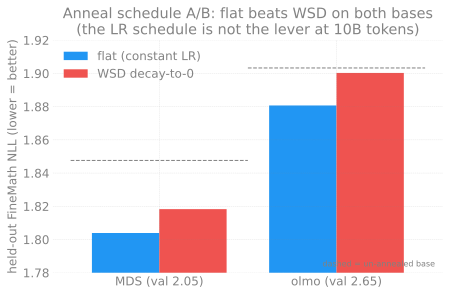
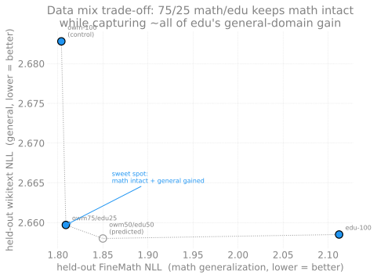

# 2B MDS mid-training: anneal-schedule A/B + data-mix experiment (Sunspot)

**Dates:** 2026-07-27 -> 2026-07-29
**Cluster:** Sunspot (Intel Max 1550 XPU), 32N/384 tiles, torch 2.13.0.dev20260519+xpu
**Base:** AuroraGPT-2B MDS `global_step138650` (val ~2.05, vocab 256000, gemma
tokenizer), forked model-only (`checkpoint.initial_load_path` +
`initial_load_model_only=True`), fresh AdamW.
**Recipe (fixed across all arms):** HSDP dp_shard=12 / dp_replicate=NHOSTS, LBS=2,
seq_len 8192, `--debug.seed=42`, ckpt interval 100, `--checkpoint.async-mode=disabled`,
~1600 steps ~= 10B tok/arm.

## TL;DR

Two questions, both answered with **held-out val-loss** (pre-registered primary
metric; NLL, lower=better) on frozen holdouts **disjoint from every training arm**:

1. **Does the LR SCHEDULE matter?** NO. Constant-LR (flat) beats WSD-decay-to-0 on
   BOTH bases. The schedule is not the lever at 10B.
2. **Does the DATA MIX matter?** ENORMOUSLY. Pure edu-web forgets math
   catastrophically; a **75% math / 25% edu** blend is the sweet spot -- keeps
   ~all the math and captures ~all of edu's general-domain gain.

**Actionable recipe:** to continue a math-saturated 2B base, train on **~75% math
(open-web-math) / 25% general-edu (fineweb-edu) at CONSTANT LR**. Do NOT spend a
WSD anneal; do NOT go pure-general.

This **overturns** the `docs/notes/data-strategy-after-olmo-mix-2026-07.md`
prediction that the "LR-decayed-to-zero annealing stage" is the primary lever --
empirically the *data mix*, not the decay schedule, is what moves the needle.

## Experiment 1: anneal schedule A/B (flat vs WSD-decay-to-0)

Two bases x two schedules, 10B tok each, identical data (open-web-math) + seed;
arms differ ONLY in the LR schedule. FineMath-4+ / open-web-math held-out NLL:

| base | base(step0) | flat-1600 | wsd-1600 | winner |
|------|-------------|-----------|----------|--------|
| MDS (val 2.05)  | 1.8476 / 1.8964 | **1.8039 / 1.8070** | 1.8183 / 1.8290 | flat +0.014 FM |
| olmo (val 2.65) | 1.9033 / 1.8963 | **1.8807 / 1.8631** | 1.9003 / 1.8839 | flat +0.020 FM |

- **flat beats WSD on BOTH bases, both holdouts.** Both arms beat the base, so
  continued math training helps -- but the WSD decay adds nothing over constant LR.
- Jobs: 12471859 (MDS+olmo, hit 3h walltime during olmo -> olmo re-run 12471885),
  evals 12471878 / 12471908 / 12471914.

**Why the redo mattered:** an earlier quick A/B (v1) was inconclusive by design --
it passed `--checkpoint.load-only` (saved ZERO checkpoints), omitted LBS=2 (halved
the budget) and `--debug.seed` (arms saw different data), ran 300 steps, and
compared final TRAIN loss (invalid: WSD ends at LR~0 so its train loss is
structurally lower). The redo fixes all of that and decides on held-out val-loss of
saved checkpoints.

## Experiment 2: data mix (constant LR, the anneal winner)

All arms fork the MDS base at constant LR 2e-6, 10B tok; differ ONLY in the mix.
FineMath-4+ (math generalization) + wikitext (anti-forgetting) held-out NLL, both
DISJOINT from every training arm (no arm trains on FineMath or wikitext):

| arm | FineMath (math) | wikitext (general) | peS2o (science) | note |
|-----|-----------------|--------------------|-----------------|------|
| owm-100 (control) | **1.8039** | 2.6828 | -- | == anneal flat winner |
| **owm75 / edu25** | 1.8089 | 2.6597 | **2.1469** | **WINNER (sweet spot)** |
| owm50 / edu50 | 1.8155 | 2.6519 | -- | best general, 1:1 math cost past the knee |
| owm75 / cosmo25 | 1.8237 | **2.6471** | 2.1486 | Wave 3 science blend -- REFUTED |
| edu-100 | 2.1122 | 2.6585 | -- | catastrophic math forgetting |

- **edu-100 (Wave 1):** swapping math-web -> edu-web forgets math by **+0.308 nats**
  (~22x the entire anneal effect) for a tiny general gain (-0.024). Lopsided ~13:1.
- **owm75/edu25 (Phase 2):** math essentially intact (FineMath +0.005 vs owm) AND
  ~95% of edu-100's entire general gain captured (wikitext 2.6597 vs edu's 2.6585).
  25% edu buys almost the full general improvement for almost no math cost.
- **owm50/edu50 (Phase 2, confirmatory):** the marginal trade past 75/25 flips to
  ~1:1. owm->75/25 traded FineMath +0.005 for wikitext -0.023 (~4.6:1 favorable);
  75/25->50/50 trades FineMath +0.007 more for wikitext only -0.008 more (~1:1).
  Note 50/50's wikitext 2.6519 out-generalizes even pure edu-100 (2.6585) while
  staying near-owm on math. So if general were weighted >= math, 50/50 is
  defensible; for a MATH-focused continued-pretrain, 75/25 wins. (Wave 3's cosmo
  arm later took the wikitext crown outright at 2.6471 -- see below.)

### Wave 3 (2026-08-08, job 12472766): the science blend is REFUTED

Hypothesis: swap the 25% diversity corpus from fineweb-edu to
cosmopedia-SCIENCE and the science holdout (peS2o) should improve, ideally
without giving back the 75/25 math gains. Same MDS base, same constant LR 2e-6,
same 1600 steps, same recipe -- the ONLY variable is the 25% corpus.

**Both halves fail.**

- **No science gain.** peS2o 2.1486 vs edu25's 2.1469 = **+0.0017**, i.e.
  indistinguishable from zero. A science-targeted corpus did not move the
  science judge at all.
- **Real math cost.** FineMath 1.8237 vs 1.8089 = **+0.0148**, ~9x the size of
  the science non-effect and worse on math than EVERY Wave 2 arm, including
  50/50 past the knee (1.8155).

So the trade is strictly bad: pay 0.0148 nats of math, receive nothing.
**owm75/edu25 remains the recommended mix.**

The one real positive: cosmo posts the **best wikitext of any arm (2.6471)**,
beating 50/50 (2.6519) and edu-100 (2.6585). That is consistent with the Wave 2
finding that general-text gains come cheaply from ANY diversity corpus -- but
here the math price is steeper than edu's, so it is not a good way to buy them.

Two readings of the flat peS2o that this data CANNOT separate: (a) 25%
cosmopedia-science is too dilute to shift peS2o at 10B tokens, or (b) peS2o
(real papers) is too far from cosmopedia (synthetic textbook prose) for the
transfer to land. (b) feels likelier given +0.0017 is pure noise, but that is a
hypothesis, not a finding. Testing it would need either a higher cosmo fraction
or a real-paper science corpus (peS2o-train itself, keeping the holdout
disjoint).

**Holdout-provenance note.** `eval/holdouts/` was untracked and got cleaned
between waves, and the sidecar meta records dataset/config/split/num_docs but
NOT the HF revision -- so there was no way to verify a rebuild by metadata. The
rebuild was validated EMPIRICALLY instead: re-scoring owm75-edu25/step-1600 on
the rebuilt files reproduced FineMath 1.8089 and wikitext 2.6597 exactly (job
12472786), which is what makes the Wave 3 row comparable to the Wave 2 rows
above. Consider committing the holdout jsonls so this cannot recur.
- **Shape:** the math-loss curve is steep, the general-gain curve flat with a clean
  knee at 75/25 -> a math-heavy blend is near-free diversity. 50/50 CONFIRMS 75/25
  as the sweet spot; **no 90/10 Wave 3 needed** -- 75/25's math cost (+0.005) is
  already noise, so backing off to 90/10 would protect math that is not being hurt.
- Jobs: Wave 1 owm-control (free re-score of anneal flat) + edu-100 (12471929);
  Phase 2 blends 12472036 (75/25) + 12472175 (50/50; first two 50/50 attempts
  12472037/12472139/12472163 died -- transient env, then a tegu project-quota
  crash at step-100 fixed by a quota bump to soft 20T), evals 12471930 / 12472040
  (75/25) + 12472203 (50/50).

## Method / infra notes (reusable)

- **Configs** (`agpt/config_registry.py`): `agpt_2b_mds_anneal_{flat,wsd}`,
  `agpt_2b_{mds,olmo}_anneal_*`, `agpt_2b_mds_mix_{owm,edu}`,
  `agpt_2b_mds_mix_owm_edu_{7525,5050}` (Interleaved weighted blends, first ezpz
  use of `InterleavedHuggingFaceTextDataLoader`).
- **Launchers:** `scripts/anneal_ab.sh`, `scripts/mix_ab.sh` (per-arm data-source
  preflight + `MIX_FOLDER_SUFFIX` to isolate smoke vs prod checkpoints).
- **Eval:** `scripts/eval/build_math_holdout.py` (FineMath + owm + `--wikitext`
  frozen holdouts), `scripts/eval/held_out_math_valloss.py` (deterministic per-ckpt
  NLL), convert DCP->HF with `--model_flavor 2b-mds` / `agpt_2b_mds_config.json`
  (vocab 256000 -- each base evaluated with ITS OWN vocab).
- **Traps fixed en route:** olmo anneal forked with cos_sin RoPE (must be COMPLEX
  to match the base); HF-hub streaming 429-storms at 384 ranks (fix = precache +
  local-parquet routing, `resolve_precached_parquet_dir`); smoke+prod sharing a
  checkpoint folder -> prod auto-resumes the smoke's wrong-rank dataloader state
  (fix = `MIX_FOLDER_SUFFIX`); wikitext test split has only ~1656 docs
  (`--wikitext-num-docs 1500`).

## Open / next

- **COMPLETE (2026-07-30):** 50/50 eval landed (1.8155 / 2.6519), confirming the
  diminishing-returns knee at 75/25. Data-mix experiment closed; 90/10 not worth a
  Wave 3.
- The 75/25 recipe is the actionable output for the flagship continued-pretraining
  stage. A science-corpus blend (per the data-strategy memo section 2) is the
  natural follow-on: replace the generic edu 25% with science/math-dense sources
  (cosmopedia-science + Nemotron-CC-Math arms built + staged; peS2o science-judge
  holdout ready).
