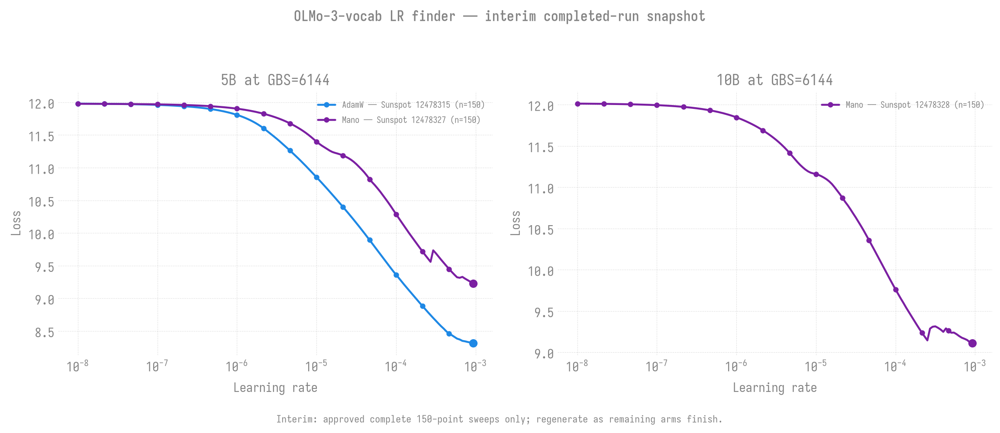

# OLMo-3-vocab ladder LR finder: 4.64B / 9.48B / 26.2B at GBS=6144

**Date:** 2026-09-18 | **Jobs:** 8837334–8837399 (12 valid submissions; see map)
**Models:** agpt `{5,10,30}b_olmo2tok`, OLMo-3 tokenizer (vocab 100,352), seq 4096
**Tokenizer compatibility:** the retained `olmo2tok` config names and staged
`OLMo-2-1124-7B` asset path are historical; its core `tokenizer.json` is
byte-identical to `allenai/Olmo-3-1025-7B`.
**Data:** olmo-mix-1124 `wiki` subset, precached, via Grain + inline OLMo-3 tokenization
**Machine:** Aurora `next-eval` and Sunspot `workq`, 64N production-batch sweeps

Status as of 2026-09-22: **PARTIAL RESULTS; COARSE-TO-FINE REDESIGN IN
PROGRESS.** The original Aurora
submissions failed before training for two successive runtime-contract defects:
first stale `spmd-types`, then a pip `impi-rt` library shadowing Aurora's site
MPICH/PMIx (`PMIX_Init returned -25`). The isolated `.venv.next-eval` runtime,
an explicit `impi-rt` rejection gate, and archive-derived activation path were
validated the runtime contract with Aurora job `8846942`, but later forensic
analysis showed that its Muon optimizer became non-finite after the first
update. Clean Aurora replacements `8847068`–`8847073` all terminated: the Muon
arms are invalid optimizer evidence, while the SophiaG arms remained finite
until a launcher timeout stopped their partial sweeps.

Sunspot is producing the first full results. Jobs `12478315` (5B AdamW) and
`12478328` (10B Mano) completed 150/150 finite points with fresh artifacts;
`12478327` (5B Mano) also completed 150/150. The first canonical 30B Mano job `12478329`
stalled at zero points with `dp_shard=8` and was cancelled. A `dp_shard=12`
control on the canonical 16,384-wide FFN (`12478356`) failed correctly because
16,384 is not divisible by 12. A separately named, checkpoint-incompatible
16,128-wide FFN flavor then passed a 4-node smoke (`12478362`, 5/5 finite
points); its full 64-node run is `12478375` (queued). Existing canonical 30B
checkpoints and configs remain unchanged.

This file records both setup and live outcomes. Per-job `report.md` files and
CSV/NPZ/PNG artifacts are generated automatically under `outputs/`; this page
is the durable campaign-level synthesis and is updated only from verified
scheduler state plus artifacts.

## Why

`agpt()` hands every size `lr=8e-4`, and the only guard (`_is_80b_config`)
gates on `flavor.startswith("80b")`, so none of these three is covered. For
scale: the 20B runs production at 2.28e-5, and the prior 30B olmo2tok sweep
(2026-08-23, GBS=960, Sunspot) put AdamW at **3.05e-05**. The inherited default
is therefore ~26x above the only measured number we have for this geometry.
The 80B shipped its inherited default against a documented ~7.4e-7 ceiling and
blew up at step 2.

## Geometry

| flavor | dim | layers | heads | kv | params | emb+head share |
|---|---:|---:|---:|---:|---:|---:|
| `5b_olmo2tok` | 3072 | 40 | 24 | 8 | 4.64B | ~14% |
| `10b_olmo2tok` | 4096 | 48 | 32 | 8 | 9.48B | |
| `30b_olmo2tok` | 6144 | 64 | 48 | 8 | 26.20B | |

Parameter counts are measured (meta-device build), not estimated.

## Setup notes that mattered

**Queue: next-eval, and it changes the node count.** `qstat -Qf next-eval`
shows NO nodect limits -- only walltime 00:05:00-06:00:00 and max_queued 20.
That dissolves the constraint `submit_lr_finder_30b_aurora.sh` was built
around, where 8-255 nodes above one hour was a queue dead zone forcing 256N
purely to reach a multi-hour queue. 64N is the measured throughput sweet spot
(exp06: 456 tps, 26.57% MFU) and is legal here. 64N x 12 = dp 768;
6144 = 768 * 2 * 4, so LBS=2/GAS=4.

**Runtime comes from the agpt-2b-v2 clone, not this repo.** next-eval runs a
TEST bkc image (26.181.0 / oneAPI 2026.1); this repo's `.venv` is based on a
`/opt/aurora/26.26.0/spack/...` python that does not exist there. Probe
(job 8837294) on a next-eval compute node:

- PROD spack python: **ABSENT**; the repo venv's interpreter is flatly
  "No such file or directory"
- clone venv: **OK** -- Python 3.14.2, torch 2.13.0.dev20260428+xpu, `xpu True`

So: code from this repo, runtime from that tarball, joined by `LRF_VENV_SRC`
plus an explicit `PYTHONPATH`. The tarball already carries torch 2.13 (not
2.10) and postdates the venv's `pyvenv.cfg`, so yeet will not skip it as stale.
Verified separately that HEAD's actual floor is satisfied on that runtime:
`from torch.distributed.fsdp import DataParallelMeshDims` -> IMPORT_OK, and
`torchtitan.distributed.fsdp` -> TT_FSDP_OK.

**Data: the config's own dataloader, NOT blendcorpus.** `run_lr_finder.sh`
hardcoded `--dataloader.dataset blendcorpus` on every invocation. Every
blendcorpus list on Aurora is gemma- or Llama-2-tokenized; feeding those ids to
a 100,352 embedding is the Polaris gibberish failure, and it fails SILENTLY --
ids below the embedding size index fine and the loss curve looks plausible.
`LRF_USE_CONFIG_DATALOADER=1` leaves the config's Grain path in place, which
tokenizes raw text inline with the OLMo-3 tokenizer.

**LR window 1e-8 -> 1e-3**, 150 probes (fraction 0.15 of 1000 steps) =
30 points/decade. Inherited from the 30B script: the script default 1e-6 -> 1.0
spends most probes above 1e-5 where everything has already diverged, and puts a
plausible optimum AT the first sample where a minimum is unresolvable.

**All four optimizers swept.** An earlier version of this file said AdamW
only, on the grounds that SophiaG's curve is "smooth". That was wrong: SophiaG
produced a real measured blow-up at 3.55e-04 in the 30B/GBS=960 sweep, the same
as the other two arms. "Smooth through the low band" describes the region below
the cliff and is true of every optimizer. A sweep finds a cliff if the window
reaches it -- which is exactly why the window is now per-optimizer.

SophiaG's 4/4 training divergences remain a reason not to LAUNCH it without
--grad-norm-abort=20.0, but they were never a reason not to MEASURE it.

**One size per job**, so a failure in one geometry does not cost the other two
their walltime.

## Preconditions verified before submitting

- LR-finder scheduler suspension still holds (`tests/test_lr_finder_scheduler.py`):
  suspended sees the full 4-decade spread, unsuspended collapses 5 decades to
  5x. Worth knowing: that file is a script, not a pytest module -- `pytest` on
  it collects nothing and exits 0, so this guard is NOT running in CI.
- ALCF preflight: PASS (worktree current, tokenizer, data-list, torch floor,
  ZE_FLAT_DEVICE_HIERARCHY=FLAT).
- OLMo-3 tokenizer assets staged at the historical
  `assets/hf/OLMo-2-1124-7B/` path: `tokenizer.json` plus three companions; the
  core tokenizer file is byte-identical to `allenai/Olmo-3-1025-7B`.
- olmo-mix wiki precached at 6.1 GB / 2 shards. (`du -sh` on an HF snapshot
  reports ~20K because snapshots are symlinks into `blobs/`; use
  `--dereference`.)

## Job map

3 sizes x 4 optimizers = 12 sweeps.

| size | adamw | mano | muon | sophiag |
|---|---|---|---|---|
| 5b  | 8837334 | 8837373 | 8837397 | 8837391 |
| 10b | 8837335 | 8837375 | 8837398 | 8837392 |
| 30b | 8837336 | 8837377 | 8837399 | 8837393 |

**Ignore any output from 8837374 / 8837376 / 8837378.** Those were the first
muon submissions and carry a 1e-3 window, 5.7x BELOW muon's measured 5.68e-03
cliff (30B/GBS=960). They will sweep, never diverge, and exit 0 with NO
suggestion -- an empty result that looks like a failed optimizer rather than a
mis-set window. PBS snapshots the script at qsub so they could not be fixed in
place, and `qalter -v` cannot help either: the old script sets LRF_MAX_LR with
an unconditional `export`, which overwrites anything injected. 8837397/8/9 are
the corrected replacements.

## Results

Verified results as of 2026-09-21. A minimum at the final sampled LR means the
curve was still descending and **does not constitute a defensible LR
recommendation**; the sweep window must be extended or interpreted alongside
the completed curve.

### Interim completed-run snapshot



This is intentionally an **interim** chart and will be regenerated in place as
additional full sweeps finish. It includes only three explicitly approved,
complete 150-point sweeps—not five-point smokes or failed/invalid runs. The
current snapshot contains Sunspot
`12478315` (5B AdamW), `12478327` (5B Mano), and `12478328` (10B Mano). The
optimizer minima marked at the edge of a search window are observations, not
yet recommended learning rates.

The chart is reproducible directly from the committed source CSVs with:

```bash
python torchtitan/experiments/ezpz/scripts/plot_olmo3_lrf_interim.py \
  --output torchtitan/experiments/ezpz/docs/experiments/lr-finder/agpt/figures/2026-09-21-olmo3-gbs6144-interim.png
```

[`plot_olmo3_lrf_interim.py`](../../../../scripts/plot_olmo3_lrf_interim.py)
requires exactly 150 finite rows for each allowlisted PBS job and verifies each
committed CSV's SHA-256 digest. The CSV schema does not record gradient/update
health; that evidence was checked from each job's terminal logs before its
digest was allowlisted. This prevents arbitrary or partial CSVs—including the
finite-loss but optimizer-invalid Aurora Muon output—from entering the chart.

### Aurora W&B runs

There is not currently a separate shared W&B Report. The six clean replacement
runs are available individually:

- Muon: [5B (`8847068`)](https://wandb.ai/aurora_gpt/torchtitan.ezpz.train/runs/2abqxxcc), [10B (`8847069`)](https://wandb.ai/aurora_gpt/torchtitan.ezpz.train/runs/3m93gxnj), [30B (`8847070`)](https://wandb.ai/aurora_gpt/torchtitan.ezpz.train/runs/346ucb4v)
- SophiaG: [5B (`8847071`)](https://wandb.ai/aurora_gpt/torchtitan.ezpz.train/runs/spix9udq), [10B (`8847072`)](https://wandb.ai/aurora_gpt/torchtitan.ezpz.train/runs/sgmfddmr), [30B (`8847073`)](https://wandb.ai/aurora_gpt/torchtitan.ezpz.train/runs/2usu7dw9)

| job | machine | model / optimizer | points | finite | min loss | LR at min | status |
|---|---|---|---:|---:|---:|---:|---|
| 12478315 | Sunspot | 5B / AdamW | 150 | 150 | 8.3131 | 9.261e-4 | complete; minimum at final point; shard-4 extended replacement `12478392` queued |
| 12478328 | Sunspot | 10B / Mano | 150 | 150 | 9.1098 | 9.261e-4 | complete; minimum at final point; shard-4 extended replacement `12478393` queued |
| 12478327 | Sunspot | 5B / Mano | 150 | 150 | 9.2289 | 9.261e-4 | complete; minimum at final point |
| 12478385 | Sunspot | 5B / AdamW | 5 | 5 | 11.9914 | 1.585e-5 | shard-4 smoke passed; 8.45 GiB model memory |
| 12478386 | Sunspot | 10B / Mano | 5 | 5 | 11.9901 | 1.585e-5 | shard-4 smoke passed; 13.88 GiB model memory |
| 12478392 | Sunspot | 5B / AdamW | — | — | — | — | shard-4 extended `1e-5`–`1e-1` window queued |
| 12478393 | Sunspot | 10B / Mano | — | — | — | — | shard-4 extended `1e-5`–`1e-1` window queued |
| 12478362 | Sunspot | 30B-dp12 / Mano | 5 | 5 | 11.8506 | 1.000e-4 | smoke passed; minimum at final point |
| 12478375 | Sunspot | 30B-dp12 / Mano | — | — | — | — | full 150-point run queued |
| 8846942 | Aurora | 5B / Muon | 5 | 5 losses | — | — | runtime passed, but optimizer became non-finite after its first update; invalid as a training canary |
| 8847068 | Aurora | 5B / Muon | 150 | 150 losses | — | — | finished (`exit=0`), but gradients were non-finite from step 2; excluded from comparison chart |
| 8847069 | Aurora | 10B / Muon | 61 / 150 | partial | — | — | failed (`exit=1`); loss and gradients non-finite by step 60 |
| 8847070 | Aurora | 30B / Muon | 6 / 150 | partial | — | — | failed (`exit=1`) before completing sweep |
| 8847071 | Aurora | 5B / SophiaG | 97 / 150 | finite partial | — | — | launcher timeout at 6,000 s (`exit=1`) |
| 8847072 | Aurora | 10B / SophiaG | 60 / 150 | finite partial | — | — | launcher timeout at 6,000 s (`exit=1`) |
| 8847073 | Aurora | 30B / SophiaG | 10 / 150 | finite partial | — | — | launcher timeout at 6,000 s (`exit=1`) |

### Controlled failures and decisions

- Aurora `8847068` wrote 150 finite loss values but had non-finite gradients
  from step 2 onward. Its apparent loss curve is not valid optimizer evidence
  and is deliberately excluded from the interim comparison figure.
- Aurora `8847069`–`8847073` terminated with `Exit_status=1` after only
  61/6/97/60/10 sweep points respectively. The Muon arms were non-finite or
  otherwise unhealthy; the SophiaG arms were stopped by a submitter bug that
  overwrote the requested timeout with 6,000 seconds. Their partial data remain
  linked in W&B for diagnosis but are not completed LR-finder results.
- `12478325`, 10B AdamW: failed after 14 minutes; replacement `12478340` is queued.
- `12478329`, canonical 30B Mano with `dp_shard=8`: entered the sweep but
  completed zero points and stalled in oneCCL/MPI pending requests; cancelled.
- `12478356`, canonical 30B Mano with `dp_shard=12`: failed during DTensor
  parameter initialization because FFN dimension 16,384 is not divisible by 12.
  The later rank-36 SIGTERM was launcher cleanup, not the initiating error.
- `12478362`: validated the additive `30B_olmo2tok_dp12` flavor at FFN=16,128,
  where `16128 / 12 = 1344`. This keeps each 12-rank shard group within one
  node. It is a new architecture and cannot load canonical 30B checkpoints.

Prior for comparison: canonical 30B olmo2tok at GBS=960 on Sunspot gave AdamW
3.05e-05 (2026-08-23-30b-gbs960-three-optimizers.md). Optimal LR is batch-size
dependent, so the GBS=6144 answer is expected to differ -- the 80B's
small-batch finder said 1.1e-5 while its real production-batch ceiling was
~14x lower.

## Artifacts

`outputs/lr_finder_{5b,10b,30b}_olmo2tok_gbs6144/`
