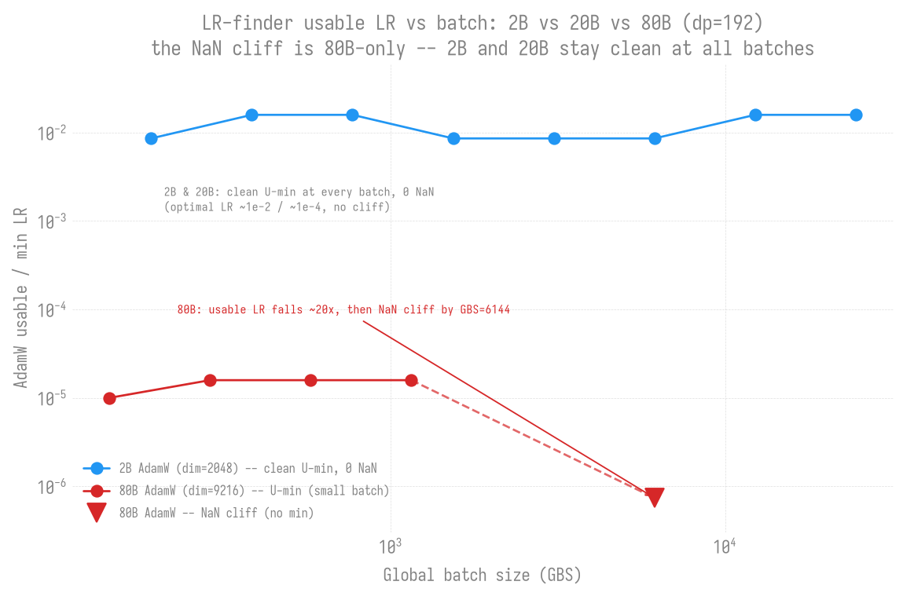
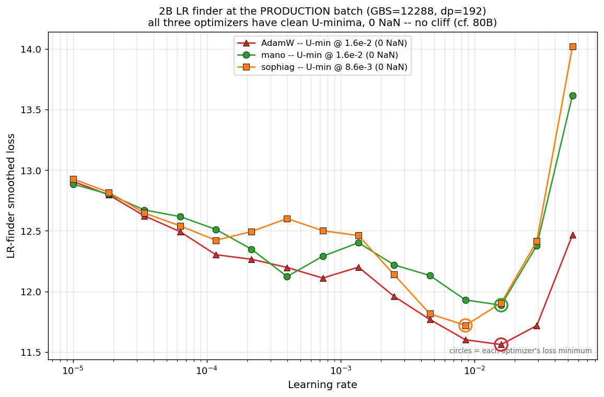
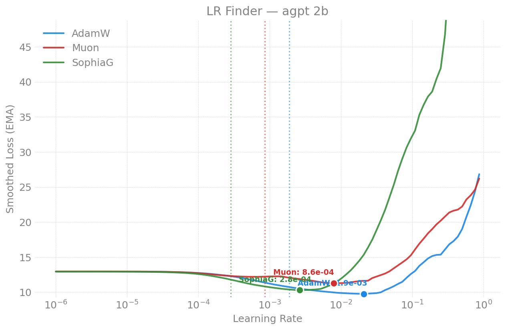

# LR Finder -- agpt 2B

Learning-rate-finder results for the dense **agpt 2B** model. For how the
finder works see the [methodology README](../../README.md); for the
cross-model recommendation table and findings see the
[agpt index](../README.md). Figures in [`figures/`](figures/).

**Recommended (small-batch, `sqrt(2/(5*d))` init):** AdamW **1.3e-3**, Muon
**2.4e-3**, SophiaG **3.1e-4** (Sunspot 2026-04-14).

**Key result (2026-06-28):** unlike 80B, **2B never cliffs.** Its AdamW usable
LR is flat at ~1e-2 across the entire GBS 192..24576 range (128x batch, 0 NaN
anywhere) -- the usable-LR collapse + NaN cliff seen at 80B is a large-model
(dim=9216 bf16) phenomenon, not universal. See the trend section below.

---

## 2026-06-28 -- LR-ceiling vs GBS trend

Reproducing the 80B
[LR-ceiling-vs-GBS trend](../80b/README.md#lr-ceiling-vs-gbs-trend-adamw) at
2B: does the usable-LR collapse + U-min -> cliff transition also appear at 2B,
or does the smaller model (dim=2048) stay clean across the whole batch range?
Run at **16N, TP=1 -> dp_degree=192** (the *same* dp as the 80B GBS=6144
headline run, so the two curves overlay on one x-axis with only model size
differing). Each GBS swept adamw + mano + sophiag (muon dropped -- it crashes
every job via a oneCCL collective abort; use `torchmuon` if needed).

- LR range 1e-5 -> 1e-1 (2B optimal ~1e-2, ~100x higher than 80B).
- GBS ladder 192 .. 24576 (12288 = 2B production, 24576 = 2x production).
- Jobs 12469769-776, isolated dumps `outputs/lrtrend-2b/gbs<N>/`.

### Result: 2B never cliffs

Every point is a clean U-min with **0 NaN** -- across a **128x** batch range.
The AdamW usable LR sits flat at ~1e-2 the whole way; there is no collapse and
no divergence cliff, even at 2x the production batch.

| GBS | AdamW min-LR | AdamW min-loss | mano min-LR | sophiag min-LR | shape (all opts) |
|----:|--------------|---------------:|-------------|----------------|------------------|
| 192   | 8.6e-3 | 11.25 | 8.6e-3 | 1.2e-4 | clean U-min |
| 384   | 1.6e-2 | 11.51 | 8.6e-3 | 1.4e-3 | clean U-min |
| 768   | 1.6e-2 | 11.68 | 8.6e-3 | 7.4e-4 | clean U-min |
| 1536  | 8.6e-3 | 11.53 | 8.6e-3 | 8.6e-3 | clean U-min |
| 3072  | 8.6e-3 | 11.53 | 8.6e-3 | 8.6e-3 | clean U-min |
| 6144  | 8.6e-3 | 11.57 | 1.6e-2 | 1.4e-3 | clean U-min |
| **12288** (prod) | 1.6e-2 | 11.56 | 1.6e-2 | 8.6e-3 | clean U-min |
| **24576** (2x prod) | 1.6e-2 | 11.63 | 8.6e-2 [1] | -- [1] | clean U-min |

[1] GBS=24576 mano/sophiag still finishing at writeup time; AdamW (the
headline) is complete. Table refreshes when they land.

All three optimizers at the 2B production batch -- every curve is a clean
U-min that turns back up, 0 NaN (contrast the
[80B production-batch figure](../80b/README.md#headline-result-all-four-optimizers-at-the-production-batch),
where AdamW cliffs to NaN):

### Contrast with 80B (same dp=192)

| | 2B (dim=2048) | 80B (dim=9216) |
|---|---|---|
| usable LR @ GBS=6144 | **8.6e-3** (clean U-min, 0 NaN) | ~7.4e-7 (NaN cliff, 7/15 NaN) |
| trend across batch | **flat ~1e-2, 192 -> 24576** | falls ~20x, 1.6e-5 -> 7e-7, then cliffs |
| failure mode at high batch | none | clean U -> noisy basin -> hard NaN cliff |

**Conclusion:** the batch-dependent usable-LR collapse documented for 80B is
**not a universal scaling law** -- it is specific to the large model. The most
likely mechanism is the same dim=9216 bf16 fragility that breaks muon/sophiag
at 80B: at large model width the AdamW update at high effective batch enters a
numerically unstable regime that 2B (dim=2048) never reaches. Practically: a
small-model finder is a poor proxy for large-model production LR (the 80B
lesson), but small models themselves are forgiving of large batches.

---

## 2026-04-14 -- 2B (Sunspot, dim-aware init)

2 nodes / 24 XPU tiles, 100 finder steps (5 warmup + 95 sweep), LR 1e-6 -> 1.0,
weight init `sqrt(2/(5*d))` (dim-aware), blendcorpus (books). (Same job also
swept 20B -- see [20B page](../20b/README.md).)

| Optimizer | Blow-up LR | Suggested LR |
|-----------|-----------|-------------|
| AdamW   | 1.30e-2 | **1.3e-3** |
| Muon    | 2.36e-2 | **2.4e-3** |
| SophiaG | 3.08e-3 | **3.1e-4** |

**Effect of dim-aware init** -- `sqrt(2/(5*d))` (vs fixed `std=0.02`) most
affects Muon: 2B Muon 7.5e-4 -> 2.4e-3 (3x). AdamW and SophiaG relatively
unaffected. Smaller init weights mean smaller gradients, so Muon can tolerate
higher LRs.

## 2026-04-21 -- 2B verification + GAS sweep (Sunspot)

Re-ran 2B on torch 2.13 (compile enabled) alongside the 80B finder to verify
no regression, plus a gradient-accumulation sweep.

| Optimizer | NaN | Suggested LR | Blow-up |
|-----------|-----|-------------|---------|
| AdamW | 0/100 | ~8e-4 | ~8e-3 |
| Muon | 0/100 | ~7e-4 | ~7e-3 |
| SophiaG | 2/100 | ~5e-7 | ~5e-6 |

### GAS (gradient accumulation) sweep -- 2B AdamW

| GAS | GBS | NaN | Suggested LR | Blow-up |
|-----|-----|-----|-------------|---------|
| 1 (baseline) | 24 | 0 | ~8e-4 | ~8e-3 |
| 4 | 96 | 0 | 8.58e-4 | 8.58e-3 |
| 8 | 192 | 0 | 9.03e-4 | 9.03e-3 |
| 16 | 384 | 0 | 4.90e-4 | 4.90e-3 |

Optimal LR is relatively stable across GBS for 2B AdamW (4.9e-4 .. 9.0e-4
across 16x GBS) at this *small* scale -- the 2026-06-28 trend sweep above
extends this to the full production-batch range to test whether that stays
true.

## 2026-04-13 -- 2B (Polaris, NVIDIA A100)

2 nodes / 8 A100-40GB, 100 finder steps, LR 1e-6 -> 1.0, fixed `std=0.02` init,
blendcorpus (books), NCCL.

| Optimizer | Min Loss | LR @ Min | Blow-up LR | Suggested LR | Final Loss |
|-----------|----------|----------|-----------|-------------|-----------|
| AdamW   | 9.80  | 1.8e-2 | ~3e-2   | **2e-3** | 30.8 |
| Muon    | 11.01 | 1.0e-2 | ~1.5e-2 | **1e-3** | 28.8 |
| SophiaG | 10.73 | 3.0e-3 | ~4e-3   | **3e-4** | NaN  |

**Cross-hardware consistency:** these match Aurora within ~1.5x -- optimal LR
is a property of the model+optimizer, not the hardware.

W&B: [AdamW](https://wandb.ai/aurora_gpt/torchtitan.ezpz.train/runs/2tz2slwx),
[Muon](https://wandb.ai/aurora_gpt/torchtitan.ezpz.train/runs/qng9p17h),
[SophiaG](https://wandb.ai/aurora_gpt/torchtitan.ezpz.train/runs/lj866hrb).

## 2026-04-12 -- 2B (Aurora, first run)

2 nodes / 24 XPU tiles, 100 finder steps, LR 1e-6 -> 1.0, fixed `std=0.02` init,
blendcorpus (books), xccl.

| Optimizer | Min Loss | LR @ Min | Blow-up LR | Suggested LR | Final Loss |
|-----------|----------|----------|-----------|-------------|-----------|
| AdamW   | 9.76  | 2.1e-2 | ~3e-2 | **2e-3** | 26.8   |
| Muon    | 11.29 | 7.9e-3 | ~1e-2 | **8e-4** | 26.2   |
| SophiaG | 10.29 | 2.6e-3 | ~4e-3 | **3e-4** | 294.6  |

---

## Reports index

| Date | Machine | GBS | Optimizers | Nodes | Key Result |
|------|---------|-----|-----------|-------|------------|
| 2026-06-28 | Sunspot | 192..24576 | AdamW, mano, sophiag | 16 | LR-ceiling-vs-GBS trend: 2B never cliffs (flat ~1e-2, 0 NaN, 128x batch) |
| 2026-04-21 | Sunspot | 24..384 | AdamW, Muon, SophiaG | 2 | torch-2.13 verify + GAS sweep; LR stable 4.9-9.0e-4 |
| 2026-04-14 | Sunspot | 48 | AdamW, Muon, SophiaG | 2 | dim-aware init: AdamW 1.3e-3, Muon 2.4e-3 (3x higher) |
| 2026-04-13 | Polaris | 48 | AdamW, Muon, SophiaG | 2 | reproduces Aurora; cross-hardware consistency |
| 2026-04-12 | Aurora | 48 | AdamW, Muon, SophiaG | 2 | AdamW 2e-3; first run |
