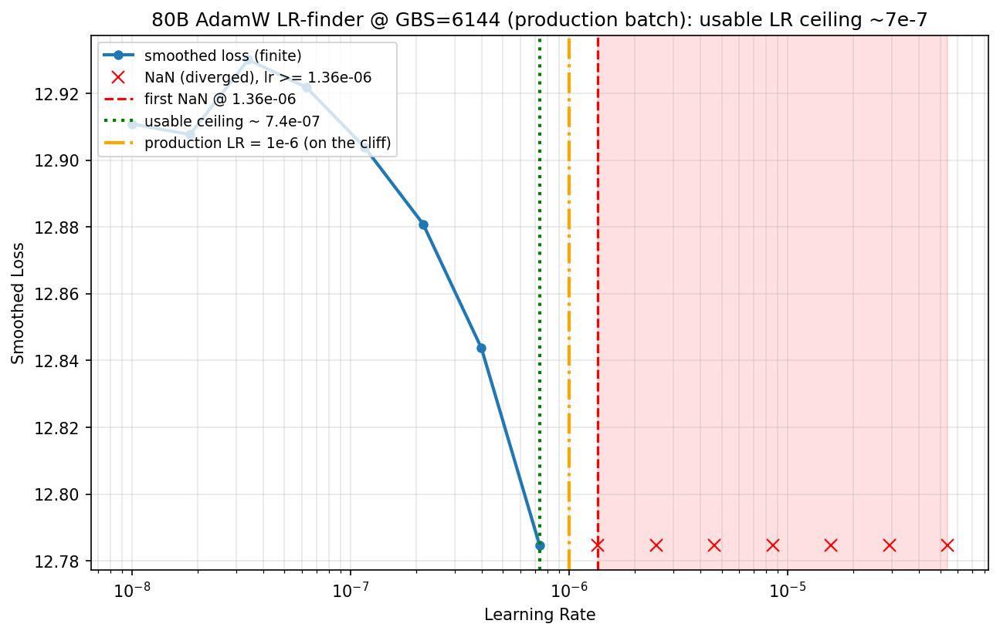
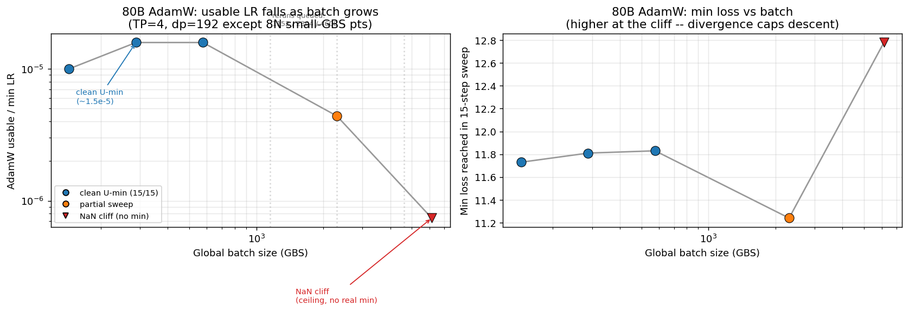

# LR Finder -- agpt 80B

Learning-rate-finder results for the dense **agpt 80B** model. For how the
finder works see the [methodology README](../../README.md); for the
cross-model recommendation table and findings see the
[agpt index](../README.md). Figures in [`figures/`](figures/).

**TL;DR for production (GBS~6144):** do NOT run AdamW at LR=1e-6 -- it is on
the NaN cliff. Use **mano ~3e-6** (safest), **sophiag ~1e-6** (lowest loss,
narrower band), or AdamW ~5e-7. The small-batch "AdamW 1.1e-5" number does
not transfer to the production batch.

---

## 2026-06-27 -- 80B at the PRODUCTION batch (GBS=6144, Sunspot)

> **This supersedes the small-batch (GBS=192) recommendation.** The earlier
> 80B finder (2026-04-21) ran at the 2-node default batch (**GBS=192**) and
> gave "AdamW = 1.1e-5". At the real production batch (**GBS=6144**, 32x
> larger) that LR diverges: AdamW's usable ceiling collapses to **~7e-7**,
> and the production default LR=1e-6 sits **on the NaN cliff**. mano -- marked
> "N/A / broken" in the old table -- is actually the **best-behaved optimizer
> at this batch**.
>
> **Two-part correction to the "SophiaG/Muon broken at 80B" claim:** at this
> batch **sophiag is NOT broken** -- it runs all 15 steps finite with a real
> minimum at lr~2.5e-6 and the *lowest loss of all four optimizers* (12.60).
> Only **muon** is broken as documented (NaN from step 7). The old "both NaN
> regardless of LR" line came from the GBS=192 finder; the larger batch
> smooths sophiag's Hessian `grad*grad` term below the bf16 overflow
> threshold. (mano stays the safest production pick -- see below.)

### Why redo the finder at GBS=6144

Optimal LR is batch-size dependent, and 80B production runs at GBS~6144
(512N-equiv) -- 32x the GBS=192 the old finder used. Calibrating from the
small batch mis-predicts the production LR by ~14x. This sweep runs the
finder **at the production batch** (TP=4 / LBS=1 / GAS=32 -> GBS=6144,
dp_degree=192), one job per optimizer.

### Environment

| Field | Value |
|-------|-------|
| Date | 2026-06-27 |
| Machine | Sunspot |
| Nodes | 64 (768 XPU tiles), TP=4 / LBS=1 / GAS=32 |
| GBS | **6144** (production batch) |
| Compile | disabled (80B AC+TP regression) |
| Seq len | 8192 |
| LR range | 1e-8 -> 1e-4, 15 steps (adamw 1e-6 -> 1e-3) |
| Jobs | adamw 12469723, mano 12469724, muon 12469725, sophiag 12469726 |

### Headline result: all four optimizers at the production batch

| Optimizer | behavior @ GBS=6144 | usable LR | min loss | NaN | verdict |
|-----------|---------------------|-----------|----------|-----|---------|
| **mano** | clean broad **U-curve** | ~1.6e-5 (min-bounded) | 12.62 @ 1.6e-5 | 0/15 | **best (safest) production pick** |
| **sophiag** | real **U-min**, blow-up onset ~4.6e-6 | ~2.5e-6 (min-bounded) | **12.60 @ 2.5e-6** (lowest of all four) | 0/15 | **NOT broken at this batch** |
| **AdamW** | NaN **cliff** (no minimum in range) | ~7.4e-7 (cliff-bounded) | 12.78 @ 7.4e-7 | 7/15 | **1e-6 is past the cliff** (NaN @ 1.36e-6) |
| muon | NaN from step 7 (~4e-7) | -- | (12.91) | 9/15 | broken as documented (bf16 dim=9216) |

- **mano**: a textbook LR-finder U -- descends to a real minimum at
  lr=1.6e-5 (loss 12.62) then rises gently, no divergence across the whole
  1e-8 -> 5.4e-5 sweep. **~20x more LR headroom than AdamW with a soft top.**
- **sophiag**: descends cleanly to a real minimum at lr=2.5e-6 (loss 12.60,
  the lowest of all four), then blows up sharply (grad_norm 14 -> 85 -> 132
  over steps 10 -> 12). **Directly contradicts the GBS=192 finding that
  sophiag NaNs by step 7 regardless of LR** -- at GBS=6144 it has a usable
  region and the best minimum. Narrower safe band than mano, though.
- **AdamW**: loss descends monotonically to lr=7.4e-7 (12.78), then NaNs
  at 1.36e-6 -- no minimum, just a wall. The production LR=1e-6 lands
  *between* the last stable point and the NaN, explaining the
  nondeterministic NaNs observed on GBS~6000 production attempts.
- **muon**: NaN from step 7 (lr~4e-7) onward, exactly as the GBS=192 finder
  reported -- the Newton-Schulz `A @ A` (9216x9216) overflow is not relieved
  by the larger batch the way sophiag's Hessian term is.

> **Data note:** the GBS=6144 AdamW numbers here come from the figures /
> per-experiment record below, not from the live `.../80B/adamw/
> lr_finder_data.csv` -- that CSV is keyed by `(model, optimizer)` only, so
> the later GBS=2304 and GBS=288 trend probes overwrote the GBS=6144 AdamW
> rows in place. The mano/sophiag/muon CSVs are unique (their optimizer ran
> only at GBS=6144) and are stamped `global_batch_size=6144, world_size=768`.

(The finder's auto `lr_vs_loss.png` for this run is misleading -- it drops
the NaN sweep points and its derivative annotations misfire on the
near-flat 80B floor. These figures are rebuilt from the CSV to show the
real cliff.)

### Batch dependence (the reason the old number was wrong)

| Finder batch | AdamW usable-LR ceiling |
|---|---|
| GBS=192 (2026-04-21) | ~1.1e-5 (clean blow-up) |
| **GBS=6144 (this run)** | **~7.4e-7 (NaN cliff)** |

~14x lower ceiling at the production batch, AND a change of failure mode
(clean blow-up -> hard NaN cliff). A small-batch finder cannot be trusted
to set a large-batch production LR for AdamW at 80B.

### Production recommendation

1. **Do not run AdamW at LR=1e-6 at GBS=6144** -- it is on the NaN cliff.
   If staying on AdamW, use **~5e-7** (under the 7.4e-7 stable point).
2. **Strongly consider mano as the 80B production optimizer at this batch**
   -- no cliff, ~20x LR headroom, soft top. Suggested mano LR **~3e-6**
   (min/5). mano is the *safest* pick: the widest margin between a usable LR
   and divergence.
3. **sophiag is a viable second** (no longer "broken" at this batch): it has
   the lowest minimum loss (12.60) but a narrower safe band -- blow-up onset
   is only ~2x above its minimum (2.5e-6 -> 4.6e-6), vs mano's gentle rise.
   If trying sophiag, stay conservative: LR **~1e-6** (min/2.5) with tight
   grad clipping.
4. **Confirm with a head-to-head convergence run** (mano @ ~3e-6 vs sophiag
   @ ~1e-6 vs AdamW @ ~5e-7, GBS=6144) before locking the config -- the
   finder measures early-step stability/descent, not full convergence.

Raw per-experiment record:
[`docs/experiments/agpt/sunspot/2026-06-27-80b-lr-finder-production-batch.md`](../../../agpt/sunspot/2026-06-27-80b-lr-finder-production-batch.md).

### LR-ceiling vs GBS trend (AdamW)

The GBS=192 vs GBS=6144 jump above is two endpoints of a continuous trend.
To see *how* AdamW's usable LR collapses as the batch grows -- and where the
clean U-min turns into the hard NaN cliff -- we swept AdamW at a ladder of
batch sizes (TP=4 throughout; small-GBS points at 8N/dp=24, larger points at
64N/dp=192).

| GBS | nodes | usable/min LR | min loss | sweep | shape |
|----:|------:|---------------|---------:|-------|-------|
| 144  | 8  | 1.0e-5  | 11.73 | 1e-6 -> 1e-3 (15/15) | clean U-min |
| 288  | 8  | 1.6e-5  | 11.81 | 1e-6 -> 1e-3 (15/15) | clean U-min |
| 576  | 8  | 1.6e-5  | 11.83 | 1e-6 -> 1e-3 (15/15) | clean U-min |
| 1152 | -- | (rerun queued) | -- | -- | -- |
| 2304 | 16 | ~4.4e-6 | 11.24 | 1e-6 -> 1e-3 (11/15) | soft/noisy basin |
| 4608 | -- | (rerun queued) | -- | -- | -- |
| 6144 | 64 | ~7.4e-7 | 12.78 | 1e-8 -> 1e-4 (15/15) | **NaN cliff (no min)** |

Reading the trend:

- **Usable LR falls monotonically with batch** -- from ~1.6e-5 (GBS<=576)
  toward ~7e-7 (GBS=6144), roughly a ~20x drop across a 10x batch increase.
- **The failure mode changes, not just the number.** Small batches blow up
  cleanly with a real loss minimum in-range; the production batch has *no*
  minimum -- loss descends to a wall and NaNs (the "usable LR" there is a
  ceiling, not a U-bottom).
- **The transition is gradual.** GBS=2304 already shows a soft, noisy basin
  (loss flat 11.2-11.6 across lr 4e-6..2e-5, grad_norm bouncing 13-85) rather
  than either a clean U or a sharp cliff -- the edge sharpens somewhere
  between GBS=2304 and 6144.
- **Min-loss is non-monotonic** (right panel): it improves slightly to the
  GBS=2304 basin (11.24) then jumps up at the cliff (12.78) -- once divergence
  caps the LR, the 15-step sweep simply can't descend as far.

**Caveats (this is in progress):** GBS=1152/2304/4608 are being re-run at 64N
(jobs 12469765-767) -- the first 2304 attempt reached only step 11/15 (6h
walltime) and the first 4608 attempt produced 0 points (the auto-retry
watchdog fired mid-step-1: at 16N/dp=48 the GAS=96 step exceeded the 1800s
no-output timeout). The reruns use dp=192 (GAS 6/12/24, fast steps) and a
2400s watchdog. The figure + table will be refreshed when they land; the
8N small-GBS points and the 6144 cliff are final.

A 2B reproduction of this same trend (16N, dp=192, GBS 192..24576) is running
-- see [agpt 2B](../2b/README.md).

---

## 2026-04-21 -- 80B + GAS sweep (Sunspot, small batch GBS=192)

First empirical 80B LR finder (previously extrapolated only), 2 nodes / 24 XPU
tiles, torch 2.13, compile disabled, seq_len=8192, LR 1e-6 -> 1.0 over 100 steps.

| Optimizer | Suggested LR | Blow-up | NaN Count | Status |
|-----------|-------------|---------|-----------|--------|
| **AdamW** | **1.13e-5** | 1.13e-4 | 0/100 | Clean sweep |
| **Muon** | N/A | NaN at step 7 | 93+/100 | Broken (bf16 overflow) |
| **SophiaG** | N/A | NaN at step 7 | 93+/100 | Broken **at GBS=192** (see note) |

**Muon/SophiaG bf16 overflow** -- both produce NaN regardless of LR at 80B
(dim=9216): Muon's Newton-Schulz `A @ A` (9216x9216 matmul) overflows bf16,
SophiaG's Hessian estimate `grad * grad` overflows bf16. Confirmed
LR-independent (NaN even at LR=1e-8). fp32 Newton-Schulz delays Muon NaN to
step 16 but is 6x slower -- not viable. Overflow is model-size-specific: 20B
(dim=5120) works fine for both.

> **Correction (2026-06-27): the SophiaG "broken at 80B" verdict is
> batch-specific.** At the production batch GBS=6144, SophiaG runs all 15
> finder steps finite with a real minimum at lr~2.5e-6 (loss 12.60) -- the
> larger batch smooths its Hessian `grad*grad` estimate below the bf16
> overflow threshold. **Muon stays broken regardless of batch.** See the
> [2026-06-27 production-batch section](#2026-06-27----80b-at-the-production-batch-gbs6144-sunspot)
> above.

(The 2B/20B verification runs and the 2B AdamW GAS sweep that shared this
2026-04-21 job are recorded on the [2B](../2b/README.md) and
[20B](../20b/README.md) pages.)

---

## Reports index

| Date | Machine | GBS | Optimizers | Nodes | Key Result |
|------|---------|-----|-----------|-------|------------|
| [2026-06-27](#2026-06-27----80b-at-the-production-batch-gbs6144-sunspot) | Sunspot | 6144 (prod) | AdamW, mano, muon, sophiag | 64 | AdamW cliffs @ ~7e-7; mano U-min 1.6e-5 (best); sophiag NOT broken |
| trend | Sunspot | 144..6144 | AdamW | 8-64 | usable LR falls ~20x; U-min -> NaN cliff transition |
| [2026-04-21](#2026-04-21----80b-gas-sweep-sunspot-small-batch-gbs192) | Sunspot | 192 | AdamW, Muon, SophiaG | 2 | AdamW 1.1e-5 (small batch); Muon/SophiaG NaN |
