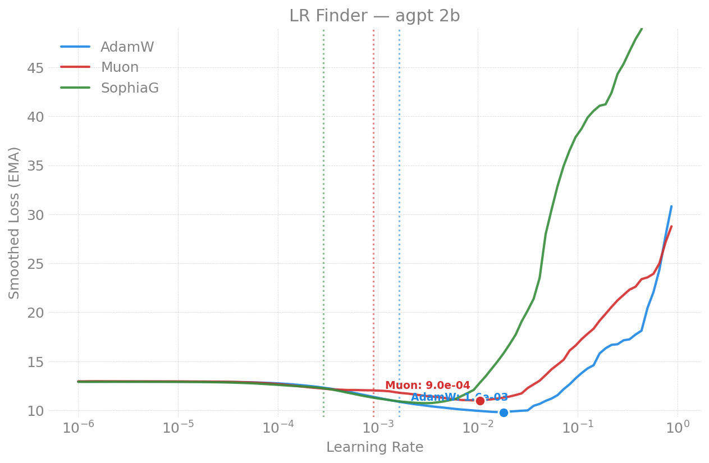
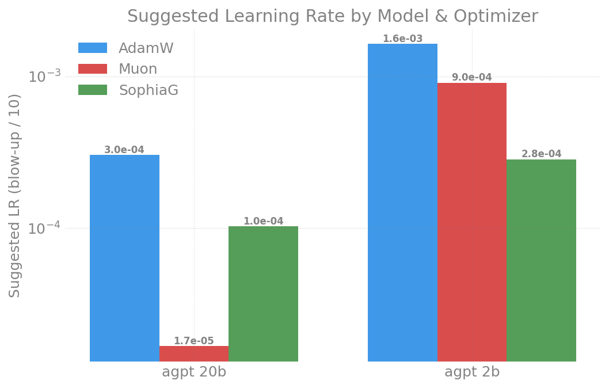
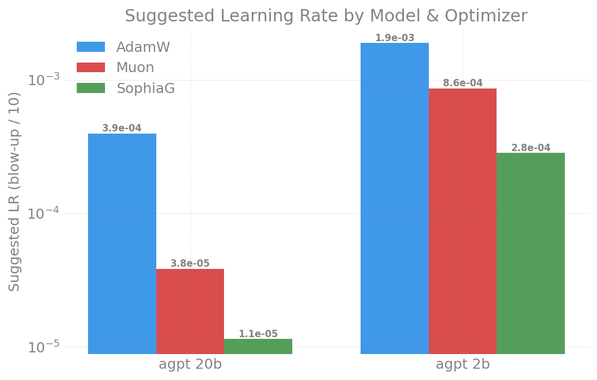

# LR Finder -- agpt (Dense)

All learning-rate-finder results for the dense **agpt** (AuroraGPT) models,
consolidated across machines (Aurora / Sunspot / Polaris) and dates. For how
the finder works, its knobs, and usage, see the
[parent README](../README.md).

Figures live in [`figures/`](figures/) with a machine prefix
(`aurora_*`, `sunspot_*`, `polaris_*`).

## Recommended Learning Rates

Small-batch finder (`sqrt(2/(5*d))` weight init, 5% warmup, Sunspot 2026-04-14,
GBS at the 2-node default):

| Model | AdamW   | Muon    | SophiaG |
|-------|---------|---------|---------|
| 2B    | **1.3e-3**| **2.4e-3**| **3.1e-4**|
| 20B   | **4.0e-4**| **1.7e-4**| **1.8e-5**|
| 80B (small batch, GBS=192) | **1.1e-5** | N/A[1] | N/A[1] |

[1] At GBS=192, Muon/SophiaG NaN'd: bf16 overflow in Newton-Schulz (Muon) and
Hessian estimate (SophiaG) on 9216-dim matrices. See the
[2026-04-21 80B section](#2026-04-21----80b--gas-sweep-sunspot). **At the
production batch GBS=6144 SophiaG is NOT broken** (real U-min at lr~2.5e-6);
only Muon stays broken -- see the
[2026-06-27 section](#2026-06-27----80b-at-the-production-batch-gbs6144-sunspot).

> **80B at the PRODUCTION batch (GBS=6144) is different -- the small-batch
> number above does NOT transfer.** Re-running the finder at the real
> production batch (32x larger) shows AdamW's usable LR collapses from
> 1.1e-5 to **~7e-7** (a NaN cliff, not a clean blow-up), so the production
> default LR=1e-6 sits *on the cliff*. **mano** (marked N/A at small batch)
> is the best-behaved optimizer at GBS=6144 -- a clean U-min at **1.6e-5**,
> no divergence, lower loss than AdamW.
>
> | Optimizer @ GBS=6144 | usable LR | min loss | behavior |
> |---|---|---|---|
> | **mano** | **~1.6e-5 (use ~3e-6)** | 12.62 | **clean broad U-min, 0 NaN** |
> | **sophiag** | ~2.5e-6 (use ~1e-6) | **12.60** | real U-min, 0 NaN, narrower band |
> | AdamW | ~7e-7 (use ~5e-7) | 12.78 | NaN cliff at 1.36e-6 |
> | muon | -- | -- | broken (NaN from step 7) |
>
> Note **sophiag is NOT broken at this batch** (it was at GBS=192) -- only
> muon still overflows. Full detail in the
> [2026-06-27 production-batch section](#2026-06-27----80b-at-the-production-batch-gbs6144-sunspot)
> below. **Recommendation: do not run AdamW @ 1e-6 at GBS=6144; mano is the
> safest 80B production optimizer, sophiag a viable second.**

## Key Findings (cross-machine)

1. **Optimizer sensitivity:** `AdamW (most tolerant) > Muon > SophiaG (most sensitive)`
2. **Model scaling:** Larger models need lower LRs. Muon/SophiaG scale more
   aggressively (~N^-0.5) than AdamW (~N^-0.25).
3. **Blow-up severity:** SophiaG diverges catastrophically (loss 7,000+) vs
   gradual blow-up for AdamW (loss ~60). SophiaG requires tighter LR scheduling.
4. **Cross-hardware consistency:** Suggested LRs match within 2x across Intel
   XPU (Aurora, Sunspot) and NVIDIA A100 (Polaris).
5. **Batch dependence (80B):** the optimal/ceiling LR shifts strongly with
   batch size; a small-batch sweep cannot calibrate a large-batch production
   LR (see the GBS=6144 section).

### Cross-Machine Comparison -- agpt 2B

| Optimizer | Aurora (std=0.02) | Sunspot (sqrt(2/5d)) | Polaris (std=0.02) |
|-----------|--------|---------|---------|
| **AdamW** suggested LR | 2e-3 | 1.3e-3 | 2e-3 |
| **Muon** suggested LR | 8e-4 | **2.4e-3** | 1e-3 |
| **SophiaG** suggested LR | 3e-4 | 3.1e-4 | 3e-4 |

### Cross-Machine Comparison -- agpt 20B

| Optimizer | Aurora (std=0.02) | Sunspot (sqrt(2/5d)) | Polaris (std=0.02) |
|-----------|--------|---------|---------|
| **AdamW** suggested LR | 4e-4 | 4.0e-4 | 4e-4 |
| **Muon** suggested LR | 4e-5 | **1.7e-4** | -- |
| **SophiaG** suggested LR | 1e-5 | 1.8e-5 | -- |

**Takeaway:** AdamW and SophiaG are robust to weight init changes. Muon is
sensitive -- `sqrt(2/(5*d))` init allows 3-10x higher LRs vs fixed `std=0.02`.
This is because Muon's orthogonal momentum amplifies gradient scale differences.

---

## 2026-06-27 -- 80B at the PRODUCTION batch (GBS=6144, Sunspot)

> **This supersedes the 80B row of the small-batch recommendation table.**
> The earlier 80B finder (2026-04-21) ran at the 2-node default batch
> (**GBS=192**) and gave "AdamW = 1.1e-5". At the real production batch
> (**GBS=6144**, 32x larger) that LR diverges: AdamW's usable ceiling
> collapses to **~7e-7**, and the production default LR=1e-6 sits **on the
> NaN cliff**. mano -- marked "N/A / broken" in the old table -- is actually
> the **best-behaved optimizer at this batch**.
>
> **Two-part correction to the "SophiaG/Muon broken at 80B" claim:** at this
> batch **sophiag is NOT broken** -- it runs all 15 steps finite with a real
> minimum at lr~2.5e-6 and the *lowest loss of all four optimizers* (12.60).
> Only **muon** is broken as documented (NaN from step 7). The old "both NaN
> regardless of LR" line came from the GBS=192 finder; the larger batch
> smooths sophiag's Hessian `grad*grad` term below the bf16 overflow
> threshold. (mano stays the safest production pick -- see below.)

### Why redo the finder at GBS=6144

Optimal LR is batch-size dependent, and 80B production runs at GBS~6144
(512N-equiv) -- 32x the GBS=192 the old finder used. Calibrating from the
small batch mis-predicts the production LR by ~14x. This sweep runs the
finder **at the production batch** (TP=4 / LBS=1 / GAS=32 -> GBS=6144,
dp_degree=192), one job per optimizer.

### Environment

| Field | Value |
|-------|-------|
| Date | 2026-06-27 |
| Machine | Sunspot |
| Nodes | 64 (768 XPU tiles), TP=4 / LBS=1 / GAS=32 |
| GBS | **6144** (production batch) |
| Compile | disabled (80B AC+TP regression) |
| Seq len | 8192 |
| LR range | 1e-8 -> 1e-4, 15 steps (adamw 1e-6 -> 1e-3) |
| Jobs | adamw 12469723, mano 12469724, muon 12469725, sophiag 12469726 |

### Headline result: all four optimizers at the production batch

| Optimizer | behavior @ GBS=6144 | usable LR | min loss | NaN | verdict |
|-----------|---------------------|-----------|----------|-----|---------|
| **mano** | clean broad **U-curve** | ~1.6e-5 (min-bounded) | 12.62 @ 1.6e-5 | 0/15 | **best (safest) production pick** |
| **sophiag** | real **U-min**, blow-up onset ~4.6e-6 | ~2.5e-6 (min-bounded) | **12.60 @ 2.5e-6** (lowest of all four) | 0/15 | **NOT broken at this batch** |
| **AdamW** | NaN **cliff** (no minimum in range) | ~7.4e-7 (cliff-bounded) | 12.78 @ 7.4e-7 | 7/15 | **1e-6 is past the cliff** (NaN @ 1.36e-6) |
| muon | NaN from step 7 (~4e-7) | -- | (12.91) | 9/15 | broken as documented (bf16 dim=9216) |

- **mano**: a textbook LR-finder U -- descends to a real minimum at
  lr=1.6e-5 (loss 12.62) then rises gently, no divergence across the whole
  1e-8 -> 5.4e-5 sweep. **~20x more LR headroom than AdamW with a soft top.**
- **sophiag**: descends cleanly to a real minimum at lr=2.5e-6 (loss 12.60,
  the lowest of all four), then blows up sharply (grad_norm 14 -> 85 -> 132
  over steps 10 -> 12). **Directly contradicts the GBS=192 finding that
  sophiag NaNs by step 7 regardless of LR** -- at GBS=6144 it has a usable
  region and the best minimum. Narrower safe band than mano, though.
- **AdamW**: loss descends monotonically to lr=7.4e-7 (12.78), then NaNs
  at 1.36e-6 -- no minimum, just a wall. The production LR=1e-6 lands
  *between* the last stable point and the NaN, explaining the
  nondeterministic NaNs observed on GBS~6000 production attempts.
- **muon**: NaN from step 7 (lr~4e-7) onward, exactly as the GBS=192 finder
  reported -- the Newton-Schulz `A @ A` (9216x9216) overflow is not relieved
  by the larger batch the way sophiag's Hessian term is.

> **Data note:** the GBS=6144 AdamW numbers here come from the figures /
> per-experiment record below, not from the live `.../80B/adamw/
> lr_finder_data.csv` -- that CSV is keyed by `(model, optimizer)` only, so
> the later GBS=2304 and GBS=288 trend probes overwrote the GBS=6144 AdamW
> rows in place. The mano/sophiag/muon CSVs are unique (their optimizer ran
> only at GBS=6144) and are stamped `global_batch_size=6144, world_size=768`.

(The finder's auto `lr_vs_loss.png` for this run is misleading -- it drops
the NaN sweep points and its derivative annotations misfire on the
near-flat 80B floor. These figures are rebuilt from the CSV to show the
real cliff.)

### Batch dependence (the reason the old number was wrong)

| Finder batch | AdamW usable-LR ceiling |
|---|---|
| GBS=192 (2026-04-21) | ~1.1e-5 (clean blow-up) |
| **GBS=6144 (this run)** | **~7.4e-7 (NaN cliff)** |

~14x lower ceiling at the production batch, AND a change of failure mode
(clean blow-up -> hard NaN cliff). A small-batch finder cannot be trusted
to set a large-batch production LR for AdamW at 80B.

### Production recommendation

1. **Do not run AdamW at LR=1e-6 at GBS=6144** -- it is on the NaN cliff.
   If staying on AdamW, use **~5e-7** (under the 7.4e-7 stable point).
2. **Strongly consider mano as the 80B production optimizer at this batch**
   -- no cliff, ~20x LR headroom, soft top. Suggested mano LR **~3e-6**
   (min/5). mano is the *safest* pick: the widest margin between a usable LR
   and divergence.
3. **sophiag is a viable second** (no longer "broken" at this batch): it has
   the lowest minimum loss (12.60) but a narrower safe band -- blow-up onset
   is only ~2x above its minimum (2.5e-6 -> 4.6e-6), vs mano's gentle rise.
   If trying sophiag, stay conservative: LR **~1e-6** (min/2.5) with tight
   grad clipping.
4. **Confirm with a head-to-head convergence run** (mano @ ~3e-6 vs sophiag
   @ ~1e-6 vs AdamW @ ~5e-7, GBS=6144) before locking the config -- the
   finder measures early-step stability/descent, not full convergence.

Raw per-experiment record + the in-progress LR-ceiling-vs-GBS trend sweep
(8N probes, GBS=144..4608):
[`docs/experiments/agpt/sunspot/2026-06-27-80b-lr-finder-production-batch.md`](../../agpt/sunspot/2026-06-27-80b-lr-finder-production-batch.md).

---

## 2026-04-21 -- 80B + GAS sweep (Sunspot)

First empirical 80B LR finder (previously extrapolated only), 2 nodes / 24 XPU
tiles, torch 2.13, compile disabled, seq_len=8192, LR 1e-6 -> 1.0 over 100 steps.

| Optimizer | Suggested LR | Blow-up | NaN Count | Status |
|-----------|-------------|---------|-----------|--------|
| **AdamW** | **1.13e-5** | 1.13e-4 | 0/100 | Clean sweep |
| **Muon** | N/A | NaN at step 7 | 93+/100 | Broken (bf16 overflow) |
| **SophiaG** | N/A | NaN at step 7 | 93+/100 | Broken **at GBS=192** (see note) |

**Muon/SophiaG bf16 overflow** -- both produce NaN regardless of LR at 80B
(dim=9216): Muon's Newton-Schulz `A @ A` (9216x9216 matmul) overflows bf16,
SophiaG's Hessian estimate `grad * grad` overflows bf16. Confirmed
LR-independent (NaN even at LR=1e-8). fp32 Newton-Schulz delays Muon NaN to
step 16 but is 6x slower -- not viable. Overflow is model-size-specific: 20B
(dim=5120) works fine for both.

> **Correction (2026-06-27): the SophiaG "broken at 80B" verdict is
> batch-specific.** At the production batch GBS=6144, SophiaG runs all 15
> finder steps finite with a real minimum at lr~2.5e-6 (loss 12.60) -- the
> larger batch smooths its Hessian `grad*grad` estimate below the bf16
> overflow threshold. **Muon stays broken regardless of batch.** See the
> [2026-06-27 production-batch section](#2026-06-27----80b-at-the-production-batch-gbs6144-sunspot).

### 2B/20B verification (torch 2.13, compile enabled)

| Model | Optimizer | NaN | Suggested LR | Blow-up |
|-------|-----------|-----|-------------|---------|
| 2B | AdamW | 0/100 | ~8e-4 | ~8e-3 |
| 2B | Muon | 0/100 | ~7e-4 | ~7e-3 |
| 2B | SophiaG | 2/100 | ~5e-7 | ~5e-6 |
| 20B | AdamW | 0/100 | ~4.6e-5 | ~4.6e-4 |
| 20B | Muon | 0/100 | ~7.4e-4 | ~7.4e-3 |
| 20B | SophiaG | 7-9/100 | ~4.6e-7 | ~4.6e-6 |

### GAS (gradient accumulation) sweep -- 2B AdamW

| GAS | GBS | NaN | Suggested LR | Blow-up |
|-----|-----|-----|-------------|---------|
| 1 (baseline) | 24 | 0 | ~8e-4 | ~8e-3 |
| 4 | 96 | 0 | 8.58e-4 | 8.58e-3 |
| 8 | 192 | 0 | 9.03e-4 | 9.03e-3 |
| 16 | 384 | 0 | 4.90e-4 | 4.90e-3 |

Optimal LR is relatively stable across GBS for 2B AdamW (4.9e-4 .. 9.0e-4
across 16x GBS), no strong scaling at this small scale; 20B GAS=4/8/16 all
completed with 0 NaN. **Caveat (now confirmed by the GBS=6144 run above):
the GBS=192 ceiling does NOT extrapolate to production batch for 80B.**

---

## 2026-04-14 -- 2B/20B (Sunspot, dim-aware init)

2 nodes / 24 XPU tiles, 100 finder steps (5 warmup + 95 sweep), LR 1e-6 -> 1.0,
weight init `sqrt(2/(5*d))` (dim-aware), blendcorpus (books).

| Model | Optimizer | Blow-up LR | Suggested LR |
|-------|-----------|-----------|-------------|
| 2B  | AdamW   | 1.30e-2 | **1.3e-3** |
| 2B  | Muon    | 2.36e-2 | **2.4e-3** |
| 2B  | SophiaG | 3.08e-3 | **3.1e-4** |
| 20B | AdamW   | 3.95e-3 | **4.0e-4** |
| 20B | Muon    | 1.65e-3 | **1.7e-4** |
| 20B | SophiaG | 1.82e-4 | **1.8e-5** |

**Effect of dim-aware init** -- `sqrt(2/(5*d))` (vs fixed `std=0.02`) most
affects Muon: 2B Muon 7.5e-4 -> 2.4e-3 (3x), 20B Muon 1.7e-5 -> 1.7e-4 (10x);
AdamW and SophiaG relatively unaffected. Smaller init weights mean smaller
gradients, so Muon can tolerate higher LRs.

| | |
|---|---|
|  |  |
|  | |

---

## 2026-04-13 -- 2B/20B (Polaris, NVIDIA A100)

2 nodes / 8 A100-40GB, 100 finder steps, LR 1e-6 -> 1.0, fixed `std=0.02` init,
blendcorpus (books), NCCL.

| Model | Optimizer | Min Loss | LR @ Min | Blow-up LR | Suggested LR | Final Loss |
|-------|-----------|----------|----------|-----------|-------------|-----------|
| 2B  | AdamW   | 9.80  | 1.8e-2 | ~3e-2   | **2e-3** | 30.8 |
| 2B  | Muon    | 11.01 | 1.0e-2 | ~1.5e-2 | **1e-3** | 28.8 |
| 2B  | SophiaG | 10.73 | 3.0e-3 | ~4e-3   | **3e-4** | NaN  |
| 20B | AdamW   | 11.38 | 3.5e-3 | ~8e-3   | **4e-4** | 85.7 |
| 20B | Muon    | 12.59 | 1.7e-4 | ~3e-4   | **2e-5** | 66.0 |
| 20B | SophiaG | 11.64 | 1.0e-3 | ~2e-3   | **1e-4** | NaN  |

**Cross-hardware consistency:** LR finder curves agree within ~1.5x across
A100 (Polaris) and Intel Max 1550 (Aurora) -- optimal LR is a property of the
model+optimizer, not the hardware. Minor loss differences reflect bf16 numerics.

W&B: [2B AdamW](https://wandb.ai/aurora_gpt/torchtitan.ezpz.train/runs/2tz2slwx),
[2B Muon](https://wandb.ai/aurora_gpt/torchtitan.ezpz.train/runs/qng9p17h),
[2B SophiaG](https://wandb.ai/aurora_gpt/torchtitan.ezpz.train/runs/lj866hrb),
[20B AdamW](https://wandb.ai/aurora_gpt/torchtitan.ezpz.train/runs/9vx92cl7).

| | |
|---|---|
|  |  |
|  | |

---

## 2026-04-12 -- 2B/20B (Aurora, first run)

2 nodes / 24 XPU tiles, 100 finder steps, LR 1e-6 -> 1.0, fixed `std=0.02` init,
blendcorpus (books), xccl.

| Model | Optimizer | Min Loss | LR @ Min | Blow-up LR | Suggested LR | Final Loss |
|-------|-----------|----------|----------|-----------|-------------|-----------|
| 2B  | AdamW   | 9.76  | 2.1e-2 | ~3e-2 | **2e-3** | 26.8   |
| 2B  | Muon    | 11.29 | 7.9e-3 | ~1e-2 | **8e-4** | 26.2   |
| 2B  | SophiaG | 10.29 | 2.6e-3 | ~4e-3 | **3e-4** | 294.6  |
| 20B | AdamW   | 11.43 | 4.0e-3 | ~5e-3 | **4e-4** | 57.1   |
| 20B | Muon    | 12.51 | 3.8e-4 | ~5e-4 | **4e-5** | 67.9   |
| 20B | SophiaG | 12.40 | 1.3e-4 | ~2e-4 | **1e-5** | 7528.9 |
| 80B | all     | --    | --     | --    | --       | OOM    |

**80B OOM:** could not complete on 2 Aurora nodes (24 XPUs). At TP=2, memory
is 93.5% of 64 GiB, no headroom for finder state -- needs higher TP or more
nodes (resolved in the 2026-04-21 run via compile=OFF). SophiaG shows
catastrophic divergence (20B loss > 7500) vs AdamW/Muon (~60).

| | |
|---|---|
|  |  |
|  | |

---

## Reports index

| Date | Machine | Models | Optimizers | Nodes | Key Result |
|------|---------|--------|-----------|-------|------------|
| [2026-06-27](#2026-06-27----80b-at-the-production-batch-gbs6144-sunspot) | Sunspot | 80B | AdamW, mano | 64 | AdamW cliffs @ ~7e-7 at GBS=6144; mano U-min 1.6e-5, better |
| [2026-04-21](#2026-04-21----80b--gas-sweep-sunspot) | Sunspot | 80B + 2B/20B GAS | AdamW, Muon, SophiaG | 2 | 80B AdamW (small batch) 1.1e-5; Muon/SophiaG broken at 80B |
| [2026-04-14](#2026-04-14----2b20b-sunspot-dim-aware-init) | Sunspot | 2B, 20B | AdamW, Muon, SophiaG | 2 | dim-aware init: Muon 3-10x higher LR |
| [2026-04-13](#2026-04-13----2b20b-polaris-nvidia-a100) | Polaris | 2B, 20B | AdamW, Muon, SophiaG | 2 | Reproduces Aurora; cross-hardware LR consistency |
| [2026-04-12](#2026-04-12----2b20b-aurora-first-run) | Aurora | 2B, 20B | AdamW, Muon, SophiaG | 2 | AdamW most tolerant; SophiaG 10x lower LR; 80B OOM |
