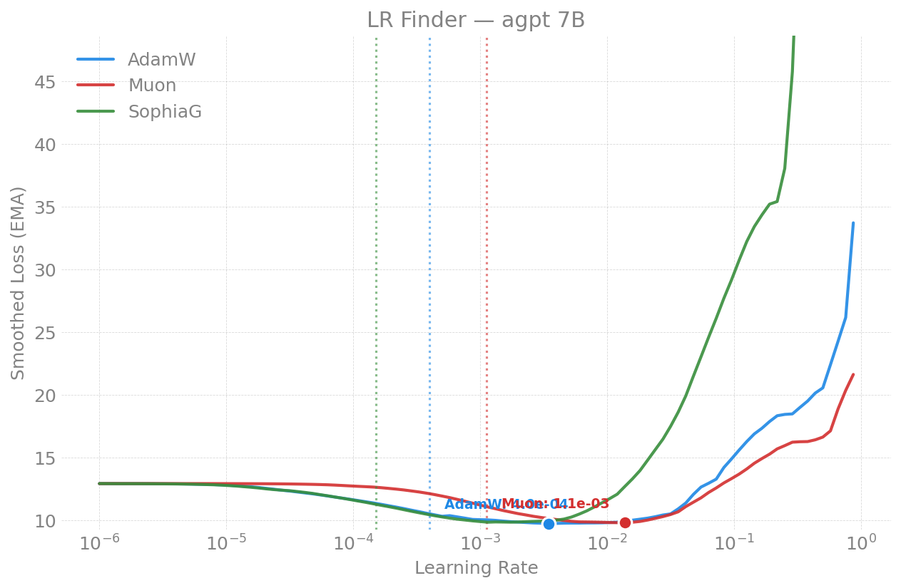

# LR Finder -- moe 7B (36 experts)

Part of the [moe LR-finder index](../README.md); methodology in the
[parent README](../../README.md). Figures in [`figures/`](figures/).

## 2026-04-21 (Sunspot, 2N, torch 2.13, compile on, seq_len=8192, LBS=1)

| Optimizer | NaN | Suggested LR | Blow-up | Status |
|-----------|-----|-------------|---------|--------|
| AdamW   | 0 | 3.99e-4 | 3.99e-3 | clean (representative MoE optimum) |
| Muon    | 0 | -- | -- | ok |
| SophiaG | 5 | -- | -- | mild instability at high LR only |

> Note: `moe_10b_2b_sdpa` (36 experts) was also attempted in this sweep but
> OOM'd at seq_len=8192 (needs seq_len=4096 or more nodes -- at LBS=1 it uses
> ~62 GiB/tile, over the 64 GiB limit). No finder data.
