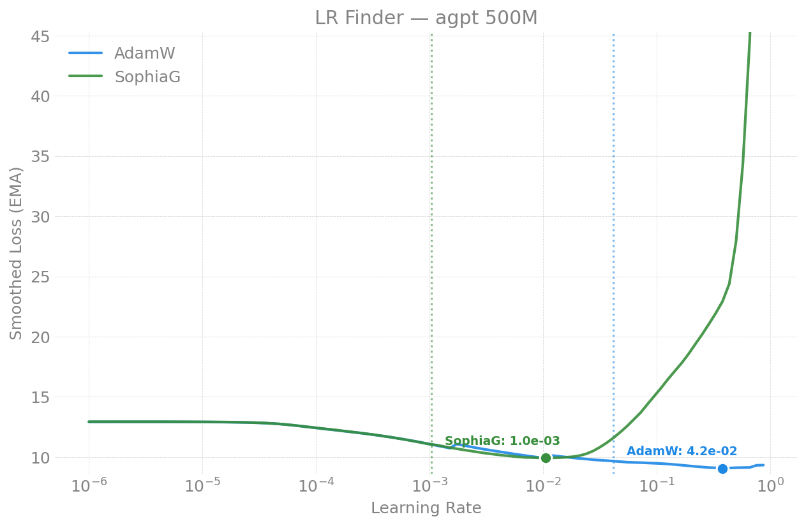
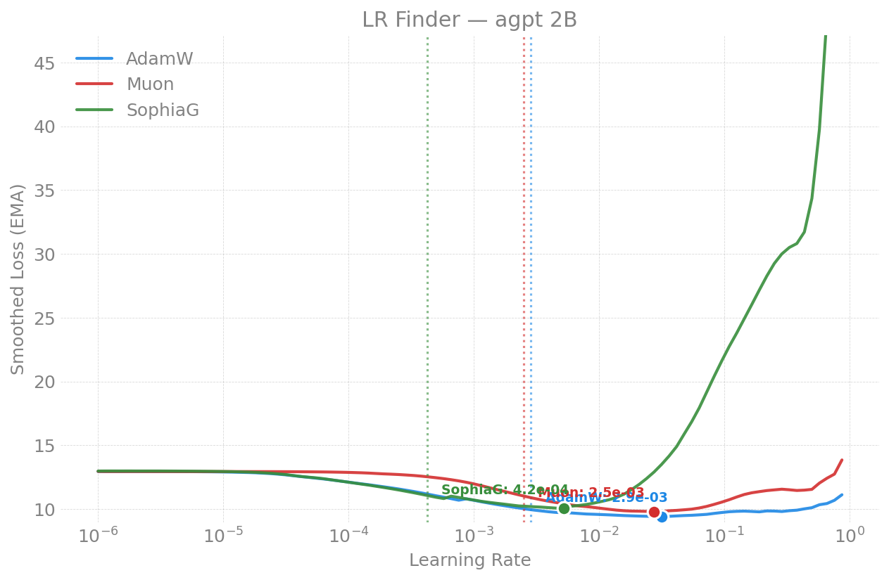
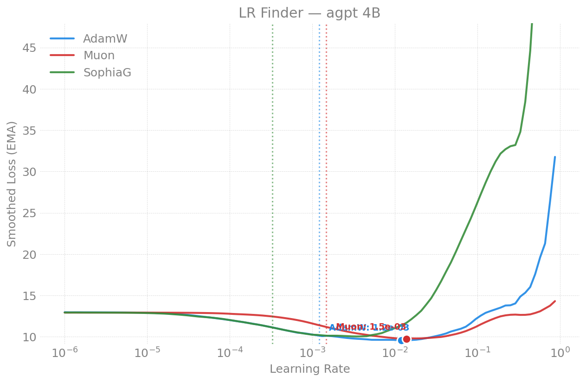

# LR Finder -- moe (Sparse)

Learning-rate-finder results for the sparse **moe** (DeepSeek-style) models.
For how the finder works, its knobs, and usage, see the
[parent README](../README.md). Figures live in [`figures/`](figures/).

---

## 2026-04-21 -- MoE configs (Sunspot)

2 nodes / 24 XPU tiles, torch 2.13, compile enabled, vocab 256128 (Gemma),
seq_len=8192, LBS=1, LR 1e-6 -> 1.0 over 100 steps.

### AdamW

| Config | Experts | NaN | Suggested LR | Blow-up |
|--------|---------|-----|-------------|---------|
| debugmodel | 8 | 0 | 1.49e-7* | 1.49e-6* |
| 500M | 16 | 0 | 4.17e-2 | 4.17e-1 |
| 2B | 24 | 0 | 1.72e-7* | 1.72e-6* |
| 4B | 24 | 0 | 1.22e-3 | 1.22e-2 |
| 7B | 36 | 0 | 3.99e-4 | 3.99e-3 |
| 10b_2b_sdpa | 36 | -- | -- | OOM at seq_len=8192 |

### Muon

| Config | Experts | NaN | Status |
|--------|---------|-----|--------|
| debugmodel | 8 | -- | expired (Muon NS overhead too slow) |
| 500M | 16 | -- | expired |
| 2B | 24 | 0 | ok |
| 4B | 24 | 0 | ok |
| 7B | 36 | 0 | ok |

### SophiaG

| Config | Experts | NaN | Status |
|--------|---------|-----|--------|
| debugmodel | 8 | 0 | ok |
| 500M | 16 | 0 | ok |
| 2B | 24 | 0 | ok |
| 4B | 24 | 1 | mild instability at high LR |
| 7B | 36 | 5 | mild instability at high LR |

*Very low suggested LRs for debugmodel and 2B are likely derivative-analysis
artifacts -- early noise in the loss curve triggers false blow-up detection.
The 4B (1.22e-3) and 7B (3.99e-4) values are more representative.

### Key Findings

1. **All MoE models are numerically stable** -- Muon and SophiaG both work
   (unlike 80B dense where they crash). The MoE model dim=2048 is well below
   the bf16 overflow threshold (9216).
2. **AdamW is universally clean** -- 0 NaN across all 5 configs tested.
3. **SophiaG has mild instability** -- 1 NaN on 4B at high LR only. Not a
   structural issue like the 80B overflow.
4. **Muon is disproportionately slow on small MoE models** -- the
   Newton-Schulz iteration overhead dominates compute for debugmodel and 500M,
   causing 2-hour job timeouts.
5. **10b_2b_sdpa OOMs at seq_len=8192** -- needs seq_len=4096 or more nodes.
   At LBS=1 and seq_len=8192, the model uses ~62 GiB per tile, exceeding the
   64 GiB limit.

| | |
|---|---|
|  |  |
|  |  |
|  |  |

---

## Reports index

| Date | Machine | Configs | Optimizers | Nodes | Key Result |
|------|---------|---------|-----------|-------|------------|
| [2026-04-21](#2026-04-21----moe-configs-sunspot) | Sunspot | debugmodel/500M/2B/4B/7B | AdamW, Muon, SophiaG | 2 | All stable; 0 NaN AdamW/Muon; 10b OOM at 8192 |
