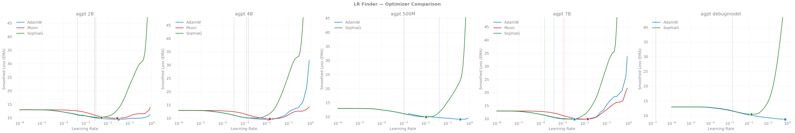
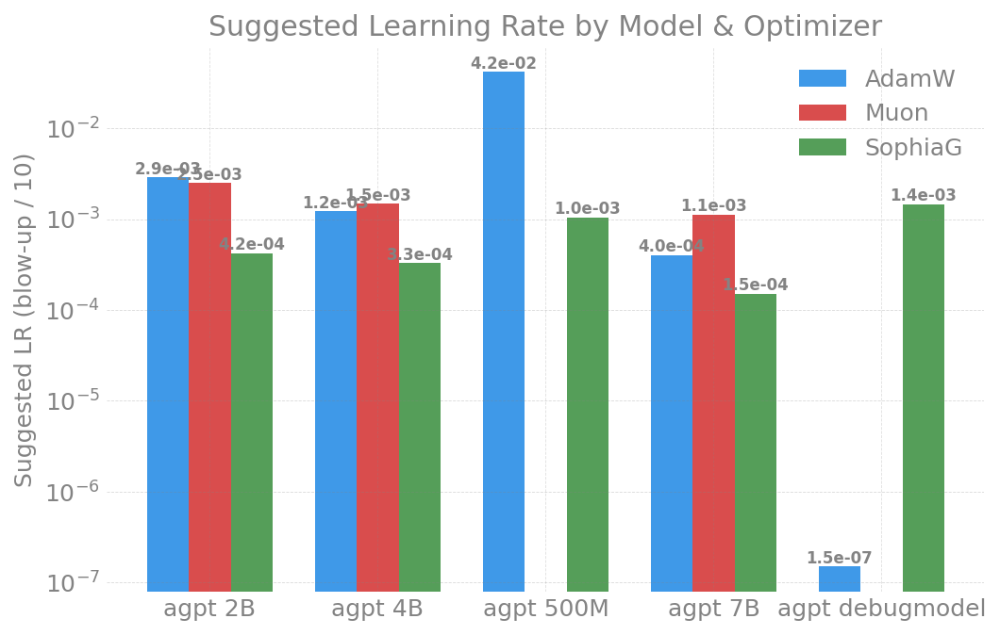

# LR Finder -- moe (Sparse) -- index

Learning-rate-finder results for the sparse **moe** (DeepSeek-style) models.
This page is the cross-config index; per-config detail lives in its own page.
For how the finder works, its knobs, and usage, see the
[methodology README](../README.md). Index-level cross-config figures are in
[`figures/`](figures/); single-config figures live under each config page.

Per-config pages (all from the 2026-04-21 Sunspot sweep):

- [debugmodel (8 experts)](debugmodel/README.md)
- [500M (16 experts)](500m/README.md)
- [2B (24 experts)](2b/README.md)
- [4B (24 experts)](4b/README.md)
- [7B (36 experts)](7b/README.md)

## 2026-04-21 -- MoE sweep summary (Sunspot)

2 nodes / 24 XPU tiles, torch 2.13, compile enabled, vocab 256128 (Gemma),
seq_len=8192, LBS=1, LR 1e-6 -> 1.0 over 100 steps.

| Config | Experts | AdamW LR | AdamW NaN | Muon | SophiaG |
|--------|---------|----------|-----------|------|---------|
| [debugmodel](debugmodel/README.md) | 8  | 1.49e-7* | 0 | expired (slow) | 0 NaN |
| [500M](500m/README.md)             | 16 | 4.17e-2  | 0 | expired (slow) | 0 NaN |
| [2B](2b/README.md)                 | 24 | 1.72e-7* | 0 | ok | 0 NaN |
| [4B](4b/README.md)                 | 24 | **1.22e-3** | 0 | ok | 1 NaN (high LR) |
| [7B](7b/README.md)                 | 36 | **3.99e-4** | 0 | ok | 5 NaN (high LR) |
| 10b_2b_sdpa                        | 36 | -- | -- | -- | OOM at seq_len=8192 |

*Very low suggested LRs for debugmodel and 2B are likely derivative-analysis
artifacts -- early noise in the loss curve triggers false blow-up detection.
The 4B (1.22e-3) and 7B (3.99e-4) values are more representative.

### Key Findings

1. **All MoE models are numerically stable** -- Muon and SophiaG both work
   (unlike 80B dense where they crash). The MoE model dim=2048 is well below
   the bf16 overflow threshold (9216).
2. **AdamW is universally clean** -- 0 NaN across all 5 configs tested.
3. **SophiaG has mild instability** -- 1 NaN on 4B at high LR only. Not a
   structural issue like the 80B overflow.
4. **Muon is disproportionately slow on small MoE models** -- the
   Newton-Schulz iteration overhead dominates compute for debugmodel and 500M,
   causing 2-hour job timeouts.
5. **10b_2b_sdpa OOMs at seq_len=8192** -- needs seq_len=4096 or more nodes.
   At LBS=1 and seq_len=8192, the model uses ~62 GiB per tile, exceeding the
   64 GiB limit.

---

## Reports index

| Date | Machine | Configs | Optimizers | Nodes | Key Result |
|------|---------|---------|-----------|-------|------------|
| 2026-04-21 | Sunspot | debugmodel/500M/2B/4B/7B | AdamW, Muon, SophiaG | 2 | All stable; 0 NaN AdamW/Muon; 10b OOM at 8192 |
