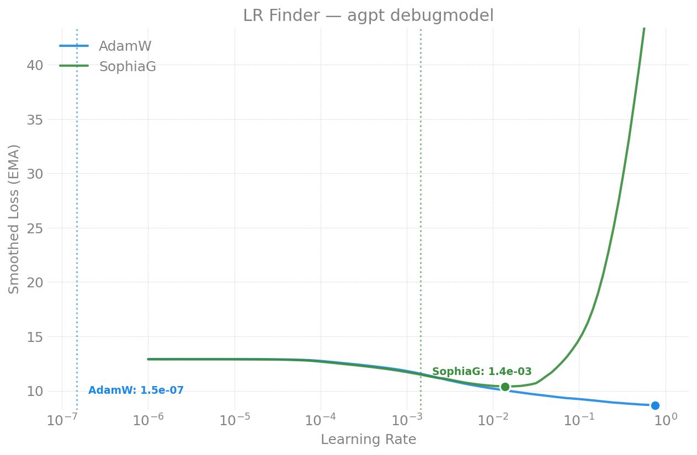

# LR Finder -- moe debugmodel (8 experts)

Part of the [moe LR-finder index](../README.md); methodology in the
[parent README](../../README.md). Figures in [`figures/`](figures/).

## 2026-04-21 (Sunspot, 2N, torch 2.13, compile on, seq_len=8192, LBS=1)

| Optimizer | NaN | Suggested LR | Blow-up | Status |
|-----------|-----|-------------|---------|--------|
| AdamW   | 0 | 1.49e-7* | 1.49e-6* | clean |
| Muon    | -- | -- | -- | expired (Newton-Schulz overhead too slow) |
| SophiaG | 0 | -- | -- | clean |

*The very low AdamW suggested LR is likely a derivative-analysis artifact --
early noise in the loss curve triggers false blow-up detection at this small
config. The 4B/7B values are more representative of the real MoE optimum.

