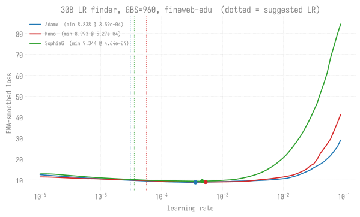
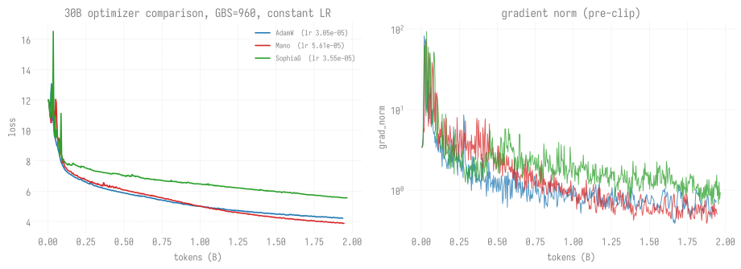
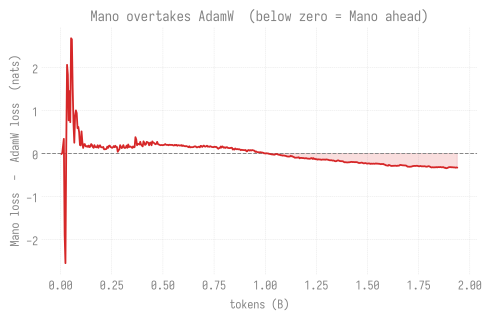

# Fixed-batch optimizer comparison: AdamW vs Mano vs SophiaG

**Model:** agpt 30B (26.2B params), OLMo-2 tokenizer (100,352 vocab), seq 4096.
**Status:** COMPLETE. Both healthy arms ran to the `training.steps=6000`
ceiling on 2026-08-29 -- 23.59B tokens each, `rc=0`, 0 NaN/inf, 0 grad skips.
**[W&B report](https://api.wandb.ai/links/aurora_gpt/0em3ktti)** &middot;
[project `agpt-30b-optcmp`](https://wandb.ai/aurora_gpt/agpt-30b-optcmp)

## RESULT: Mano wins at the 10B budget

Both healthy arms crossed the 10B target (step 2,543 at GBS=960 x 4096 =
3.93M tok/step). Final numbers at and around the budget line:

| step | tokens | AdamW | Mano | Mano - AdamW |
|---:|---:|---:|---:|---:|
| 2400 | 9.43B | 2.9492 | **2.8016** | -0.1477 |
| 2500 | 9.82B | 2.9161 | **2.7683** | -0.1479 |
| **2543** | **9.99B** | **2.9134** | **2.7701** | **-0.1433** |
| 2590 | 10.18B | 2.9069 | **2.7643** | -0.1426 |

**Mano finishes 0.143 nats ahead of AdamW at 10B tokens**, having led since
the crossover at ~1.0B. SophiaG is disqualified -- it diverged in **4 of 4**
replicates: three forks of one checkpoint (steps 1048, 1176, 1071) plus an
independent from-scratch run with `--debug.seed=1234` pinned (step ~1550).
That fourth arm also showed **no precursor**: 1,529 steps at 0.0% excursions
before onset, where the original arm ran 17.9%. See
[the known-bugs writeup](../../guides/known-bugs/sophiag-stochastic-divergence-30b.md).

The gap flattened rather than closed. Refit on the last billion tokens the
closing rate is +0.0056 nats/B against +0.0252 over 5.9-7.5B, which puts a
crossover at ~35B rather than the ~10B a whole-span fit suggested. AdamW does
not catch Mano within any horizon this experiment reaches.

### Confirmed by a +10B continuation, to ~21.6B tokens

Both arms were resumed from step 2800 and run a further 10B tokens, reaching
steps 5504 (AdamW) and 5491 (Mano). Mean loss per 250-step window:

| window | AdamW | Mano | gap |
|---:|---:|---:|---:|
| 2750 | 2.85076 | **2.71296** | -0.1378 |
| 3000 | 2.79227 | **2.65386** | -0.1384 |
| 3250 | 2.76546 | **2.63579** | -0.1297 |
| 3500 | 2.74284 | **2.62022** | -0.1226 |
| 3750 | 2.71802 | **2.60138** | -0.1167 |
| 4000 | 2.69667 | **2.58457** | -0.1121 |
| 4250 | 2.67590 | **2.56922** | -0.1067 |
| 4500 | 2.65860 | **2.55581** | -0.1028 |
| 4750 | 2.64135 | **2.54271** | -0.0987 |
| 5000 | 2.62479 | **2.52999** | -0.0948 |
| 5250 | 2.60907 | **2.51798** | -0.0911 |

Both arms then ran on to the configured ceiling. Final windows:

| window | AdamW | Mano | gap |
|---:|---:|---:|---:|
| 5500 | 2.59550 | **2.51625** | -0.0793 |
| 5750 | 2.57410 | **2.52161** | -0.0525 |
| 6000 | 2.51357 | **2.43889** | -0.0747 |

**Final: AdamW 2.51357, Mano 2.43889 at step 6000 / 23.59B tokens -- Mano
ahead by 0.075 nats.**

The narrowing is monotone from 2750 through 5500 (-0.1378 -> -0.0793, about
0.0187 nats per 1,000 steps) and then REVERSES over the last two windows. The
reversal is not a change in trend: the 5750 window contains a transient
disturbance in the Mano arm (see below) that temporarily raised its mean loss,
and 6000 contains the rebound to its best loss of the run. Fitting a crossover
through the tail would read that detour as signal. Fit on 2750-5500 and the
implied crossover is ~40B tokens, consistent with the ~35B from the 10B run's
tail and far outside any budget this comparison would spend.

### The fresh SophiaG replicate finished FIRST on loss

The independent seeded replicate (`TAG=fresh-seed1234`) ran 5,080 steps from
random init and finished at **2.43156**, ahead of both healthy arms. All three
arms log from step 10 with step-aligned histories, so equal step is equal
tokens and this is a like-for-like comparison:

| step | AdamW | Mano | SophiaG fresh |
|---:|---:|---:|---:|
| 3000 | 2.81825 | 2.67857 | **2.59921** |
| 3500 | 2.76576 | 2.63788 | **2.56017** |
| 4000 | 2.70875 | 2.59240 | **2.51426** |
| 4500 | 2.68131 | 2.57592 | **2.50088** |
| 5000 | 2.64644 | 2.55030 | **2.47070** |
| 5080 | 2.60621 | 2.51114 | **2.43156** |

It leads by ~0.08 nats over Mano and ~0.17 over AdamW, consistently, **and it
does so having diverged twice** -- peaking at grad_norm 16,532, losing roughly
900 steps of progress, and recovering both times.

**This separates two claims the earlier sections ran together.** On loss,
SophiaG at lr=3.55e-05 is not third and is not 1.7 nats back; that number came
from an arm measured entirely after its blow-up. On stability it is still
disqualified: 4/4 onset across four arms, at four distinct steps, with no
precursor -- see
[the known-bugs writeup](../../guides/known-bugs/sophiag-stochastic-divergence-30b.md).

The honest statement is **SophiaG is the strongest of the three on loss and
the only one that is unusable in production**, because a run that silently
destroys 900 steps at an unpredictable moment cannot be scheduled around.
Nothing here recommends running it; it does mean the loss ordering in the
interim sections above should not be cited.

Caveat on the endpoint: sophiag-fresh stopped at step 5080 / 19.98B tokens
while the other two ran to 6000 / 23.59B, so the FINAL numbers are not
comparable. The matched-step table above is.

### The Mano arm's late disturbance

After 5,600 steps at 0.0% excursions, Mano entered a noisier stretch:

| window | over 2.0 | rate | max gn | mean loss |
|---|---|---|---|---|
| 5600 | 0 | 0.0% | 0.20 | 2.5051 |
| 5650 | 2 | 4.0% | 5.18 | 2.5226 |
| 5700 | 3 | 6.0% | 3.85 | 2.5321 |
| 5750 | 3 | 6.0% | **60.09** | 2.5319 |
| 5800 | 4 | 9.1% | 13.08 | 2.5654 |

Step 5792 was a genuine discontinuity -- grad_norm 0.23 -> 60.09 in one step
with loss jumping 2.51 -> 3.03 -- and for a stretch the between-spike floor
sat at 0.6-2.7 rather than its usual 0.18-0.28. It resolved: no further
excursions after step ~5850, and the arm finished at 2.43889, its best loss of
the run and below where it sat before the event.

Worth recording because the rate drift (0 -> 4 -> 6 -> 6 -> 9.1%) looks like
the opening of a SophiaG-style regime flip and is not one. What separates them
is scale and direction: SophiaG's equivalent four windows ran 6% -> 20% -> 74%
-> 100% with mean loss 2.93 -> 4.54 and peaks in the thousands. Mano's rate
topped out under 10%, its peak was 60, and its loss recovered. A single
disturbance is not a regime -- bin it and watch whether mean loss follows.

The monotonicity is the point. Single-point readings taken during the run
ranged from -0.064 to -0.154 and each looked like the gap widening or
collapsing; all of them were noise around this curve. Bin before claiming a
trend -- the same lesson the SophiaG arm taught at a larger cost.

Excursion behaviour over the full run: **AdamW 0 steps above grad_norm 2.0 in
5,747 steps** (lifetime max 1.20), Mano 21 (0.4%, max 60.09). Both are far
inside the healthy band; for contrast the SophiaG arms spend 38-56% of steps
there.

Mano's 21 fall into two clusters, not one: **7 at steps 1694-1981** (max 4.94,
including the 3.84 spike at step 1944 that the regime-flip section analyses)
and **14 at steps 5693-5980** (the late disturbance described below). An
earlier version of this line said all of them were late, which was wrong.

Both counts are over steps with `loss < 5.0`, which is the window these arms
are comparable in. Unfiltered from step 21 the same census gives AdamW 54 and
Mano 142 -- but every one of AdamW's 54 sits at steps 21-161 with `loss >= 5.0`,
i.e. ordinary early training from a fresh init, not an excursion in any
meaningful sense. The two censuses count the same events through different
windows; the filtered ones are the comparable figures.

### What this does and does not say

**Does:** at a fixed GBS=960, with per-optimizer LRs measured at that exact
batch, held constant after a 20-step warmup, Mano reaches a lower loss than
AdamW at every point past ~1.0B tokens; the advantage is ~0.14 nats at 10B
and 0.075 nats at 23.59B, narrowing at ~0.0187 nats per 1,000 steps.

**Does not:** this is one seed per arm and there is **no decay phase**. The
documented prior from earlier competitions is precisely "Mano/Muon win short
runs, AdamW wins in the cosine decay phase" -- so this result is consistent
with that prior rather than a refutation of it. Testing whether Mano's lead
survives a decay phase is the obvious follow-up and is NOT answered here.

**Also does not:** say anything about SophiaG's usability at a lower LR. The
LR-finder sweep is smooth through the whole low band, and the divergence is
state-dependent rather than LR-driven, so a low-LR arm would test a different
hypothesis than the one the sweep addresses.


## Conclusions and production guidance

At a fixed GBS=960, with each optimizer at its own LR measured at that batch and
held constant after a 20-step warmup: **Mano beats AdamW at every point past
~1.0B tokens and finishes 0.075 nats ahead at 23.59B**; **AdamW is the only arm
that never left the healthy gradient band**; and **SophiaG produced the best
loss trajectory of the three while diverging in 4 of 4 replicates** at four
distinct and unpredictable steps. No arm wins on both axes, so the guidance
below is conditioned rather than a single name.

### Loss and stability are separate results -- read them separately

Conflating them is how "SophiaG is a clear third, 1.7 nats back" got published
off an arm measured entirely after its blow-up. The two orderings are exact
reverses of each other and neither implies the other.

| arm | LOSS at matched step 5080 | STABILITY over the full chain |
|---|---:|---|
| SophiaG (fresh, seed 1234) | **2.43156** | 2 onsets, peak grad_norm 16,532, ~900 steps lost |
| Mano | 2.51114 | 21 excursions (0.4%), max 60.09, one transient that resolved |
| AdamW | 2.60621 | **0 excursions in 5,747 steps**, max 1.20 |

All three arms log from step 10 with step-aligned histories, so equal step is
equal tokens and the loss column is like-for-like. It is NOT a final-loss
ranking: sophiag-fresh stopped at 5080 / 19.98B while the other two ran to
6000 / 23.59B. The two-arm final is AdamW 2.51357 vs Mano **2.43889**, both
`rc=0` at the configured ceiling, 0 NaN/inf, 0 grad skips.

### Which optimizer to run

**Mano, if the run is constant-LR and the budget is fixed.** It leads from ~1.0B
tokens onward, by 0.143 nats at 10B and 0.075 nats at 23.59B, and its stability
is good enough to schedule: 0.4% of steps above grad_norm 2.0 and a single
transient at step 5792 (grad_norm 0.23 -> 60.09, loss 2.51 -> 3.03) that
resolved by ~5850 and left the arm at its best loss of the run.

**AdamW, if the run has a decay phase or must be unattended.** This is the
binding caveat on the Mano recommendation, not a hedge. The documented prior
from earlier competitions is "Mano/Muon win short runs, AdamW wins in the cosine
decay phase", and these arms are constant-LR **by design** -- there is no decay
phase anywhere in this experiment. A real production run has one, so the
0.075-nat Mano lead does not transfer to it without being retested. AdamW is
also the only arm here with a perfect record: 0 steps above grad_norm 2.0 in
5,747, lifetime max 1.20.

**Do not run SophiaG in production, whatever its loss curve does.** It is the
strongest of the three on loss and the only one that is unusable. A run that
destroys ~900 steps at an unpredictable moment cannot be chained, and 4/4 onset
across four arms -- including one from random init with `--debug.seed=1234`
pinned -- makes that a property of SophiaG at this scale, not of one lineage.

**If you run SophiaG anyway, `--grad-norm-abort=20.0` is mandatory, not
optional.** It is off by default (0.0). It fired on both documented divergences
(step 1049, eight steps before the 100,611 peak; step 1176, thirteen before
204,016) and stayed clean on adamw and mano. `nan_abort_consecutive` never fires
here -- every value in a SophiaG blow-up is finite.

**Measure the LR per optimizer AT the production batch.** For Mano alone the
suggested LR spans 4.79e-03 (2B config) to ~3e-06 (80B, GBS=6144) -- three
orders of magnitude for the same optimizer. The inherited 3.0e-4 placeholder was
8.5x above SophiaG's suggestion and only 1.18x below its measured blow-up;
running it would have read as "SophiaG is unstable at 30B" for the wrong reason.

### There is no way to monitor a SophiaG run into safety

This is the result that removes "just watch it" from the options.

| | original arm | fresh arm (seed 1234) |
|---|---:|---:|
| clean steps before onset | 1,027 at **17.9%** over 2.0, max 75.2 | 1,529 at **0.0%**, max 0.31 |
| onset step | 1048 | ~1550, then again at ~4106 |
| peak grad_norm | 100,611 | 16,532 (first), 177 (second) |

The original arm's elevated pre-onset baseline looks like a warning sign you
could monitor for. The fresh arm ran 1,529 comparable steps at exactly zero
excursions and blew up anyway, then held the good state for ~2,200 more clean
steps and blew up a second time. **No quiet streak certifies a SophiaG arm.**

Severity is stochastic too, not just timing: the same arm's two onsets peaked at
16,532 and 177, ran 100% vs 16.7% worst-window excursion rates, and lasted ~4
windows vs ~2 intermittent ones. Nothing in either run-up predicts which you get.

`dataloader.seed` was 42 in every arm, so data order was never the variable.

### Reconciling the two excursion censuses in this document

Two tables above report the healthy arms' stability and appear to contradict
each other: **0 excursions / 5,747 steps** for AdamW here, **54 (2.7%)** in the
[regime-flip section](#sophiag-a-regime-flip-4-of-4). They count the same 54
events. The difference is the filter, and the filtered number is the right one:

| census | AdamW | Mano |
|---|---:|---:|
| step > 20 only | 54 over 2.0 | 144 over 2.0 |
| step > 20 **and loss < 5.0** | **0** (max 1.20) | **21** (0.4%, max 60.09) |

Every one of AdamW's 54 sits at steps 21-161 with loss >= 5.0 -- a fresh init
holds grad_norm 5-50 for its first tens of steps, and counting those makes any
from-scratch run look like it diverged at step 21. This is the same artifact the
known-bugs writeup flags for the SophiaG arms ("unfiltered, this arm reports 162
excursions pre-onset -- every one of them at loss >= 5.0").

One correction while reconciling. The full-run line above says Mano's excursions
are "all of them in the late disturbance". They are not: 14 of the 21 are (steps
5693-5980, max 60.09), but 8 sit in a mid-run cluster at steps 1694-1981 with a
max of 4.94 -- one of which is the 3.84 spike at step 1944 that the regime-flip
section analyses in detail. The 0.4% rate and every conclusion drawn from it
stand; only the "all" is wrong.

### Open questions

**A low-LR SophiaG arm is live and unfinished.** Job 12474322, lr **1.78e-5**
(half the 3.55e-5 suggestion), `--debug.seed=1234` pinned, 6000 steps
configured. As of 2026-08-30 it is at step ~331, loss 6.04 -- still in ordinary
early training and far short of the earliest onset observed anywhere (1048).

> **UPDATE 2026-08-31 -- the arm has advanced, and it is still indeterminate.**
> It has since cleared all four prior onset steps: **1,052 in-window steps, zero
> excursions, loss 2.879 at step 1579**
> ([`summaries/2026-08-31.md`](../../summaries/2026-08-31.md) SS2). That does NOT
> show lower LR helps. At every matched step the full-LR arm was equally clean
> -- 0 excursions in 574 in-window steps below 1081 -- and diverged anyway at
> ~1550. The loss cost of halving is near zero (2.879 vs 2.910), so the trade
> would be nearly free if it worked, but the comparison is indeterminate rather
> than favourable. Settling it needs ~4200 steps, past where the fresh arm's
> second onset fired. The "do not pre-judge it" reading below still stands.

It currently proves nothing in either direction; do not pre-judge it. Note also
what it can and cannot settle: clearing 1,550 would only show delay, and the
fresh arm's second onset at ~4106 came after ~2,200 clean steps, so the honest
stopping condition is behavioural (no divergence for N steps) rather than a step
number -- the lesson recorded in the known-bugs Correction. Even a clean 6,000
steps bounds the rate rather than disproving the failure.

**No decay phase, anywhere in this experiment.** Whether Mano's lead survives
cosine decay is the obvious follow-up and is NOT answered here.

**One seed per arm.** The 0.075-nat final gap has no error bar. The crossover
near 40B is an extrapolation from the 2750-5500 windows; nobody ran there.

**The SophiaG mechanism is unresolved.** The discriminating test is instrumenting
the Hessian-estimate norm and its update clipping per step to see whether the
estimate degrades before onset. Another LR arm does not discriminate it.

### What a reader should NOT conclude

* **NOT** that Mano beats AdamW in a decayed production run. Untested, and the
  documented prior points the other way.
* **NOT** that SophiaG is worse on loss. It was the best of the three at every
  matched step measured. The "clear third, 1.7 nats back" reading came from an
  arm measured entirely post-blow-up.
* **NOT** that the last two windows (5750, 6000) show the gap reopening. The
  narrowing is monotone from 2750 to 5500 (-0.1378 -> -0.0793, ~0.0187 nats per
  1,000 steps); the final two straddle the Mano transient and its rebound. Fit
  on 2750-5500 only.
* **NOT** that 0.075 nats is a converged separation. It is the gap at the
  configured ceiling, still closing.
* **NOT** that sophiag-fresh's 2.43156 beats Mano's 2.43889 -- different token
  counts (19.98B vs 23.59B). Compare at matched step or not at all.
* **NOT** that a healthy-looking SophiaG run is a safe one. 1,529 and ~2,200
  clean steps each preceded an onset.
* **NOT** that lower LR fixes SophiaG. As of 2026-08-31 that arm is at step
  1579 with zero excursions, past all four prior onsets -- and it is still
  indeterminate, because the full-LR arm was equally clean at every matched
  step and diverged anyway. See the Open questions UPDATE above.
* **NOT** that any of this measures seed variance, or transfers to GBS=15360
  production without re-measuring the LR at that batch.

---
---

## What this replaces, and why

The previous Mano run (64N, GBS=15360, jobs 12473683 + 12473698) was cancelled
because its result could not answer the question it was asked. Two defects,
both in how the LR was scheduled rather than in the optimizer:

1. **The LR was decaying throughout.** `decay_ratio=0.8` was inherited from
   the shared `agpt` config. `--training.steps` was chosen as a walltime
   CEILING, but the scheduler reads it as the schedule HORIZON, so a number
   picked for the timeout silently set the decay pace. At step 140 the LR was
   at 1.125e-04 -- **37.5% of the nominal 3e-4** -- so most of the run was not
   at the LR it was labelled with.

2. **The resume moved the LR discontinuously.** The continuation set
   `steps=400` where the parent had `steps=200`, which reshapes the schedule.
   At the resume point the LR jumped **1.83x upward** (1.406e-04 -> 2.578e-04).
   The loss bump at resume was first attributed to data-order; it was the LR.

Both are avoided below by holding the LR **constant after warmup**.

## Design

Every arm is identical except the optimizer and its LR:

| | |
|---|---|
| global batch | **GBS=960** (LBS 5 x 192 ranks x GAS 1), 3.93M tok/step |
| nodes | 16N per arm, **3 arms concurrently** = 48N |
| LR schedule | warmup 20 steps, then **constant** (`decay_ratio=0.0`) |
| step rate | ~42.7 s/step (measured 8N/GAS=1; per-rank throughput is flat 8N->64N) |

**Why GBS=960.** It sits near the AdamW baseline's GBS=480 -- the one existing
30B loss curve worth comparing against -- while still being a realistic shape.
It is deliberately NOT the 15360 production batch: three arms at that size
would not fit concurrently, and serial arms invite exactly the kind of drift
this experiment exists to rule out.

**Why constant LR.** It makes the optimizer the only variable and it is
resume-safe: a chained job cannot reshape the schedule, which is defect (2)
above. The cost is that final loss will be modestly worse than a decayed run,
so absolute numbers are NOT comparable to the decayed AdamW baseline. Only the
three arms are comparable to each other, which is the actual question.

## Phase 1: LR finders (running)

Each optimizer gets its own finder **at GBS=960**, because the suggested LR is
strongly batch- and optimizer-dependent. Measured for Mano alone:

| batch | suggested LR |
|---|---:|
| 2B config | 4.79e-03 |
| 30B, GBS=480 | 1.29e-04 |
| 80B, GBS=6144 | ~3e-06 |

Three orders of magnitude for the *same optimizer*. An inherited LR would turn
the comparison into "which optimizer got a luckier constant."

```bash
qsub -v OPT=adamw   -N lrf-adamw   lrfind_opt.pbs
qsub -v OPT=mano    -N lrf-mano    lrfind_opt.pbs
qsub -v OPT=sophiag -N lrf-sophiag lrfind_opt.pbs
```

One parameterized script, not three copies: three copies drift, and a fix
applied to one leaves the others measuring something else.

Sweep 1e-6 -> 1e-1 over 100 steps, warmup_fraction=0.1. The upper bound is
far above any plausible answer on purpose -- a sweep that never blows up
produces **no suggestion at all**, so bracketing divergence is required.

Expect SophiaG to find the ceiling: the 2026-07-03 80B SophiaG run NaN'd at
step 14 and burned ~12h. That is what the blow-up detection is for.

## Phase 1 RESULTS (2026-08-23, jobs 12473714/15/16)



These sweeps are what set the LRs every Phase 2 arm runs at, so they are the
premise the whole comparison rests on. Each curve descends smoothly to a
minimum and then blows up; the suggestion is taken an order of magnitude below
the blow-up, not at the minimum.

Two things to read off the figure directly. The low band is **smooth** -- there
is no instability anywhere below the suggestion for any of the three, which is
why "SophiaG's divergence is a too-high LR" does not survive contact with the
sweep: a static 100-step probe cannot see a failure that arms after ~1,000
steps. And the three minima sit within 1.8x of each other, far tighter than
the spread the same optimizers show ACROSS batch sizes.

Regenerate with `python3 torchtitan/experiments/ezpz/scripts/plot_lrfind_30b.py`.
Full writeup: [2026-08-23-30b-gbs960-three-optimizers.md](../lr-finder/agpt/2026-08-23-30b-gbs960-three-optimizers.md).

All three swept 1e-6 -> 1e-1 over 100 steps at GBS=960 on fineweb-edu, and all
three produced a real blow-up, so every suggestion is a measurement rather than
a sweep that ran out of range.

| arm | suggested LR | blow-up | min loss | at LR |
|---|---:|---:|---:|---:|
| AdamW | **3.05e-05** | 3.05e-04 | 8.8381 | 3.594e-04 |
| Mano | **5.61e-05** | 5.61e-04 | 8.9925 | 5.275e-04 |
| SophiaG | **3.55e-05** | 3.55e-04 | 9.3441 | 4.642e-04 |

Verified from the raw CSVs, not just the log summaries: 90 rows each, and every
row of every arm records `global_batch_size=960`, `world_size=192`. The fixed
batch is therefore a checked fact, not an assumption -- which matters because
the suggestion is batch-dependent and the arms are only comparable at one batch.

**The inherited placeholder was on the divergence cliff.** Both mano and sophiag
configs carried lr=3.0e-4 from the 2B competition configs:

| | value | vs suggested | vs blow-up |
|---|---:|---:|---:|
| placeholder | 3.0e-4 | 8.5x too high (sophiag) | only 1.18x below |

Running SophiaG there would have read as "SophiaG is unstable at 30B" when the
truth is "SophiaG was run at 8.5x its usable LR" -- the same shape as the
documented 2026-07-03 80B NaN. This is the concrete payoff of measuring per
optimizer per batch instead of inheriting a constant.

Note the three suggestions land within 1.8x of each other (3.05e-05 to
5.61e-05), which is much tighter than the three-orders-of-magnitude spread seen
ACROSS batch sizes. At a fixed batch the optimizer choice moves the usable LR
far less than the batch size does.

## Phase 2: comparison runs (LAUNCHED 2026-08-23)

Jobs 12473720 (adamw), 12473721 (mano), 12473722 (sophiag) -- 16N each, running
concurrently on 48N, each at its own Phase 1 LR, constant after a 20-step warmup.

```bash
qsub -v OPT=adamw,LR=3.05e-5   -N cmp-adamw   optcmp.pbs
qsub -v OPT=mano,LR=5.61e-5    -N cmp-mano    optcmp.pbs
qsub -v OPT=sophiag,LR=3.55e-5 -N cmp-sophiag optcmp.pbs
```

## Phase 2: design notes

Each arm runs at its own finder-suggested LR, constant after warmup, to a
shared token budget. At 3.93M tok/step an 8h job yields ~2.3B tokens, so the
budget will need chaining -- and every chain link keeps the same constant LR,
which is the property that makes chaining safe here.

Comparisons are **per-token**, never per-step or per-wallclock.

## Reading the results

`rc=124` on a finder means the inner timeout fired before the sweep completed;
the result is incomplete, not a finding. The job summary prints the reported
GAS (must be 1) and the resolved optimizer name, so a config that silently
failed to take cannot pass unnoticed.


## Phase 2 launch: five failures, and the process fix

Phase 2 took six attempts to leave the ground. Every failure was a
sub-minute crash on a 48-node allocation, and every one was a DIFFERENT layer
of the same cause: the 80th upstream sync landed between the Phase 1 finders
(which ran on the pre-merge tree and succeeded) and the first Phase 2 launch.

| # | jobs | failure | layer |
|---|---|---|---|
| 1 | 12473720-22 | `Unrecognized options: --training.seq-len, --training.local-batch-size, --training.global-batch-size` | CLI flags renamed by #4121 |
| 2 | 12473725-27 | `NotImplementedError: dataset='fineweb_edu_local' used the HF delegate` | dataloader class deleted by #4088 |
| 3 | 12473729-31 | `Unrecognized options: --dataloader.num-workers` | flag absent from `GrainDataLoader.Config` |
| 4 | 12473732-34 | `GrainDataLoader.__init__() missing 2 required keyword-only arguments` | dataloader kwargs stale in `trainer.py` |
| 5 | 12473735-37 | `NameError: name 'global_batch_size' is not defined` | stale name in a log line |

**Every one was reachable at 2 nodes.** Fixing forward at full scale, five
times, was the actual mistake -- each failure looked like an isolated bug, but
they were a cascade from one merge, so fixing the top layer only exposed the
next. The standing rule (smoke before large jobs) was skipped because the
finders had just succeeded; they had run on the pre-merge tree.

Two durable guards came out of it:

**`optcmp_smoke.pbs`** -- runs all three arms sequentially, 3 steps each, in one
2N allocation, printing a PASS/FAIL verdict per arm. One job proves every arm
reaches real training. Its GBS is deliberately not 960: 24 ranks cannot reach
the comparison batch, and the smoke tests the code path, not the numerics.

**An argument preflight inside `optcmp.pbs`** -- parses the exact argv on one
rank before allocating, and asserts the resulting batch (`max_context_length`
4096, LBS 5, GBS 960, GAS 1, `decay_ratio` 0.0) rather than only that the flags
parse. It deliberately stops at config construction and does NOT build the
Trainer, because that calls `set_device` and a login context has no GPU -- the
first version did exactly that and rejected valid arguments.

The batch assertions matter more than the flag check. A flag that parses but
yields a different GBS would not crash; it would silently train at the wrong
batch and invalidate the comparison against the Phase 1 LRs. Verified
negatively: the preflight rejects an unknown flag, a halved GBS, and
`decay_ratio` flipped back to 0.8.

`pyflakes` over `torchtitan/experiments/ezpz/` is the cheap catch for failure 5
and should be run after any upstream sync -- it reports zero undefined names in
`trainer.py` now.


## Loss curves (final, all four arms)



Left panel is loss against tokens; right is pre-clip `grad_norm` on a log
axis, which is where the SophiaG arms separate. AdamW and Mano run to step
6000 (23.59B tokens); the original SophiaG arm stops at 1976 where it was
abandoned post-blow-up; the fresh seeded replicate runs to ~4861 and shows
both of its onsets as vertical excursions of four to five orders of magnitude
against the healthy arms' flat sub-1.0 band.

The grad_norm panel is the one to read for stability. The loss panel alone
makes SophiaG look merely worse; the log-scale gradient axis is what shows it
is a different failure mode rather than a slower optimizer.



The faint line is the raw per-step difference and the solid one is its
250-step mean. Both are plotted deliberately: single-point readings taken live
during this run ranged from -0.064 to -0.154 and each looked like the gap
collapsing or widening, while the binned trend moved smoothly from -0.138 to
-0.079. Every claim in this document rests on the solid line.

Regenerate with `python3 torchtitan/experiments/ezpz/scripts/plot_optcmp.py`.
It reads the arms' `train.log` files directly rather than W&B, so the figures
rebuild from a checkout with no network and no run-id bookkeeping. Chained
jobs re-log steps they resumed over, so the reader keys by step with
last-write-wins -- otherwise a resumed step would appear twice with the killed
run's value.


Jobs 12473743/44/45, 16N each, GBS=960, constant LR after a 20-step warmup,
each arm at its own Phase 1 LR. Loss / grad_norm at each 100-step mark:

| step | tokens | AdamW | Mano | SophiaG | Mano - AdamW |
|---:|---:|---:|---:|---:|---:|
| 100 | 0.39B | **6.1018** | 6.3064 | 7.1746 | +0.2046 |
| 200 | 0.79B | **5.3382** | 5.4752 | 6.6477 | +0.1370 |
| 300 | 1.18B | 4.7682 | **4.6622** | 6.2720 | **-0.1060** |
| 400 | 1.57B | 4.4364 | **4.1891** | 5.9182 | -0.2473 |
| ~495 | 1.95B | 4.2057 | **3.8722** | 5.5492 | **-0.3335** |

**Mano overtakes AdamW between step 200 and 300** and the gap keeps widening
(+0.20 -> -0.33 nats). This is not a single-point wobble: the sign flips once,
monotonically, and holds across 200+ steps.

Per-100-step improvement over the last two intervals shows why -- Mano is
descending faster, not merely starting luckier:

| arm | 300->400 | 400->~495 |
|---|---:|---:|
| AdamW | 0.3318 | 0.2307 |
| **Mano** | **0.4731** | **0.3169** |
| SophiaG | 0.3538 | 0.3690 |

SophiaG is a clear third throughout (1.7 nats back) but has the flattest
decay in improvement rate, so its ordering versus the others is the least
settled of the three.

> **Superseded on loss.** This measured the ORIGINAL SophiaG arm, which blew
> up at step 1048, so every point after that is "SophiaG after a blow-up"
> rather than SophiaG. An independent seeded replicate run later finishes
> AHEAD of both healthy arms at every matched step -- see
> [the fresh replicate's result](#the-fresh-sophiag-replicate-finished-first-on-loss).
> The disqualification stands, but it rests on stability, not on loss.

### What this is not yet

* **1.95B of a 10B budget.** The documented pattern from earlier competitions
  is "Mano/Muon win short runs, AdamW wins in the cosine decay phase" -- and
  these runs are constant-LR by design, so they have NO decay phase. This
  result speaks to the constant-LR regime only.
* **One seed per arm.** The crossover is large relative to the step-to-step
  noise, but no seed variance has been measured here.
* Absolute losses are NOT comparable to the decayed AdamW 30B baseline
  (2.115 at 3.93B tokens); only the three arms are comparable to each other.

### Interruptions (none affected the numbers)

Chain 1 was killed externally at 05:23-05:25 on 2026-08-24 -- all three arms
simultaneously, mid-line, on different nodes, with no catchable signal. PBS
recorded 6:09 walltime against an 8h request, and a maintenance reservation
(14:00 -> Tue 00:30) was scheduled the same day, so node drain is the likely
cause. All three had complete step-400 checkpoints, so chain 2
(12473753/54/55) resumes there; it is queued behind the reservation with an
estimated start of Tue 00:30.


## Phase 2 results at 7.37B tokens per arm (chains 1-7)

| step | tokens | AdamW | Mano | Mano - AdamW |
|---:|---:|---:|---:|---:|
| 1300 | 5.11B | 3.3155 | **3.0444** | -0.2711 |
| 1500 | 5.89B | 3.2141 | **3.0028** | -0.2113 |
| 1700 | 6.68B | 3.1416 | **2.9574** | -0.1842 |
| 1900 | 7.47B | 3.0596 | **2.8880** | -0.1715 |
| 2000 | 7.86B | 3.0627 | **2.9141** | -0.1485 |
| 2100 | 8.25B | 2.9894 | **2.8428** | -0.1466 |
| 2200 | 8.65B | 2.9912 | **2.8451** | -0.1461 |
| 2275 | 8.94B | 2.9490 | **2.8073** | -0.1417 |

**Mano leads throughout, and the gap has stopped closing.** It narrowed
quickly through 7.9B and has been nearly flat since:

| window | slope | implied crossover | gap at 10B |
|---|---:|---:|---:|
| 5.9-7.5B | +0.0252 nats/B | ~14.2B | -0.105 |
| **7.9-8.9B** | **+0.0056 nats/B** | **~34.6B** | **-0.137** |

Fitting only the recent window drops the closing rate by 4.5x. At the current
rate Mano finishes the 10B budget still ~0.14 nats ahead, and AdamW does not
catch it within any horizon this experiment can reach.

This is the fourth revision of this claim, and the pattern in the failures is
consistent enough to state plainly: every wrong version came from fitting a
trend across a window that included a regime change.

| at | claim | why it failed |
|---|---|---|
| 3.54B | "peaked, AdamW catches up ~6-7B" | 3 points off a fresh peak |
| ~5.2B | "no longer closing, reopening" | read noise (-0.271 -> -0.273) as reversal |
| 5.31B | "crossover well past budget" | rate fit across the noisy stretch |
| 7.37B | "crossover ~10.1B, at the budget end" | fit spanned the fast-closing phase that had already ended |

The honest statement now: **Mano wins this comparison at the 10B budget.** The
gap is -0.142 at 8.94B and closing at a rate that would need ~26B more tokens
to reach zero. That is a statement about this configuration -- constant LR, one
seed, no decay phase -- and the documented prior is that AdamW recovers ground
during cosine decay, which this experiment deliberately does not have.

SophiaG is excluded from this table. It diverged at step 1048 and every later
point measures a post-divergence trajectory. See below.

### SophiaG: a regime flip, 4 of 4

All three replicates forked from the clean `step-1000` checkpoint blew up, at
**four distinct steps: 1048, 1176, 1071, and ~1550**. The fourth was an
independent draw from random init with RNG pinned, which rules out both seed
and lineage: timing is random, the event is not.
Full analysis in
[`guides/known-bugs/sophiag-stochastic-divergence-30b.md`](../../guides/known-bugs/sophiag-stochastic-divergence-30b.md).

The failure is not a too-high LR:

| arm | post-warmup steps | grad_norm > 2.0 | max grad_norm |
|---|---:|---:|---:|
| AdamW | 1,984 | 54 (**2.7%**) | 14.6 |
| Mano | 1,983 | 128 (**6.5%**) | 30.0 |
| SophiaG | 1,524 | 573 (**37.6%**) | 100,611 |
| SophiaG re-run | 644 | 380 (**59.0%**) | 204,017 |

An earlier version of this table reported **0 excursions and max 0.8** for both
healthy arms. That was wrong: it was computed from a single chain link's
`train.log` rather than the whole chain, and each arm is six chained jobs, so
it missed every excursion outside that one window. Mano has reached 30.0.

The separation survives the correction but is quantitative, not absolute. The
healthy arms spend 3-7% of steps above 2.0 and peak in the tens; the SophiaG
arms spend 38-59% there and peak in the hundred-thousands -- a factor of
~3,000 in magnitude.

What actually discriminates them is the SHAPE of an excursion, not its
existence. Mano's largest late spike (3.84 at step 1944) ramped over six steps
-- 0.24, 0.39, 0.55, 1.03, 3.84 -- with the loss moving alongside it (2.89 ->
3.09), and was back under 1.0 within five steps: a hard batch, not a state
change. SophiaG's onsets are discontinuities under a nearly flat loss: 0.39 ->
2.41 -> 89.9 -> 437 -> 1702 while the loss moves only 3.957 -> 4.089.

Splitting SophiaG at its first onset (step 1048) over the full chain:

| window | steps > 2.0 | max |
|---|---:|---:|
| SophiaG, steps 21-1047 (pre-onset) | 184 / 1,027 (**17.9%**) | 75.2 |
| AdamW, same window | 54 / 1,027 (5.3%) | 14.6 |
| Mano, same window | 121 / 1,027 (11.8%) | 30.0 |

This retires the "bimodal" framing an earlier version of this document used.
That claim rested on the same single-log census -- it reported SophiaG as
0/147 above 2.0 before onset, i.e. indistinguishable from the healthy arms,
with a clean discontinuity into a bad regime. On the full chain SophiaG is
already the noisiest arm BEFORE its blow-up: 17.9% of pre-onset steps above
2.0 against 5.3% and 11.8%, and a pre-onset peak of 75.2 that neither healthy
arm approaches.

So the honest reading is escalation from an elevated baseline, not a flip
between two clean states. The blow-up is still real, still recurrent (3/3),
and still five orders of magnitude beyond anything the healthy arms do -- but
SophiaG was visibly the least stable arm the whole time, which is a better
early-warning signal than waiting for the discontinuity.

### It is recoverable, but not reliably -- read to the end of this section

Both SophiaG arms were left running well past their blow-ups to see whether
the high-gradient state ever ends. It does, for one of them. Excursion rate
per 100-step window (fraction of steps with grad_norm > 2.0):

| window | sophiag | sophiag re-run |
|---|---:|---:|
| 1000-1099 | 52% (max 100,611) | -- |
| 1100-1199 | 81% (max 497) | 28% (max 204,017) |
| 1200-1299 | 92% (max 9,613) | 68% (max 63,685) |
| 1300-1399 | 93% (max 9.9) | 55% (max 315) |
| 1400-1499 | 61% (max 419) | 88% (max 4,250) |
| 1500-1599 | 11% (max 89.7) | 98% (max 1,120) |
| 1600-1699 | **0% (max 0.7)** | 97% (max 1,023) |
| 1700-1799 | -- | 93% |

**sophiag recovered completely.** By step 1600 it is at 0 excursions with a
peak of 0.7 -- below Mano's lifetime average, ~600 steps after a 100,611 spike.
The decline is not monotone (it peaks at 93% in 1300-1399 before falling), so
the recovery is only visible once several windows are compared; any single
window would read as noise.

**sophiag re-run did not.** Same optimizer, same LR, same seed checkpoint,
same data; 600 steps past onset it is still at 93-98% and still spiking past
1,000.

This retires the "does not leave that regime" claim earlier versions of this
document made. That claim was made when the only evidence was ~400 post-onset
steps, all of which happened to be inside the bad window. Given another 200
steps, one arm walked out of it.

So the regime is **metastable, not absorbing** -- and, like onset itself,
whether an arm escapes appears to be luck. Two replicates from the same
checkpoint diverged at different steps; two replicates past divergence had
opposite recoveries. That is the same stochastic signature at both ends.

What does NOT change: the blow-up is recurrent (3/3), five orders of magnitude
beyond the healthy arms, and costs hundreds of steps of progress even when the
arm eventually recovers. A recoverable failure that burns 600 steps of a 2,500
step budget is still disqualifying for this comparison.

### And it relapses -- recovery is not an exit

Left running further, the re-run did briefly recover, then fell straight back
in. Per-100-step excursion rate (grad_norm > 2.0):

| window | sophiag | sophiag re-run |
|---|---:|---:|
| 1600 | 0% (max 0.7) | 97% (max 1,023) |
| 1700 | 0% (max 0.5) | 95% (max 29.5) |
| 1800 | 2% (max 7.0) | **4% (max 5.2)** |
| 1900 | 0% (max 0.9) | 93% (max 17,065) |
| 2000 | -- | **100% (max 27,524)** |

The re-run's window-1800 is a genuine quiet spell -- 4%, peak 5.2, materially
better than Mano's lifetime 6.5% -- and it does not hold. The next window is
back to 93% with a peak three orders of magnitude higher, and the one after is
100%.

So recovery is not a one-way exit. An arm can sit quiet for a hundred steps and
re-enter, which means **no finite quiet window proves an arm is out of it**.
The reading immediately above -- one arm "left the regime", the other did not
-- was taken at the moment the re-run happened to be in its quiet window, and
it did not survive another 200 steps. That is the second time a claim in this
section came from a window that happened to sit inside one phase.

`sophiag` has now held 0-2% across four consecutive windows with a peak of 7.0,
which is a far stronger basis than the single window the earlier claim rested
on -- but on this evidence it is a longer quiet spell, not proof of exit.

The practical consequence is unchanged and firmer: an optimizer that can
re-enter a 27,000-grad-norm state after appearing healthy for a hundred steps
is not usable for a production chain, recoverable or not.


It ended at loss 4.193 -- back in its pre-blow-up range, and on a loss chart
alone indistinguishable from a recovered run. Its grad_norm at that same step
was 2.449, six times anything AdamW or Mano have reached. **Read these arms by
grad_norm, never by loss.**

The grad-norm guard caught replicate 3 at 53.49 (133x trailing median) and
stopped it at rc=0 in 55 minutes, against the ~8h each that replicates 1 and 2
burned. `nan_abort_consecutive` never fires here -- every value in the blow-up
is finite.

### Caveats unchanged

Constant LR by design, so no decay phase -- and the documented prior from
earlier competitions is exactly "Mano/Muon win short runs, AdamW wins in the
cosine decay phase." One seed per arm.

### Status

**Running.** 7.37B of the 10B budget per arm; jobs 12473867 (adamw) and
12473868 (mano) resumed from step-1800. SophiaG is retired from the comparison
-- all three replicates are post-divergence and no clean arm exists.

Checkpoint policy: each arm keeps step-400 (matched pre-divergence anchor),
step-1000 (the SophiaG divergence seed), and its newest resumable link.
Mid-chain links are deleted once superseded. `backup` is a timestamped `mv` and
reclaims nothing, so freeing quota requires actual deletion.

A walltime cut can leave an empty `step-N` directory with no `.metadata` (seen
on adamw/step-1881). The resume logic skips those by design, but they are worth
removing so the newest-directory heuristic stays honest.
