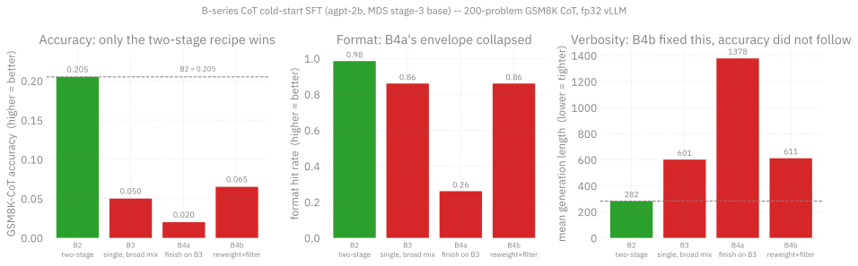
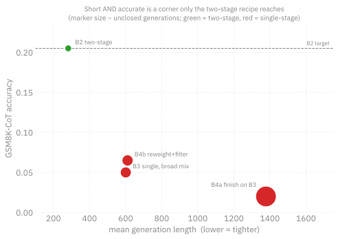

# B4 results -- both paths FAILED to recover B2; two-stage structure is the lever

Date: 2026-07-24
Verdict: NEITHER B4 path recovered B2's 0.205. Do not pursue single-stage rebuilds further.

## TL;DR

Teaching chain-of-thought in **two separate SFT stages** (general math, then
GSM8K CoT) beats doing it in **one combined SFT run** -- and the gap is large,
not marginal. The two-stage "B2" model scores **0.205** on the 200-problem
GSM8K CoT eval while every single-stage rebuild lands at **0.02-0.065**, a 3-10x
difference. Mix weights, length filtering, and sequence length were all varied
across the rebuilds and none of them closed it. The *sequencing* is doing the
work, not the data composition.

This matters beyond this recipe: it says the cold-start CoT lever at 2B is the
SFT *structure*, so future post-training effort should go into extending the
two-stage lineage rather than into re-tuning a single combined mix.

## Results (200-problem GSM8K CoT, fp32 vLLM, identical eval)

| model | cot_accuracy | format_hit_rate | mean_gen_len | n_unclosed | notes |
| --- | --- | --- | --- | --- | --- |
| B2 (two-stage: tulu-math -> gsm8k-r1cot) | 0.205 | 0.985 | 282 | ~0 | the target; best result |
| B3 (single SFT, broad mix @8192) | 0.05 | 0.86 | 601 | 26 | long-CoT dilution regression |
| B4a (gsm8k-r1cot finish on B3 base) | 0.02 | 0.26 | 1378 | 133 | WORSE: verbose bias baked in |
| B4b (reweighted + len-filtered @4096) | 0.065 | 0.86 | 611 | 27 | fixed run-on symptom, NOT accuracy |

Jobs: B4a 12471671 (ep1/2/3 = 12471676/77/78), B4b 12471672 (eval 12471685).



The three panels are the whole story. **Accuracy (left)** separates one model
from three: B2 clears 0.205, and no rebuild gets close. **Format (middle)** and
**verbosity (right)** move on a completely different axis -- B4b restored both
to B3-like health (0.86 hit rate, gen_len 611, 27 unclosed) and its accuracy
still only went 0.05 -> 0.065. That independence is the key negative result:
**the run-on style was a symptom, not the cause of the accuracy loss.** Fixing
what the guardrails flagged did not fix what we cared about.



Plotted against verbosity, B2 sits alone in the short-and-accurate corner
(282 tokens, 0.205) while the single-stage rebuilds cluster long-and-inaccurate.
B4a is the cautionary datapoint: adding a short gsm8k-r1cot finish on top of the
already-verbose B3 base pushed it *further* out (1378 tokens, 133/200 generations
never closed, accuracy floor 0.02). Marker size tracks unclosed generations, so
B4a's blow-out is visible as both position and size.

## What each arm tested

- **B3** -- one combined SFT from the MDS stage-3 base (`global_step138650`) on a
  broad instruct+CoT mix at seq-len 8192, with gsm8k-r1cot weighted only 0.15 and
  diluted by 0.25 OpenR1 long-form CoT. Regressed to 0.05.
- **B4a** -- hypothesis: B3 has the knowledge and only lacks the *finishing*
  signal, so bolt B2's final stage (gsm8k-r1cot only, 3 epochs, checkpoint +
  eval per epoch) onto the B3 base. This was the "best of both worlds" bet.
- **B4b** -- hypothesis: the OpenR1 long-CoT contamination is the problem, so
  rebuild the single-stage mix with an `OPENR1_MAX_THINK_CHARS` length filter,
  gsm8k-r1cot reweighted up to 0.40, at seq-len 4096.

Both B4 hypotheses were refuted, in different ways: B4a refuted the "just add a
finishing stage" story, B4b refuted the "it's the long-CoT contamination" story.

## Conclusions

1. **B4a REFUTED (finishing stage on the B3 base).** A short gsm8k-r1cot finish did
   NOT un-teach B3's verbose R1 style -- it made it worse (gen_len 601 -> ~1400-2000,
   format collapsed to 0.0-0.26). The B3 base's verbose bias is baked in; a light
   finish destabilizes the envelope. You cannot rehabilitate a verbose-poisoned base.

2. **B4b partially worked but missed the point.** The OPENR1_MAX_THINK_CHARS length
   filter + reweight (gsm8k-r1cot 0.40) fixed the SYMPTOM the guardrails flagged
   (gen_len 611 not B3's 601-ish-but-run-on, unclosed 27 not 133, format 0.86) --
   but accuracy stayed at 0.065, ~B3's level, far from B2's 0.205. The run-on style
   was not the accuracy cause.

3. **The real lever is STRUCTURE, not mix.** Every single-SFT-from-gs138650 recipe
   (B3 0.05, B4b 0.065) lost badly to B2's two-stage tulu-math -> gsm8k-r1cot lineage
   (0.205), regardless of mix weights, OpenR1 length filtering, or seq length. A
   single combined SFT -- even a well-balanced, filtered one -- does not reproduce
   what the specific two-stage sequence produced.

4. **~0.2 is near the 2B GSM8K-CoT ceiling for this base.** Across the whole effort
   -- RL (flat at 0.205->0.215), B3 (0.05), B4a (0.02), B4b (0.065) -- nothing beat
   B2's two-stage 0.205. The accuracy lever is NOT SFT recipe tuning at 2B; it is a
   bigger / math-specialized base model, or accepting B2 as the deliverable.

## Why the guardrails earned their keep

The eval reports `mean_gen_len` and `n_unclosed` alongside accuracy. On B4a,
accuracy alone (0.02) would have read as "the finish stage just didn't help."
The guardrails showed something sharper: 133 of 200 generations never emitted a
closing tag, i.e. the model had lost the *format envelope*, not merely the math.
That distinction is what ruled out "train it longer" and sent us to B4b instead.
Keep these fields in any future CoT eval -- an accuracy number by itself hides
envelope collapse.

## Recommendation

- Keep B2 (checkpoint-93 lineage, 0.205) as the agpt-2b CoT cold-start deliverable.
- Do NOT attempt further single-stage SFT rebuilds -- the structure result is
  consistent across B3/B4a/B4b.
- If pushing accuracy remains a goal: (a) reproduce B2's two-stage recipe exactly and
  extend/tune WITHIN it, or (b) move to a larger or math-pretrained base. Both are
  bigger lifts than mix-tuning and should be scoped separately.
- Reusable infra built this session survives regardless: OPENR1_MAX_THINK_CHARS
  filter, b4_reweight_mix, the eval gen_len/n_unclosed guardrails (which correctly
  surfaced the run-on failure that accuracy alone hid), and merge_and_eval tooling.

## Reproducing the charts

```bash
python3 torchtitan/experiments/ezpz/docs/live/sft/agpt/2b-mds/b4-finish-and-reweight/plot_b4.py
```

Writes `figures/*.svg` and `figures/*.png`. Requires `matplotlib` + `ambivalent`
(the house style; a missing `ambivalent` raises rather than silently falling back).

## Related

- [B4 design](design.md) -- the two hypotheses and why each was worth testing
- [B4 implementation plan](implementation-plan.md)
- [B3 design](../b3-instruct-cot-mix/design.md) -- the single-stage mix that regressed
- [tulu_math_uc_mix_full](../tulu_math_uc_mix_full) -- the B2 lineage and its evals
