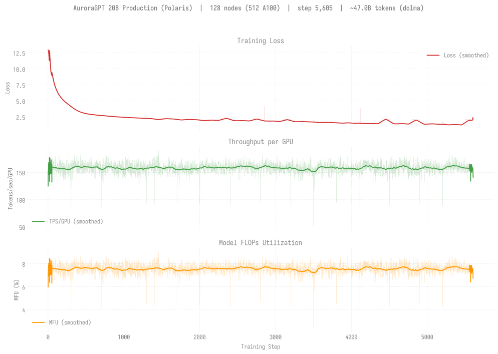
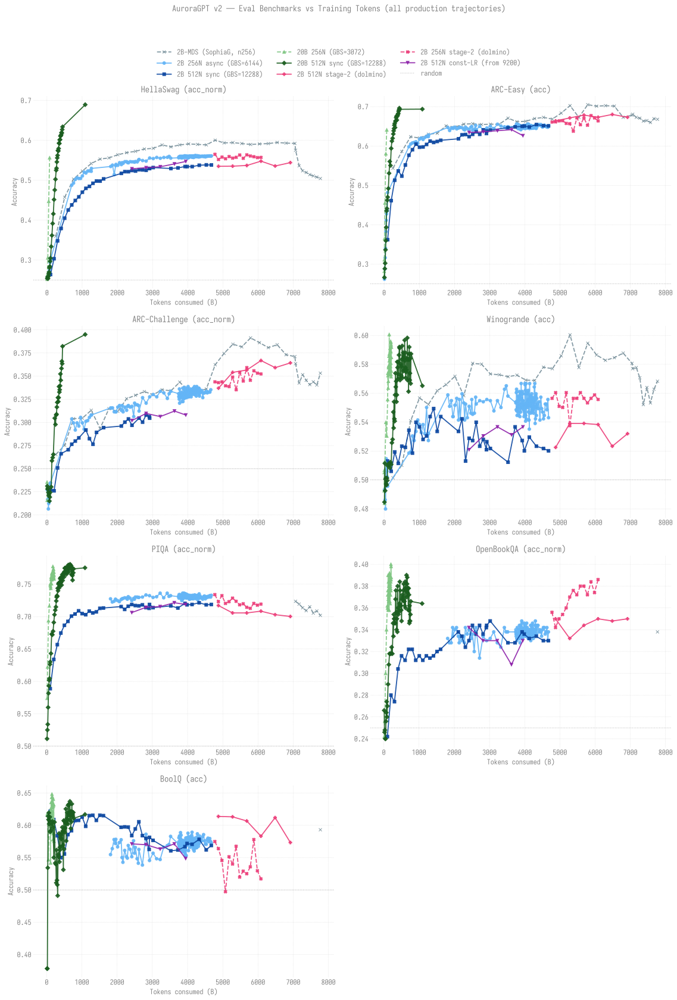
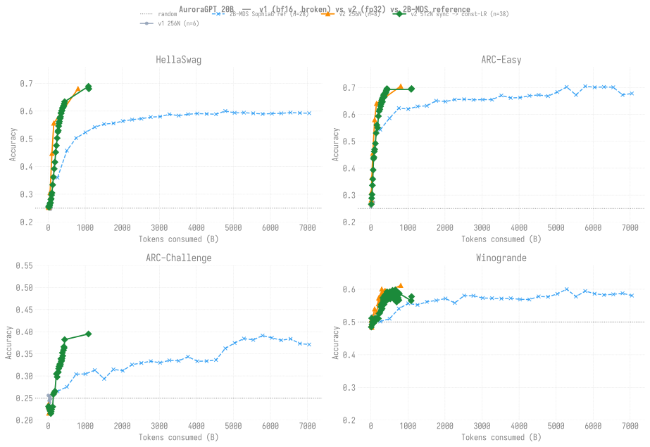
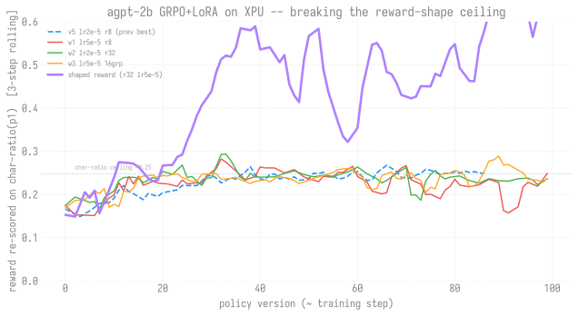
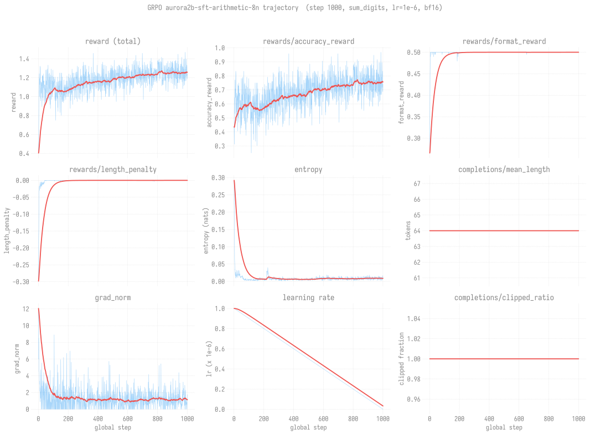
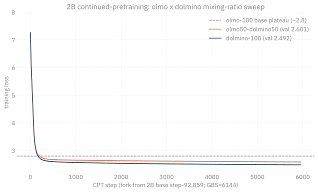
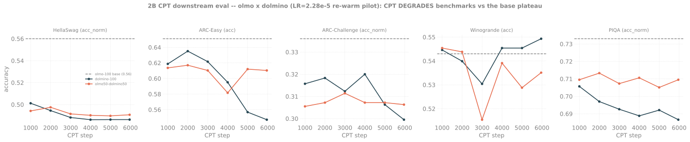
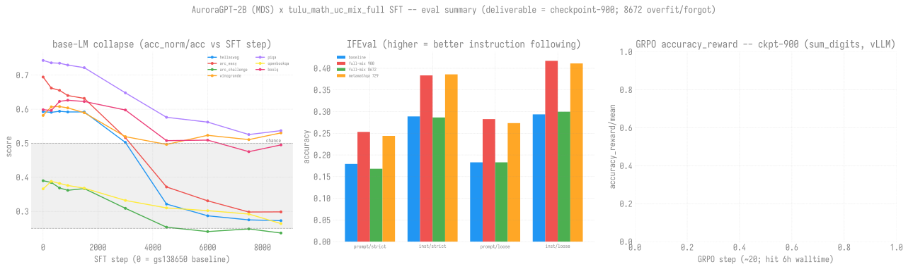

# AuroraGPT Sync — Meeting Notes

> Sam Foreman. Most recent first.

---

## 2026-08-03

> [!IMPORTANT]
> **Headline:** both 20B production chains advanced (256N step 6,000 -> 7,600;
> 512N 6,100 -> 6,850) and the ~2k-node 5-chain umbrella is staged to run Tue;
> the 2B continued-pretrain data-mix experiment closed with a clean verdict
> (75/25 owm/edu is the sweet spot on val-loss, but downstream-neutral at 10B
> tokens); the 80B TP=4 training crash is NOT the qk_norm bug it looked like --
> it re-diagnosed to memory pressure at 2N, so the whole "TP=4 is broken" thread
> is unconfirmed and 80B-at-scale is still an open corner

Covers the ~1 week since 2026-07-27. Production kept advancing (both 20B chains,
umbrella built + queued at 2,098N) and two research fronts moved: the **anneal +
data-mix** experiment ran to a full verdict (actionable recipe for the flagship
stage-2 continued-pretrain), and a deep dive on the **80B TP=4 crash** that ended
in a process correction rather than a fix. Also: commonsense eval complete to
tip + modern block backfilling, upstream synced (72nd), RC-venv `libpti` import
bug fixed, science-corpus Wave 3 built + smoke-passed.

### 1. Data-mix continued-pretrain experiment -- CLOSED, 75/25 is the recipe

The stage-2 continued-pretrain data question (per the data-strategy memo) is
answered. All arms fork the MDS base at constant LR 2e-6, 10B tokens, differing
ONLY in the data mix; scored on held-out FineMath (math generalization) +
wikitext (anti-forgetting), both DISJOINT from every training arm.

| arm | FineMath (math) | wikitext (general) |
|---|---|---|
| owm-100 (control) | **1.8039** | 2.6828 |
| **owm75 / edu25 (WINNER)** | 1.8089 | 2.6597 |
| owm50 / edu50 | 1.8155 | **2.6519** |
| edu-100 | 2.1122 | 2.6585 |

- **75/25 owm/edu is the sweet spot** for a math-focused continued-pretrain: it
  holds math at owm-level (FineMath +0.005 = noise) while capturing ~all of the
  general-ability gain (wikitext 2.6597 vs edu's 2.6585). The marginal trade has
  a clean knee -- owm->75/25 is ~4.6:1 favorable, 75/25->50/50 flips to ~1:1.
  **No 90/10 Wave 3 needed** (75/25's math cost is already noise).
- edu-100 confirms the failure mode: swapping math-web for edu-web forgets math
  by +0.308 nats (~22x the anneal effect) for a tiny general gain.
- **Important caveat -- val-loss verdict does NOT transfer to downstream
  accuracy at this scale.** The lm-eval sweep (gsm8k/mmlu/mmlu_stem/hellaswag/
  arc/winogrande/piqa/openbookqa) across all three arms came back
  **downstream-indistinguishable** (every delta within noise at 2B / 10B tokens;
  if anything edu-100 edges ahead on arc_easy/openbookqa). Takeaway: at 10B
  tokens val-loss NLL is the sensitive instrument; **75/25 is a val-loss win,
  downstream-neutral** -- do not oversell it as a downstream win.
- Also settled earlier in this window: the **anneal A/B** (WSD LR-decay vs flat
  constant-LR) showed **flat >= wsd on both MDS and olmo bases** -- i.e. the
  LR-schedule is NOT the lever, DATA is. That result is what motivated the
  data-mix experiment.
- Report: [`20260728-2b-mds-anneal-and-datamix`](../experiments/agpt/sunspot/20260728-2b-mds-anneal-and-datamix.md).

### 2. 80B TP=4 training crash -- a diagnosis correction, not a fix (read this one carefully)

Chased the 80B qk_norm "tensor does not have a device" TP=4 backward crash to a
proposed fix, then a discriminating experiment overturned the whole framing.
Honest status: **no confirmed 80B TP=4 training path, and the "qk_norm is the
bug" story is unconfirmed -- most 80B crashes this window are consistent with
memory pressure at 2N, not the exotic DTensor/sharding bugs first diagnosed.**

The sequence:
- A parallel code investigation root-caused the crash to DTensor's native
  RMSNorm backward through a `Shard(2)` tensor under AC=full recompute, and built
  a `LocalShardRMSNorm` fix (compute the per-head norm on the local shard,
  bit-identical since head_dim is unsharded). Code committed (`77a0009f3`) and
  independently reviewed CORRECT on gradient placements (the DP-double-count risk
  is impossible under the default backend -- the weight DTensor is TP-only).
- **The fix FAILED validation** (2N/TP=4): identical crash, zero steps. So
  qk_norm's RMSNorm backward was not the (sole) device-loser -- the "root cause"
  was a hypothesis routed around an unpinned mechanism (the two investigators on
  the actual TP=2-vs-TP=4 asymmetry died on API errors and returned null).
- The discriminating experiment that should have run FIRST -- plain `agpt_80b`
  (no qk_norm) at the same TP=4/2N corner -- **reproduced a crash too, but a
  DIFFERENT one** (`GPU NotPresent/banned` memory fault at the step 1->2 optimizer
  allocation, 84% peak mem at step 1). A TP=2 control at 2N then hit an explicit
  `UR_RESULT_ERROR_OUT_OF_RESOURCES` (OOM) before step 1.
- **The through-line: all three are consistent with 80B not fitting at 2N.** The
  documented-good 80B smoke (job 12466025) was **4N/TP=2 at 88.94% peak** -- i.e.
  80B barely fits at 4N. Every crash this window was run at **2N**, under-resourced.
  The clean experiment (plain 80B at **4N**/TP=4, real headroom) has not been run.
- **Process lesson (owned):** for an opaque distributed crash, run the cheap
  discriminating experiment (plain-vs-feature, TP=2-vs-TP=4, and check peak
  memory / the boring OOM cause) BEFORE building any fix. Two workflow "root
  causes" this window were plausible-but-unverified hypotheses; the code review
  was flawless but aimed at the wrong target.
- **Where 80B stands:** `LocalShardRMSNorm` is committed + review-correct but
  UNVALIDATED (parked until a memory-clean TP=4 baseline exists). The real open
  question is whether 80B trains at TP=4 with adequate nodes (4N+) at all -- and
  separately, TP=2 is memory-good but NaNs at production GBS (the original reason
  TP=4 was wanted). 80B-at-2000N (dp~6000) remains the hard, unsolved corner.

### 3. Production pre-training -- both 20B chains advanced, ~2k-node umbrella staged

The flagship v2 chains kept moving this window despite persistent `at_queue`
starvation, and the multi-chain umbrella (one PBS job driving all live chains)
is built + smoke-passed + queued at >2k nodes.

| chain | window start (07-27) | now (08-03) | delta | loss | tokens | MFU |
|---|---|---|---|---|---|---|
| **20B 256N** | step 6,000 | **step 7,600** | +1,600 | 2.467 | ~382B (8.2%) | ~22% |
| **20B 512N** | step 6,100 | **step 6,850** | +750 | 2.248 | ~685B (14.7%) | ~19% |
| **2B 256N** | COMPLETE (4.674T) | unchanged | -- | 2.652 | 100% | -- |

- **20B 256N is the mover:** +1,600 steps (persisted head step-7,600, loss
  2.467, 22% MFU / 442 tps-per-gpu / 65.8 TFLOP/s). Kept alive across the window
  by a 260N `prod` resume (`8698754`, walltime-finished clean at step-7,600 after
  12h02m) plus a 16N capacity bridge earlier; a fresh 260N continuation
  (`8730438`) is queued to carry it to the umbrella handoff.
- **20B 512N** advanced +750 steps to step-6,850 (loss 2.248, 19% MFU); the
  current persisted head is step-6,800. Its constant-LR individual (`8687863`) is
  held for a 512N slot.
- **Umbrella job (`8714502`): 2,098 nodes, 24h walltime, 5 chains in one PBS
  allocation** via `ezpz launch --auto-retry` -- {2B-512, 20B-512, 20B-256,
  2B-512-const-LR, 2B-256-const-LR (fork @ step-9,500)}. Smoke-validated at 15N
  (`8714337`), submitted to `large`, currently Q with PBS estimated start
  **Tue Aug 4 ~15:20** (node scarcity, not a fault); `afterany` continuation
  `8714503` chained. This is the first umbrella slotted to actually run -- prior
  2,098N attempts were terminated while queued (walltime bump to 24h, ghost
  cleanup). A collision guard is armed to retire the running individual chains
  the instant the umbrella seats, since they share checkpoint dirs.
- **No corruption, no collisions** this window; the earlier bridge/umbrella
  shared-ckpt-dir hazard was cleaned up (corrupt 256 step-6,200/6,300 + poisoned
  2B-const step-9,250/9,260 quarantined via `backup`).
- **80B: still no production job** (see item 2); the at-scale corner is unsolved.

### 4. Evaluation -- commonsense complete to tip; modern block backfilling

- **Commonsense-7 ladder is complete to each chain's live tip:** 256N through
  step-6,800, 512N through step-6,500, all fresh this window. Headline
  accuracies at the tips (~610-680B tokens): 256N step-6,800 = arc_e 0.662 /
  arc_c(n) 0.348 / hellaswag(n) 0.597 / winogrande 0.574; 512N step-6,500 =
  arc_e 0.677 / arc_c(n) 0.354 / hellaswag(n) 0.609 / winogrande 0.579. Both far
  above v1's flat ~0.27 arc baseline; 512N edges 256N on shared metrics.
- **Modern block (MMLU-57 + gsm8k) is backfilling now.** The first tail pass had
  the modern half die on the old 12h walltime cap mid-MMLU; resubmitted as two
  `capacity`-queue jobs at **48h** (`8729921` 256N running, `8731413` 512N
  running) so the slow ~56k-request/step MMLU pass can't be walltime-killed. Fill
  targets: 256N modern on steps 5,900-6,800, 512N modern on 6,200-6,500 (+gsm8k
  on each tip). Content-aware skip-guard merges into existing `results.json` and
  reuses cached HF conversions.
- **HellaSwag plateau holds:** peaked ~0.63, now oscillating 0.60-0.63 -- as
  before, not yet climbing out at this token count.

### 5. Smaller items

- **Upstream synced (72nd, merge `e5841d611`, 2 commits).** Replayed the float8
  `filter_fqns` fix (#4008) onto `ezpz/moe`: our 671B float8 config filtered on
  `output` (old head name) not `lm_head`, silently fp8-quantizing the LM head --
  only affects the float8 MoE path, now fixed. #4012 (FA4 Blackwell) is
  CUDA-gated, XPU-inert.
- **RC venv (`2026.1.0-rc0`, torch 2.14) import failure fixed:** the masked
  "Cannot import config_registry" was `libpti_view.so.0` missing (needs
  `module load pti-gpu`); permanently fixed by symlinking the system-module lib
  into `torch/lib` (found via `$ORIGIN` RUNPATH on every rank, no env needed).
- **Science-corpus Wave 3 built + smoke-passed:** `owm_cosmo_7525` (75%
  open-web-math / 25% cosmopedia-science) 2N smoke trained clean (loss
  4.02->3.42); the nemotron-CC-math arm + peS2o science-judge holdout are staged.
  32N prod not yet launched. This is the science-dense variant of the 75/25
  recipe (swap generic edu for science sources).
- **Ops drags this window:** persistent Aurora/Sunspot `at_queue` starvation +
  intermittent SSH/API outages; a transient tegu **project-quota** exhaustion
  (11T/10T) crashed a blend run mid-checkpoint (since raised to 20T soft / 22T
  hard); the mix launcher hardened to retry venv setup + hard-fail loud on a
  broken env instead of a misleading "data source did not resolve".

### Top asks / open decisions

1. **80B TP=4:** run the memory-clean plain-80B at **4N/TP=4** to settle whether
   any TP=4 crash was ever a real code bug vs. pure 2N OOM. If 4N/TP=4 trains
   clean -> retest the (committed) qk_norm fix at 4N; if it still crashes with
   headroom -> genuine TP=4 bug. Until then 80B-at-scale has no confirmed path.
2. **2B stage-2 recipe:** adopt **75/25 owm/edu** as the continued-pretrain data
   mix (val-loss-validated, downstream-neutral at 10B), and decide whether to
   launch the science-dense Wave 3 (cosmopedia / nemotron-math) 32N to test
   whether science sources beat generic edu on a science judge.
3. **80B TP=2 vs TP=4 tension:** TP=2 is memory-good but NaNs at production GBS;
   TP=4 was wanted for that but has no confirmed training path here. Is the
   near-term 80B plan the fp32-mixed-precision-param TP=4 interim (only
   confirmed-clean at 4N, ~3-5x slower), pending the above?

---

## 2026-07-27

### Headline: 80B NaN re-root-caused (bf16, not the optimizer), the CoT-teaching front ran to a clear verdict (SFT is the accuracy lever, not RL), full-mix SFT deliverable is checkpoint-900, and Aurora queue starvation + a 2026-07-27 outage are the main drags on production throughput

Shortlist of the top items over the ~2 weeks to 2026-07-27; the detailed
write-up is the [2026-07-20 entry below](#2026-07-20). **Nothing is on fire; the
main story is queue starvation, not broken code.**

### 1. Biggest single result -- 80B NaN re-diagnosed (changes the plan)

The 80B production NaN is a **bf16 residual-stream activation overflow, NOT an
optimizer bug** (the old SophiaG-vs-mano debate is moot -- both NaN identically,
mano has no Hessian term). The fp32-activations run trains clean and exposes
true grad_norms of 21K-79K that bf16 was masking to ~5-7. **Only confirmed-clean
config is fp32 mixed-precision-param at TP=4 (~3-5x slower); no 80B job is
queued pending a direction call.** A per-block fp32-residual prototype was built
but still NaNs at dp=192 -- necessary, not sufficient. Guard added:
`--nan-abort-consecutive=5` (the last 512N NaN wasted ~6,100 node-h). This is
**Ask #1 below** and the top open decision.

### 2. CoT-teaching front -- ran end-to-end to a verdict

The chain-of-thought teaching effort (opened 07-20) is now **Stages 0-2
complete**, and it produced a clean, actionable finding:

- **Cold-start CoT-SFT is the accuracy lever; GRPO is not, at 2B.** Two-stage
  SFT (B2: tulu-math -> gsm8k-r1cot) reaches GSM8K **~0.205**, beating every
  single-stage rebuild. Gated GRPO on that base is **drift-proof** (format
  perfected 0.985 -> 1.0, no reward-hacking) but **accuracy stays flat**
  (0.205 -> 0.215 = noise) -- at ~20% GSM8K the correct-rollout density is too
  thin for RL to bite. **Takeaway: invest in the cold-start SFT / a stronger or
  math-heavier base, not more RL, to move 2B accuracy.**
- Enabling infra along the way: the reward-ceiling break (**+168%** from a
  componentized reward vs a flat ~0.25 wall) and Monarch+TorchStore+vLLM
  GRPO+LoRA vendored in-tree with **zero edits to core/experiments-rl**.

### 3. Full-mix SFT -- finished, but the deliverable is checkpoint-900

The 12x-more-tokens full-mix SFT **catastrophically forgot** at 1 epoch
(step-8672: train loss 0.357 but HellaSwag 0.59 -> 0.27). **The deliverable is
checkpoint-900** (base-LM retained, IFEval prompt-strict 0.253). Root cause: LR
2e-5 held above 1e-5 through step ~4350. **Lesson (now a guardrail ask): cap
full-mix SFT at O(1000) steps or drop LR.** More tokens did NOT beat the tiny
metamathqa-729 SFT.

### 4. Production pre-training -- steady, queue-limited

- **2B 256N: COMPLETE** (4.674T tokens, 100%, loss 2.652) -- unchanged; the base
  for CPT/SFT. Final-ckpt eval still blocked on PM.
- **20B 512N: step 6,100** (~614.0B, 13.1%, loss ~2.44); **20B 256N: step 6,000**
  (~302.0B, 6.5%). Both advancing only via **16N capacity-queue bridges** --
  the 256N/512N prod jobs have sat queue-starved for days (genuine node scarcity
  + daily reservations), so a low-contention capacity trickle is what keeps them
  moving.
- **Aurora outage 2026-07-27** killed the in-flight eval + a briefly-running
  512N prod resume (`8696040`, CCL crash) with scheduler code -29. **No
  checkpoints corrupted, no ckpt-dir collisions**; jobs resubmitted, chains
  intact.
- **80B: still blocked** (item 1); no job queued.

### 5. Evaluation -- suite modernized, peer numbers still pending

- New eval-strategy review (07-17): our 7-task commonsense suite is a training
  thermometer but "nearly useless vs modern peers" -- we had **no MMLU and no
  GSM8K**. Both (+ ARC-Challenge 25-shot) are now wired and **backfilling** the
  20B tails; **no AuroraGPT MMLU/GSM8K numbers have landed in the docs yet** (the
  07-27 outage killed the modern-pass/gsm8k half of the backfill mid-run;
  resubmitted). **OLMo-2 (7B/13B)** is the named single peer.
- 20B "no plateau" no longer holds: HellaSwag peaked **0.6339 @ step-4,400**,
  now oscillating 0.60-0.63.

### 6. Charts / docs -- current

Production dashboard, per-chain READMEs, and the all-production overlay are
refreshed to disk truth (20B-512 6,100 / 20B-256 6,000). A W&B-fetch
consolidation (shared `wandb_fetch.py`) fixed a stale-curve bug where the board
and charts had drifted. The overlay now carries the MDS reference's stage 1/2/3
boundary lines (4.674T / 7.064T / 7.771T).

### Appendix A -- 80B NaN: the explicit runs + what they narrow it to

Full write-up: [`2026-07-14-80b-fp32-residual-fix`](../experiments/agpt/aurora/2026-07-14-80b-fp32-residual-fix.md).
Arch: dim=9216, 84 layers, ffn=25600, vocab 256128. The wall is **LBS>1 AND
dp_degree (=NGPUS/TP) > ~186**; the safe corner (TP=4, LBS=1, dp<=186, batch via
GAS) trains clean but can't reach production GBS.

The run ladder (this is what makes it diagnosable):

| Run | Config | Scale | Result |
|---|---|---|---|
| `8574385` | SophiaG | 510N | flat grad_norm ~6.17, step-14 inf, **NaN step-18** |
| `8661293` | **mano** (no Hessian term) | 62N, dp~186 | flat grad_norm ~6.0, **NaN step-17** -- identical signature -> **optimizer-independent** |
| `8537349` | **fp32 mixed-precision-param** (all activations fp32) | TP=4 | **CLEAN** 20 steps; exposes true grad_norms **21K-79K** that bf16 masked to ~5-7 |
| `8671046` | `agpt_80b_fp32res` (per-block fp32 residual add, bf16 GEMMs) | 4N | CLEAN (loss 12.79->9.24) -- proves the add-masking was real |
| `8671243` | `agpt_80b_fp32res` | 64N, **dp=192** | **still NaN step-19** -- per-block fp32 add necessary but NOT sufficient |
| `8673658` | `agpt_80b_fp32res_depth` (fp32 residual across all 84 layers) | 64N, **dp=192** | **still NaN ~step-37** -- full-depth residual ALSO insufficient |

**What the ladder narrows it to (the useful new signal):** the *only* delta
between `8673658` (full-depth fp32 residual, **NaN**) and `8537349` (fp32 params,
**clean**) is the **bf16 compute inside the sublayers** (attention QK^T scores +
FFN SwiGLU intermediate). So the overflow site is **inside a sublayer's bf16
matmul, not the residual accumulation** -- which contradicts the original
"deep residual stream" framing and points at two cheap, standard fixes we have
in-tree but the 80B flavor does NOT use: **attention softcap** (`*_softcap`
flavors exist) and **QK-Norm** (`attention.py` supports `qk_norm`). Ruled out in
code: loss softmax (CE upcasts to fp32), grad reduction (FSDP reduce_dtype=fp32,
loss dp-invariant). No converged 80B checkpoint exists (`80b/README` shows
`[no ckpts]`), so we can change the architecture freely -- no DCP-resume
constraint.

Recommended cheapest-first ladder (details in the doc):
1. **Per-op numerics capture at dp=192** (task #29, wired but paused) -- logs
   per-op max-abs to name the exact op that hits ~3e38 first (attention scores
   vs FFN gate). Cheap (~32N, tens of steps); turns the next step from guess to
   targeted fix.
2. **Enable QK-Norm and/or attention softcap** (near-free, no ckpt-compat cost)
   -- 4N smoke, then the dp=192 wall test (64N) that killed the residual protos.
3. If FFN is the culprit: fp32 **just the FFN** (targeted autocast), far cheaper
   than full fp32-params.
4. Guaranteed interim: **fp32 mixed-precision-param at TP=4** (`8537349`, only
   confirmed-clean, ~3-5x slower) -- start in parallel so 80B isn't idle.

"Wall 2" (separate, scale/init): 256N/dp=768 GPU `NotPresent` init segfault;
2048N SIGSEGV in `set_determinism` at 24,864 ranks; **1024N (dp=3066, `8574386`)
is the untested bracket** that would settle the practical 80B max.

### Appendix B -- SFT above 8N: the 384-rank scale fault (verified reproducer)

Full write-up: [`2026-07-10-sft-2b-gs138650-big-mix-32n`](../experiments/agpt/sunspot/2026-07-10-sft-2b-gs138650-big-mix-32n.md#blocked-384-rank-gpu-page-fault-at-step-1-2-scale-fault-unsolved).
Memory: `project_sft_v2_base_oom_badnode`.

Every 32N (= 384-rank) SFT attempt dies at **step 1-2** with a GPU page fault
during an oneCCL collective (`libccl.so` backtrace):

```
Segmentation fault from GPU ... ctx_id: 5 (CCS) type: 0 (NotPresent), access: 1 (Write) ... aborting
-> rank 221 died from signal 6 (SIGABRT)
```

Evidence (all ruled-out-in-full, not guessed):

- **Deterministic**: jobs `12470336` / `12470338` / `12470339` (+ the afterany
  chain) all die identically at step 1-2. Earlier big-mix interleave attempts
  `12468348` / `12468371` / `12468398` hit the same barrier.
- **Not a bad node**: the fault lands on **rank 221 across two different
  physical nodes** (`x1921c4s0b0n0` AND `x1922c2s3b0n0`); fresh PBS allocation
  per retry, yet it follows the rank -> scale, not hardware.
- **Not bad data / OOV**: full columnar scan of all 53,276,203 rows (2160
  shards) -> global max token id **255998 < vocab 256000**.
- **VERIFIED CLEAN REPRODUCER at 2N**: `_diag_bigmix_2n_len1024.sh`
  (job `12470343`) ran the **same** pretokenized dataset + **same** bsz2/gas8 at
  **24 ranks** for 20 steps clean (loss 1.25->1.12). Identical data+config
  trains at 24 ranks, GPU-faults at 384 -> it is purely a scale fault.
  Scale-sweep harness: `_diag_bigmix_scale_len1024.sh`
  (both under `rl/scripts/sft/`).
- **Base-independent**: moving v2-256n-base -> gs138650 did not dodge it; the
  completed metamathqa-729 SFT dodged it by luck (never hit 384 ranks).

Onset sits near the **same ~186-192 dp boundary as the 80B NaN wall** -- plausibly
the same oneCCL/Level-Zero scale class, so a facility-side fix for one may inform
the other (worth filing them as related).

**Impact**: pins SFT to <=8N (~4x slower) and blocks (a) the full-mix 32N run and
(b) the first SFT on the completed v2-256n base. It's a Level-Zero/oneCCL runtime
fault below our code -- hence the "file an ALCF ticket" ask (attach the 2N clean
repro + the three failing 32N job IDs), or accept 8N as the SFT ceiling.

### Top asks / open decisions (full list in the 2026-07-20 entry)

1. **80B (the big one):** approve starting the slow-but-stable fp32
   mixed-precision-param TP=4 run now (only confirmed-clean path, ~3-5x slower),
   or hold for a full-depth fp32-residual fix? No 80B is training until this is
   decided. (Evidence + a cheaper QK-Norm/softcap path: **Appendix A**.)
2. **2B direction:** the CoT verdict says accuracy lives in cold-start SFT, not
   RL -- do we invest in a stronger/math-heavier base + the stage-2 anneal the
   data-strategy memo recommends (50-100B tokens, LR->0, science/math upsample)?
3. **SFT above 8N:** file an ALCF ticket for the deterministic 384-rank GPU page
   fault, or accept 8N as the SFT ceiling? (Blocks full-mix 32N + v2-256n-base
   SFT. Verified 2N-clean repro + failing 32N job IDs: **Appendix B**.)
4. **Aurora queue starvation:** the prod chains only advance via capacity-queue
   bridges; is escalating the AuroraGPT allocation's queue priority worth an
   ALCF conversation, or do we accept the capacity trickle as the steady state?
5. **2B 512N (83.8%, ~25 days queue-starved):** hold for a slot, or declare the
   completed 256N chain (4.674T, 100%) the 2B deliverable and abandon 512N?

---

## 2026-07-20

### Headline: 80B NaN re-root-caused (bf16 activation overflow, not the optimizer); new clean Polaris A100 20B chain; the bulk of the effort went into RL/GRPO+Monarch on XPU, which seeded a brand-new chain-of-thought teaching front

Covers the ~2 weeks since 2026-07-06. Production held steady (2B base
COMPLETE, 20B advancing, 80B still blocked); the new work is a re-diagnosis
of the 80B wall, a from-scratch Polaris chain, and a large RL push (Monarch
GRPO+LoRA vendored in-tree, a reward-ceiling break, and the first CoT-teaching
stages).

### 1. Production pre-training

**80B -- still the top blocker, but re-diagnosed.**

- NaN re-root-caused 2026-07-14 as a **bf16 residual-stream activation
  overflow, NOT an optimizer bug**: SophiaG (512N, step-14) and mano
  (dp~186, step-17) NaN with the *identical* flat grad_norm ~6.0 signature,
  and mano has no Hessian term -> optimizer-independent (the old
  SophiaG-vs-mano decision is now moot).
- Smoking gun: the fp32-activations run (job 8537349, 20 steps) trains clean
  and exposes **true grad_norms of 21K-79K** that bf16 was silently masking
  down to ~5-7. Loss softmax and grad-reduction both ruled out in code.
- The Llama3-405B-style fix (bf16 GEMMs, fp32 only at residual + norm
  boundaries) trains clean at 4N but **still NaNs at dp=192** (job 8671243,
  step-19) -- per-block fp32 add is necessary but not sufficient.
- Only confirmed-clean config remains fp32 mixed-precision-param at TP=4
  (8537349), ~3-5x slower; no 80B job is currently queued. Operational guard
  added: 80B autoretry now sets `--nan-abort-consecutive=5` (the 512N NaN
  wasted ~6,100 node-h before this).
- Separate "Wall 2" (scale/init): 256N/dp=768 hits a GPU `NotPresent` init
  segfault; 2048N SIGSEGV'd in `set_determinism` at 24,864 ranks; **1024N
  (dp=3066, job 8574386) is the untested bracket** that decides whether 512N
  is the practical 80B max.

**Polaris (A100) -- new, and it just works.**

- New SophiaG/dolma **20B chain on leg 5** (job 7252666): persisted step
  1,300 / live ~1,400, loss **2.31** (from 12.95), ~14.7B tokens over four
  clean 12h legs -- already matching the mature 2B chain's loss (2.36) at
  ~half the tokens. Clean SophiaG convergence at 2B and 20B on A100 is a
  direct contrast to the Aurora 80B bf16 wall.
- Polaris 2B reached step 5,300 / loss 2.36 (~22.6B tokens) and is idle.
  No leg-6 or 2B continuation queued -- afterany +1 chain discipline lapsed
  on Polaris.

**Aurora 2B / 20B.**

- **2B 256N: COMPLETE** -- cont12 (8558531) finished clean at step 92,859 =
  **4.674T tokens (100%)**, loss 2.652. This is the base for CPT + SFT;
  final-ckpt eval still blocked on PM.
- **20B 512N stall broken**: frozen at step-4,400 since 2026-05-29,
  relaunched via native auto-retry (head 8638793 + cont 8638795) -> now
  persisted **step 6,000, loss 2.47, 604.0B tokens (12.9%)**. step-4500 is
  an empty/aborted save; eval re-run of the 4,400->6,000 tail is pending.
- 2B 512N sync chain queue-starved ~25 days at step 38,900 / loss 2.71 /
  83.8%; resubmitting cont10 (8521631) would reset accrued priority.

**All Aurora production chains overlaid** (loss / TPS-per-GPU / MFU vs tokens):


**New Polaris (A100) 20B chain** (loss + diagnostics, 128N, dolma/SophiaG):



See: [production rollup](../production/README.md) ·
[2B](../production/agpt/2b/README.md) ·
[20B](../production/agpt/20b/README.md) ·
[80B](../production/agpt/80b/README.md) ·
[Polaris](../production/polaris/README.md).

### 2. Evaluation

- New **eval-strategy review** (`evals/eval-landscape-2026-07.md`,
  2026-07-17): our 7-benchmark commonsense suite is a good from-scratch
  thermometer but "nearly useless for positioning vs modern peers" -- HF
  retired all six OLL-v1 tasks in June 2024 for saturation, and we had **no
  MMLU and no GSM8K at all**.
- MMLU (5-shot), GSM8K (5-shot), ARC-Challenge (25-shot) added via a
  mixed-few-shot loop and **backfilling now** -- but no AuroraGPT
  MMLU/GSM8K/ARC-C numbers have landed in the docs yet.
- **OLMo-2 (7B/13B)** named the single correct peer (same olmo-mix family,
  OLMES suite). Today only HellaSwag overlaps cleanly: 20B ~0.61 vs OLMo-2
  0.838/0.864 -- large but expected at 604B tokens (13%) vs peers' 9-11T.
  Targets: MMLU 63.7, GSM8K 67.5.
- 20B "no plateau" headline no longer holds: HellaSwag peaked **0.6339 at
  step-4,400** then oscillates 0.60-0.63 (0.6086 at step-6,000). step-4,400
  is best-per-benchmark (ARC-Easy 0.6932, PIQA 0.7650). IFEval and
  BBH/GPQA/MATH/HumanEval deferred to instruct-tuning / more tokens.

**All-production eval overlay** (HellaSwag / ARC / Winogrande vs tokens) and
the 20B eval detail:





See: [eval index](../evals/README.md) ·
[eval-landscape review 2026-07](../evals/eval-landscape-2026-07.md) ·
[20B evals](../evals/agpt/20b/README.md).

### 3. RL / GRPO / Monarch (Intel XPU) -- the biggest recent effort

- **Reward ceiling broken (+168%):** a componentized shaped reward (format
  0.2 + completeness 0.2 + order 0.6) hit **0.667** re-scored on the
  *identical* char-ratio metric vs the tuning cluster's flat 0.237-0.249
  (job 12471056, 100 steps), validated as not a scoring artifact. The
  beat-v5 sweep first proved **no config lever** (LR, LoRA rank, group
  count) beats the ~0.25 mean-reward ceiling -- the reward *shape* was the
  wall.
- **Monarch+TorchStore+vLLM GRPO+LoRA vendored in-tree** as a thin ezpz
  overlay with **zero edits to experiments/rl or core** (all XPU compat via
  runtime monkeypatches); job 12471049 fires train steps at ~1765 tok/s,
  reward_mean 0.1607, matching the fork-based v5 baseline.
- **agpt-2b gibberish root-caused to bf16** in the vLLM path (bare-vLLM
  bf16 = gibberish, fp32 = coherent); fix is `--generator.model-dtype=float32`
  (~30% slower but correct). Qwen3-0.6B GRPO+LoRA also reproduced on Sunspot
  XPU crossing the USM/PMIx wall (~3256-3273 tok/s).
- v5 GRPO+LoRA on agpt-2b shows a clean learning curve **0.167 -> 0.268**
  (crossing 0.25 at ~1978 rollouts); the lever that mattered was task
  difficulty, not LR.
- The 2026-07-06 multi-trainer-node "desync hang" closed as **two ordinary
  bugs** (oneCCL transport default + a mis-scoped AVG->SUM monkeypatch);
  confirmation job 12470083 (3N, 24 ranks) ran all 8 steps to
  accuracy_reward 0.375.
- **Caveat:** everything runs on **TCP fabric, not Slingshot CXI** (~176
  s/step at 3N); next lever is a per-group transport split. vLLM-XPU TP>1
  (multi-tile server) still unexercised.

**Ceiling-attack** (shaped reward breaks the ~0.25 wall, +168%) and the
**beat-v5 tuning sweep** (no config lever beats the ceiling):




**sum_digits arithmetic GRPO** (8N, accuracy 0.09 -> 0.76 over 1000 steps):



See: [RL hub](../production/rl/README.md) ·
[GRPO index](../production/rl/grpo/README.md) ·
[ceiling-attack](../production/rl/grpo/ceiling-attack.md) ·
[beat-v5 sweep](../production/rl/grpo/beat-v5-sweep.md) ·
[Monarch](../production/rl/monarch.md) ·
[TRL / cross-node vLLM](../production/rl/trl.md).

### 4. Chain-of-Thought teaching -- new front (opened 2026-07-20)

- New R1-style plan (`production/rl/plans/cot.md`): **cold-start CoT-SFT**
  (teach the `<think>...</think><answer>\boxed{}</answer>` envelope) ->
  **GRPO-RLVR** (reason well). RL-only R1-Zero explicitly rejected as
  primary (kept as a falsifiable control); no teacher model needed.
- **Stage 1 works**: envelope emission jumped **0.00 -> 0.955** with no
  accuracy regression (CoT accuracy 0.15 -> 0.16), from a tiny 16-step / 8N
  / 38s run on gsm8k's own re-wrapped rationales (base = checkpoint-900-hf).
- Stage 0 built the first generation-based chat-templated GSM8K-CoT eval
  (format hit-rate and CoT accuracy scored *separately*, answer read only
  from the `<answer>`/`\boxed{}` span, fp32 vLLM).
- Stage 2 applies the ceiling-attack lesson directly: `gsm8k_reason.py` uses
  three additive rewards (think_format 0.2 + answer_extractable 0.1 +
  answer_correct 0.7) instead of one saturating binary exact-match.
- Stage 2 launchers built and **smoke-debugged**: an earlier xnode run hit
  XPU `OUT_OF_RESOURCES` at step-13 (trainer peak mem = num_gen x
  (prompt+completion), worsened by a never-EOS cold-start ckpt);
  diagnosed-fixed at HEAD (commit 46f99a568) via num_gen 4, completion cap
  512, expandable_segments. **A clean completed Stage 2 run is not yet
  confirmed.** (No chart yet -- Stage 2 curves land once a clean run
  completes.)

See: [CoT-teaching plan](../production/rl/plans/cot.md).

### 5. CPT / SFT

- **Full-mix SFT finished but catastrophically forgot** at 1 epoch (step-8672:
  loss 0.357 / mtacc 0.902 but HellaSwag 0.59->0.27, ARC-Easy 0.69->0.30) --
  the **deliverable is checkpoint-900** (IFEval prompt-strict 0.253, base-LM
  retained, strong GRPO start). Root cause: LR 2e-5 held above 1e-5 through
  step ~4350. Lesson: cap full-mix SFT at O(1000) steps or drop LR. 12x more
  tokens did NOT beat the small metamathqa-729 SFT.
- **CPT pilot degraded benchmarks** via two modes (ratio-independent
  HellaSwag drop from LR re-warm shock; ratio-dependent ARC-Easy bleed --
  dolmino-100 0.619->0.547 but olmo50-dolmino50 held ~0.61). Relaunched as
  gentle-LR (2e-6 constant) olmo50-dolmino50 (umbrella 8663177) + a
  dolmino-100 gentle-LR arm (8662867). An 18-agent data-strategy memo
  recommends a **stage-2 anneal now** (50-100B tokens, LR->0, science/math
  upsample); the 2B is ~115x past Chinchilla-optimal.
- **SFT capped at 8N**: 32N/384-rank deterministic GPU page fault (bisect:
  2/4/8N clean, 12/16/32N crash, near the ~186-192 dp boundary) -- blocks
  both the full-mix 32N run and the first v2-256n-base SFT. A /lus/tegu
  disk-full incident (2026-07-13) cost ~1,150 steps of recompute.

**CPT pilot: loss beats the plateau but downstream eval DEGRADES** (the
loss/eval divergence is the whole story):





**Full-mix SFT eval** (base-LM collapse at step-8672 -> ckpt-900 is the
deliverable):



See: [CPT sweep](../production/cpt/README.md) ·
[SFT index](../production/sft/README.md) ·
[full-mix SFT evals](../production/sft/agpt/2b-mds/tulu_math_uc_mix_full/evals/README.md) ·
[data-strategy memo](../notes/data-strategy-after-olmo-mix-2026-07.md).

### 6. Development / infrastructure

- **5 upstream syncs (64th-70th)**, two breaking: 70th (MoE #3859
  sibling-experts) needed a 5-file structural replay (moe.experts ->
  moe.routed_experts.inner_experts); 69th (#3923 moved Linear to
  common/linear.py) needed import fixes. Both caught by `sync_smoke`,
  re-smoked green.
- **macOS/CPU single-device training** support landed (TORCH_DEVICE=cpu
  overlay, no-op on XPU/CUDA); the old "Cannot import config_registry" was a
  masked missing-triton import.
- **Native ezpz auto-retry umbrella** (`smoke_multi_autoretry.sh`) replaces
  legacy `failover_lib.sh`, which lost 3/4 chains to blind bad-node swaps.
- Recurring drags: the 384-rank GPU page fault (pins SFT to 8N),
  XPU-broken async-ckpt default on torch 2.13, an auto-retry classifier gap
  (bad-node SIGSEGV misread as walltime -> no spare-swap), and persistent
  **Aurora at_queue starvation** (3,487 nodes free on 07-09 yet the 1536N
  umbrella eligible 70h+ without a slot). IPC-handle cache leak fixed via
  CCL_ZE_CACHE thresholds.
- Tooling: `refresh_all.sh` coverage gap fixed (cpt/sft/grpo/2b-mds plotters
  wired in + a stale-doc coverage audit); training dashboards generalized to
  SFT + GRPO with new multi-run reward overlays.

### Decisions / asks for the team

1. **80B fix path:** commit to fp32 mixed-precision-param at TP=4 as an
   interim production path (only confirmed-clean, ~3-5x slower), or hold for
   a full-depth fp32-residual fix (per-block prototype still NaNs at dp=192)?
   Start the slow-but-stable run now, or wait?
2. **80B Wall 2:** who investigates the 256N/dp=768 init GPU `NotPresent`
   segfault, and do we run the 1024N (dp=3066, 8574386) bracket to settle
   the practical 80B max? Also fix the auto-retry classifier so a bad-node
   SIGSEGV triggers a spare-swap instead of a walltime stop.
3. **Unblock SFT above 8N:** file an ALCF ticket for the deterministic
   384-rank oneCCL/GPU page fault (onset ~96-144 ranks), or accept 8N as the
   SFT ceiling? This blocks the full-mix 32N run and the v2-256n-base SFT.
4. **CPT vs data-strategy memo:** wait for the gentle-LR dolmino retry
   (8662867) before spending the full ~2.391T olmo50-dolmino50 budget? Does
   the memo's "anneal now, LR->0, science/math upsample" supersede or fold
   in? Assign an owner for stage-2 upsample weights.
5. **SFT guardrails project-wide:** cap full-mix SFT at O(1000) steps (or
   lower LR); enforce keep-latest-N COMPLETE ckpts + project-quota
   monitoring to prevent another /lus/tegu disk-full drain.
6. **Aurora 2B 512N (83.8%):** hold cont10 (8521631) for a slot (deploy
   ezpz PR #160 first), or declare the completed 256N chain (4.674T, 100%)
   the 2B deliverable and abandon 512N? (Resubmitting resets ~25 days of
   priority.)
7. **Peer scorecard:** confirm OLMo-2 (7B/13B) as the single primary peer;
   present the commonsense suite as a training dashboard only; defer
   competitive ranking until MMLU/GSM8K/ARC-C backfill.
8. **RL next milestone + promotion:** prioritize the CoT GRPO-RLVR chain
   (confirm a clean Stage 2 run on Aurora/Sunspot); resubmit the un-converged
   10N ckpt-900 arithmetic GRPO (0.74) for convergence? Promote any
   shaped-reward/v5 LoRA adapters (none promoted yet)?
9. **Housekeeping:** queue Polaris 20B leg-6 behind 7252666; schedule the
   blocked-on-PM eval of the completed Aurora 2B 256N final ckpt
   (step-92,859); fix the 2B autoretry async-checkpoint default (XPU-broken
   on torch 2.13); bring `journal.md` current (tail is 2026-04-25, no CoT
   work recorded).

---

## 2026-07-06

### Headline: 2B base closed out (eval) and three new fronts opened -- CPT sweep, multi-node GRPO solved, first SFT on the completed v2 base

The week since 2026-06-29 resolved the entire post-PM action list and added
three new deliverables. Full detail in the
[~10-day summary](../summaries/2026-06-26_to_2026-07-06.md).

### 1. 2B base eval closeout (resolves 2026-06-29 action #1)

The final 2B checkpoint (**step-92,859 = 4.674T tokens**) was converted and
evaluated. Tail backfill (job `8638581`, 14 ckpts step-86,500..92,859):
**HellaSwag_norm 0.561, ARC-Easy 0.651, PIQA 0.733** at the final step, flat
over the last ~635B tokens (also resolved the old ARC-Easy ~0.59 artifact -- a
fresh eval reads ~0.65). The **dead-flat tail is the motivation for CPT** (item
2), not more base tokens. Table:
[`evals/agpt/2b`](../evals/agpt/2b/README.md).

### 2. 2B continued-pretraining (CPT) mixing-ratio sweep launched (resolves action #2)

With the base plateaued, launched a CPT pilot that forks the completed base and
continues on new data blends.

- **Fork mechanism:** `--checkpoint.initial-load-path` (weights-only) off the
  read-only step-92,859 base in a separate clone; distinct CKPT_DIRs so the base
  is never overwritten.
- **3 renormalized mixes:** `dolmino-mix-1124` (100), `olmo50-dolmino50`,
  `olmo25-dolmino75`. **256N pilots** `8638977` (dolmino-100) + `8638978`
  (olmo50/50) + afterany conts; GBS held 6144 (LR calibrated), LR 2.28e-5
  re-warm 200 + decay 0.8, ~300B tokens.
- **Fork verified** (smoke `8638933`): loads step-92,859 clean (0 mismatch),
  loss 7.2 -> 5.9 -- dolmino is a real distribution shift, so the CPT signal is
  live. Report:
  [`20260701-2b-cpt-olmo-dolmino-sweep`](../experiments/agpt/aurora/20260701-2b-cpt-olmo-dolmino-sweep.md).
- **Bug flagged:** the 2B autoretry script defaults async checkpointing, which
  is XPU-broken on this torch (`new_group(gloo)` -> `No backend type for xpu`).
  Workaround `CHECKPOINT_ASYNC_MODE=disabled` (20B already defaults disabled); a
  2B-default fix is TODO.

### 3. 80B: convergence NaN + 2048N init crash (resolves actions #2/#4)

- **Convergence run @ GBS=6144: all 3 optimizers NaN** at finder LRs past
  warmup -- a corner instability, not a tuning problem (only 80B cliffs; 2B/20B
  never do). Report:
  [`2026-06-30-80b-convergence`](../experiments/agpt/sunspot/2026-06-30-80b-convergence-gbs6144.md).
- **Post-PM production launch:** 512N + 1024N ran; **2048N SIGSEGVs in
  `set_determinism`** at 24,864 ranks (init-time scaling wall, same class as the
  known 1024N crash). [`80b/README`](../production/agpt/80b/README.md).
- **Still open (team decision):** 80B optimizer -- SophiaG @1e-6 (launched) vs
  **mano @3e-6** (wider stability margin for a long unattended run); and whether
  to keep pushing scale above 512N given the 2048N init crash.

### 4. Multi-trainer-node GRPO on XPU -- SOLVED (new)

Multi-*trainer*-node GRPO (FSDP across 2+ nodes) now works: job `12470083`
(3N = 1 server + 2 trainer, 24 ranks) ran **8/8 steps**, loss -0.028,
**accuracy_reward 0.375**, real cross-node FSDP grad reduce-scatter. The
2026-07-01 overnight "desync hang" was **two ordinary bugs, not a desync**:
(a) the `--no-oneccl-tcp-kvs` runs left `CCL_ATL_TRANSPORT` at oneCCL's `mpi`
default, which SIGSEGVs forming the cross-world weight-sync PG; and (b) the
AVG->SUM FSDP patch rebound the wrong `from`-import name so it never ran. Both
fixed. Root cause + all-rank stack evidence:
[`2026-07-06_multinode-grpo-root-cause`](../production/rl/2026-07-06_multinode-grpo-root-cause.md);
status flipped to works in
[`grpo-on-xpu-status`](../production/rl/grpo-on-xpu-status.md).

### 5. First SFT on the completed v2 2B base (new)

Every prior production SFT (and thus all GRPO) used the older
`AuroraGPT-2B-sophiag-gs138650` base. Launched the first SFT on the **completed
v2 256N base** (step-92,859): converted DCP->HF on Aurora, transferred to
Sunspot, ran the proven `tulu_math_uc_mix` recipe. 2N smoke green; 32N full run
`12470088` in progress (loss 1.35 -> 0.95, mean_token_accuracy 0.68 -> 0.757,
checkpoint-100 saved, fresh CKPT_DIR confirmed). Trajectory:
[`sft/agpt-2b-v2-256n`](../production/sft/agpt/2b-v2-256n/tulu_math_uc_mix/README.md).
**Sets up an eval question:** does SFT on the completed base beat SFT on the
older lineage? (head-to-head once it finishes.)

### 6. Upstream syncs 60th-64th absorbed

Four syncs in the summary window (60th-63rd) plus the **64th** (2026-07-06,
6 commits: graph_trainer + a triton-upgrade loss asset, no replay). The 64th's
`sync_smoke.sh` caught a **latent bug unrelated to the merge**: the NaN-abort
guard read `config.training.nan_abort_consecutive` but the field lives on the
top-level trainer `Config`, so `trainer.train()` `AttributeError`'d on EVERY
agpt/moe run (SFT/GRPO unaffected -> unnoticed). Fixed. See
[`upstream-sync`](../upstream-sync.md).

### 7. Infra

Native `ezpz launch --auto-retry` umbrella replaces the legacy `failover_lib.sh`
wrapper; 20B 512N chain recovered; blendcorpus index-race fixed at source
(atomic-rename). Detail in the summary.

### Decisions / asks for the team

1. **80B optimizer:** keep SophiaG @1e-6, or switch the base to mano @3e-6 for
   the wider margin? (Easy to switch before the brackets run.)
2. **80B scale ceiling:** 2048N crashes at init; cap production at <=1024N until
   the `set_determinism` init-scaling issue is understood?
3. **2B CPT direction:** once the dolmino/olmo mixes report, which wins ->
   promote to the CPT base?
4. **SFT base:** eval v2-base SFT (`12470088`) head-to-head vs the gs138650 SFT
   to decide the canonical instruct checkpoint.

---

## 2026-06-29

### Headline: 2B v2 256N pre-training is COMPLETE (4.674T tokens, 100% of target)

The 2B 256N v2 chain reached its full **4.67T-token budget**: final
checkpoint **step-92,859 = 4.674T tokens (100.0%)**, final loss **2.652**,
grad_norm ~0.056, ~14% MFU. Chain head `8558531` (cont12) finished a clean
exit-0 ~10.2h run on 2026-06-29 03:03 UTC. This is the first agpt model to
finish the full v2 (fp32-master) base pre-training run end to end.

**Discussion / decisions for the team:**
- **Eval the final 2B checkpoint.** Convert step-92,859 DCP -> HF and run the
  full lm-eval suite (ARC-E/C, HellaSwag, Winogrande, etc.) so we have the
  end-of-pretraining scorecard. Blocked until Aurora returns from PM (lm-eval
  needs compute). Queue it first thing.
- **What's next for 2B?** Options: (a) start CPT (continued pre-training) on
  additional tokens with the constant-LR config we just built, (b) SFT, (c)
  freeze it as the reference base. The constant-LR (decay_ratio=0) plumbing is
  ready -- see the 80B launch item below.

### 80B production launched at SophiaG / constant-LR / scale brackets

Submitted the first real 80B v2 production runs (queued, will start post-PM):
**512N + 1024N + 2048N simultaneously**, SophiaG @ LR=1e-6, **constant LR after
warmup (no decay)** for the planned CPT regime, validator ON (95/5 split).

- **Optimizer/LR is the discussion point.** Per the 2026-06-27 production-batch
  LR-finder, AdamW @ GBS~6144 is on a NaN cliff (LR=1e-6 past it); the finder's
  safest pick is **mano @ ~3e-6**, with SophiaG @ ~1e-6 as the lowest-loss but
  narrow-band alternative. We launched **SophiaG @ 1e-6**. Worth a team
  decision: stick with SophiaG, or switch the 80B base to mano for the wider
  stability margin on an unattended multi-T-token run?
- **Scale is unvalidated above ~512N.** 1024N (12,288 ranks) is documented to
  crash at init (`set_determinism`); 2048N (24,576 ranks, dp_degree~6138) is 2x
  that and untested. The 512N bracket is the safety net; submitting all three
  is itself the scaling experiment. Expect possible init crashes at 1024/2048N.
- A 4N pre-check confirmed the config wiring + clean SophiaG descent before
  committing the big allocations.

### Infra fixes this week (all landed + pushed)

- **blendcorpus cold-cache index race FIXED** (was blocking any fresh-CKPT_DIR
  80B run). Root cause: at TP>1 the non-rank-0 readers raced rank-0's index
  write. Fixed at source in `saforem2/blendcorpus` -- atomic writes + poll
  (`041d015f`) + a TOCTOU follow-up (`1f7e9c0`). Confirmed end-to-end: cold 4N
  TP=4 80B now builds the index and trains with 0 EOFError. **80B no longer
  needs a manual cache prewarm.**
- **Validator at 80B TP=4: the "CCL deadlock" was a phantom** -- 3 unrelated
  bugs (cold-cache mmap race, a training-side barrier stall, a `loss_fn`
  tuple-unpack crash), all fixed. Validation CONFIRMED working at TP=4
  (job 12469784). `VALIDATOR_ENABLE=1` is now safe; 95/5 split is the default.
- **Checkpoint-resume incident (recovered).** A clone `git pull` advanced the
  prod clones past an optimizer state-dict format migration (#3623/#3269,
  nested->flat), breaking DCP resume. Recovered by pinning clones pre-#3623;
  resume verified. The clones stay pinned -- a nested->flat migration shim is
  hard/risky and not worth it (chains resume fine pinned).
- **walltime-aware checkpointing** added to the ezpz trainer (force a final
  ckpt before walltime) + a job-absolute-deadline fix so it survives failover
  retries.

### 20B 256N status

Running through the PM boundary; finished clean at **step-2,100 = 105.7B tokens
(2.3%)**, loss **2.85**, ~21.8% MFU. Resumes post-PM via `8558549`.

### Going into the PM maintenance (2026-06-29 06:00 -> 07-01 03:30 UTC)

Both 256N chains exited with valid checkpoints (2B step-92,859, 20B step-2,100);
all continuations + the 6 80B jobs are queued to resume/start post-maintenance.
Nothing at risk.

---

## 2026-05-04

### bf16-master RMSNorm-freeze fix is producing real downstream gains

Quick recap for context. All v1 production runs (2B / 20B / 80B) had
`training.dtype = bfloat16`, which kept the master parameter copy in
bf16. RMSNorm.weight initializes to 1.0; the bf16 ULP at 1.0 is
~7.8e-3 and per-step optimizer updates for those parameters are ~1.6e-5,
so every update rounded to zero and **norm weights never moved from
1.0 for the entire run**. Other parameters (linears, embeddings)
initialize at much smaller scales and updated fine, so training loss
curves looked plausible — the bug only became visible at eval time.

Default flipped to `float32` on 2026-04-30 and **v2 production was
restarted from scratch** rather than continuing from the bf16-tainted
checkpoints. The v1-vs-v2 lm-eval comparison is the smoking gun:

- 2B ARC-Easy climbed **0.277 → 0.429** over 100B tokens on v2,
  vs v1's flat ~0.27 across **450B** tokens.
- **+19.8pp ARC-Easy / +15.4pp HellaSwag at 503B tokens** vs v1's
  flat baseline.
- v1's flat trajectory across 450B+ tokens is the qualitative
  signature of the bug — a model with frozen normalization cannot
  improve on what lm-eval measures, no matter how much data it sees.
- 2B eval comparison:
  [`docs/evals/agpt/2b/`](../evals/agpt/2b/README.md);
  20B eval comparison:
  [`docs/evals/agpt/20b/`](../evals/agpt/20b/README.md);
  full diagnosis + cross-linked evidence:
  [`docs/guides/training-dtype-bf16-norm-freeze.md`](../guides/training-dtype-bf16-norm-freeze.md).

### Production status

- **2B 512N canonical chain** (`8460301 → 8463626 → 8463627`):
  step **5,073**, loss **2.97**, **510B tokens / 10.9% of 4.67T
  target**. Continuation 8463627 queued, follow-up 8466847 held on
  `afterany:8463627`. Trajectory page:
  [`docs/production/agpt/2b/n512/`](../production/agpt/2b/n512/README.md).
- **20B 512N canonical chain** (`8460302 → 8463628`): step **~862**,
  loss **~3.47**, MFU ~17.8%. 8463628 currently running near
  walltime; 8466848 held on `afterany:8463628`. Trajectory page:
  [`docs/production/agpt/20b/n512/`](../production/agpt/20b/n512/README.md).
- **20B 256N (8463659):** ran 9h walltime then **NODE_FAIL after
  step 364** (loss 4.61, 18.3B tokens). `shepherd died from signal 9`
  on `x4406c6s7b0n0`, PBS exit -20 — same recurring Aurora bad-node
  failure mode as 8459818 / 8460301. **step-300 ckpt saved cleanly,
  resumable.** Throughput on this run was bouncing 21-410 TPS
  depending on flare contention (1-20% MFU). Trajectory page:
  [`docs/production/agpt/20b/n256/`](../production/agpt/20b/n256/README.md).
  Are these recurring `signal 9` crashes being tracked anywhere?
  They've now killed three long-walltime jobs across three different
  nodes — worth raising with ALCF support if not.

### 80B blocker

- 80B `compile + AC + TP=2` still hits the
  `tensors_saved_with_vc_check` AOT autograd assertion (`DeviceMesh`
  leaks into saved-for-backward tensors). Toy minimal repro doesn't
  fire — bug needs the real `Module.parallelize` + `LocalMapConfig`
  path that torchtitan uses.
- **2026-05-03:** added `agpt_50b_wide` (dim=9216, 48 layers, ~48B
  params,
  [`98a02d04`](https://github.com/saforem2/torchtitan/commit/98a02d04))
  as a smaller bisect target. 2N + torch 2.10 smoke ran 10/10 steps
  cleanly. Concluded "bug is depth-sensitive — does NOT reproduce at
  48 layers." That conclusion turned out to be wrong (see below).
- **2026-05-05 correction:** ran a proper three-config bisect on torch
  2.13 (job 12465952 4N + job 12465962 2N). All three configs
  (`agpt_50b_wide` 48L, `agpt_70b_wide` 72L, `agpt_80b` 84L) **crash
  identically** with the same assertion. Smallest tested:
  `agpt_50b_wide` on 2N takes ~30s to crash. **Bug is
  torch-version-sensitive, not depth-sensitive.** The May 3 result was
  a torch-2.10 artifact (the failing assertion in
  `_AutogradSavedState.save_from_forward` likely doesn't exist or
  isn't reached on the older AOT-autograd code path). Working repro
  bracket: torch 2.10 (any depth) ✓ → torch 2.13 (every depth tested) ✗.
- Workaround in the meantime: `compile=OFF` for any 80B-family config
  on torch 2.13, OR pin to torch 2.10 for those configs.
- **Working v2 80B path validated 2026-05-05** (job 12466025, 4N
  smoke): `agpt_80b @ TP=2, AC=full, compile=OFF, AdamW LR=1e-6,
  fp32-master` on torch 2.13. Loss descended **12.98 → 10.46** over
  20 steps, MFU steady at **~17.8%** (matches v1 compile-on baseline),
  memory peak **88.94%** with ~7 GiB headroom. Production setup just
  needs to add the 200-step linear warmup the 2B/20B v2 configs use,
  then it's ready to launch.
- Initial toy repro (legacy `parallelize_module` — does NOT fire,
  needs the new sharding API):
  [`docs/upstream-issues/repro_devicemesh_in_saved_tensors.py`](../upstream-issues/repro_devicemesh_in_saved_tensors.py).

### Open work I'm holding

- **Validation loss wiring:** blendcorpus's existing val split (5%
  slice) is now plumbed through `EzpzValidator` (subclass that also
  fixes the TP loss-reporting bug — see "Other notes" below). Default
  `enable=False` so production isn't disturbed. Smoke test not yet
  done. Do we want held-out NLL on production runs, or are downstream
  lm-eval scores at checkpoint cadence the right signal?
- **80B production** — still has open issues from prior sessions
  (LR=1e-6 stable but bad-node Gloo timeout crash at step 51).
  Worth flagging if 80B production is on the agenda.

### Other notes

- **TP loss-reporting bug found, fix filed upstream + locally
  workaround.** Upstream `_dist_reduce` change
  ([`pytorch/torchtitan@1786292d`](https://github.com/pytorch/torchtitan/commit/1786292d),
  2026-04-27) skips the cross-batch `all_reduce` when `loss` is a
  DTensor on a mesh orthogonal to `loss_mesh`, so reported loss on
  any TP > 1 run is `true / dp_world_size`. **No current production
  runs are TP > 1**, so no live dashboards are affected — but if/when
  we restart 80B production at TP=2, the historical 80B v1 W&B traces
  show `loss / 1536`. Gradients/optimizer steps were unaffected; only
  the printed value was wrong. Fix filed at
  [pytorch/torchtitan#3204](https://github.com/pytorch/torchtitan/pull/3204)
  (mergeable, awaiting maintainer review). Local ezpz workaround in
  [`a24ed2e1`](https://github.com/saforem2/torchtitan/commit/a24ed2e1)
  + [`a0b9b13d`](https://github.com/saforem2/torchtitan/commit/a0b9b13d).
  Full diagnosis:
  [`docs/guides/loss-reporting-tp-dist-reduce.md`](../guides/loss-reporting-tp-dist-reduce.md).

### Action items

- [ ] (Sam) Smoke-test `EzpzValidator` end-to-end on `agpt_2b` once
      consensus on whether to enable val.
- [ ] (Sam, blocked on review) Push for review on
      [pytorch/torchtitan#3204](https://github.com/pytorch/torchtitan/pull/3204).
- [ ] (?) Volunteer to build LocalMapConfig-based minimal repro for
      the 80B compile + AC + TP=2 crash.
- [ ] (?) Decide cadence for held-out validation loss on production.
- [ ] (?) Decide whether to file an ALCF support ticket for the
      recurring `shepherd died from signal 9` NODE_FAIL pattern
      (jobs 8459818, 8460301, 8463659 — three crashes, three
      different nodes). Resume 8463659 from step-300 in the meantime?
