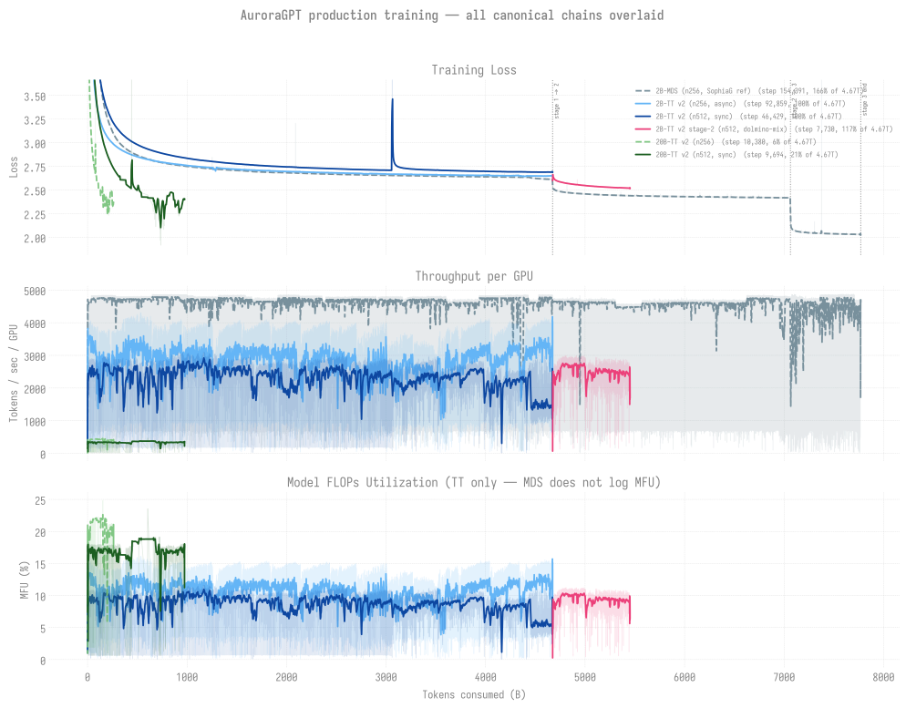

# Production Training Runs — Aurora

> **Living document** — updated as jobs complete and new runs are submitted.
> Run `scripts/refresh_all.sh` to regenerate the tables/charts below from
> disk + W&B.
>
> Last updated: 2026-08-30

> **Polaris (A100) production** is tracked separately (different hardware,
> `dolma` dataset, `72xxxxx` job IDs): see
> [**production/polaris/README.md**](polaris/README.md). This page is
> Aurora/Sunspot (Intel XPU) only.

> [!IMPORTANT]
> **Aurora production is IDLE and has not trained since 2026-08-26.**
> The last umbrella to seat, `8773440`, started Wed 08-26 04:14 UTC and used
> **5h13m of a 12h slot** (`Exit_status=-14`); three of its five seats
> trained (20B-256 +201 steps, 2B-512 +504, 2B-256 +782) and both 512N seats
> never started. `8775285` (the 30B LR-finder umbrella) ran 1h32m and exited
> 0 with all four seats at `rc=143` and no suggested LR -- a clean exit that
> produced nothing. **Nothing has trained since.**
>
> The blocker is the queue, not the code: **`8784460`** (2,098 nodes, `large`,
> project `AuroraGPT`) has been `Q` since Wed Aug 26 13:22 UTC with
> **101h+ eligible time** and `score_boost = 0` -- the previous incarnation of
> this chain pair carried a ~10M boost and started within a day, and this pair
> lost it on resubmit. `8784462` is held behind it on `afterany`. Reservations,
> allocation, queue limits, holds and node pinning were all ruled out locally.
> An ALCF ticket is **drafted but NOT SENT**:
> [`ops/alcf-ticket-8784460-not-scheduling-20260830.md`](../ops/alcf-ticket-8784460-not-scheduling-20260830.md).
>
> The tables below describe each chain's last *persisted* state. A "Trend"
> cell describing an advance refers to the job that made it, not to anything
> running now.

> [!NOTE]
> **The per-step metrics behind these tables and charts are stored locally:**
> [**production/metrics/**](metrics/README.md). Committed summaries (all
> `.o`-recovered rows plus a ~2,000-point backbone per chain) read offline with
> no W&B credentials; the full-fidelity store lives on flare outside git.
> Regenerate with `utils/export_ground_truth.py` **on Aurora** -- the `.o`-log
> fallbacks exist only there.

> [!NOTE]
> **Post-training (SFT + RL) for the 2B model has its own status page:**
> [**POST-TRAINING-2B.md**](POST-TRAINING-2B.md). This page covers
> *pre-training* trajectories. Headline from that page: accuracy lives in SFT
> **structure** (two-stage 0.205 GSM8K-CoT vs 0.02-0.065 for every single-stage
> rebuild); GRPO perfects format but moved accuracy only 0.205 -> 0.215 (noise).

**Jump to:** [Status at a glance](#status-at-a-glance) ·
[Canonical chains](#canonical-chains-one-per-model) ·
[256N trajectories](#active-256n-trajectories) ·
[Other jobs](#other-jobs) · [Known issues](#known-issues) ·
[Overview](#overview)

## Status at a glance

### Pre-training

One row per trajectory; `% target` is against the 4.67T olmo-mix budget.
**No row is advancing** -- see the idle banner above; every state below is
where its chain stopped. Post-training stages (CPT / SFT / RL-GRPO) are in the
[next table](#post-training-stages-cpt--sft--rl). Detail + per-dispatch history
in the linked pages.

| Trajectory | State | Persisted step | Loss | % target | Trend |
|------------|-------|---------------:|-----:|---------:|-------|
| [**2B 256N**](agpt/2b/n256/README.md) async | **COMPLETE** ✅ | **92,859** | 2.652 | **100.0%** | 🏁 target reached (4.674T) |
| [2B 512N](agpt/2b/n512/README.md) sync | **COMPLETE** | 46,429 | **2.687** | **100.0%** | ✅ **finished 2026-08-13 19:11 UTC** as umbrella 8744247 t0, exit 0. Full 4.674T olmo-mix-1124 budget. Final eval: MMLU 0.2511 (chance), and the last 500B tokens moved no metric. Stage 2 (dolmino CPT) seeded from step-46429 **has since run** (8756070 t0 then 8756957 t0) and sits at step 7,728, also idle. |
| [20B 256N](agpt/20b/n256/README.md) | **idle** since 08-26 | **12,000**[^head] | 2.372 | 12.9% | ⏸️ the only pre-training chain `8773440` actually advanced: seat `t2`, **+201 steps, 2.31488 -> 2.24577**. Nothing since. |
| [20B 512N](agpt/20b/n512/README.md) | **idle** since 08-26 | **10,600**[^head] | 2.400 | 22.8% | ⏸️ seat `t1` of `8773440` **never started** (0 steps). Last advance was `8764675` on 08-20. |
| [**80B**](agpt/80b/README.md) | **blocked** (dp wall) | — | nan | — | 🔴 optimizer-independent grad-path overflow at dp>~186; not a SophiaG bug |
| [2B 512N stage-2 dolmino](cpt/README.md) | **idle** since 08-26 | **7,728**[^head] | 2.519 | n/a (CPT) | ⏸️ a 2B-512 seat of `8773440` logged **0 steps**. Seeded from 2B-512 step-46429. |
| [2B 512N constlr fork](agpt/2b/n512/README.md) | **idle** since 08-26 | **21,307**[^head] | 2.745 | n/a (fork) | ⏸️ a 2B-512 seat of `8773440` ran **+504 steps, 2.74535 -> 2.73836**. Constant-LR fork branched at step 9,201. |

### Post-training stages (CPT / SFT / RL)

Continued-pretraining, supervised fine-tuning, and RL-GRPO runs that build ON
a pre-trained base. No `% target` (they don't consume the 4.67T budget); each
has its own token/step goal in the linked page.

| Stage | Base | Recipe / trajectory | State | Progress | Notes |
|-------|------|--------------------|-------|----------|-------|
| CPT | 2b-256n (plateaued) | [olmo×dolmino sweep](cpt/README.md) | **pilot complete** ✅ | step 5,960, loss **2.49** | 🟢 dolmino CPT beats olmo plateau (2.49 vs 2.80); more dolmino = lower loss |
| SFT | [2b-mds](sft/agpt/2b-mds/tulu_math_uc_mix/README.md) | tulu_math_uc_mix (metamathqa-swap, ~4.5B tok) | **complete** ✅ | 729 steps, loss **0.77** | 🏁 the reused SFT deliverable (checkpoint-729-hf); input to GRPO |
| SFT | [2b-mds](sft/agpt/2b-mds/tulu_math_uc_mix_full/README.md) | tulu_math_uc_mix_full (FULL OpenMathInstruct-2, ~54B tok) | **complete** ✅ | **deliverable=ckpt-900** (8672 overfit) | 🏁 8672 reached epoch 1.0 but forgot (base-LM->chance, IFEval flat); ckpt-900 = IFEval 0.253 >= metamathqa + base-LM intact + GRPO 0.31->0.74 |
| SFT | [2b-v2-256n](sft/agpt/2b-v2-256n/tulu_math_uc_mix/README.md) | tulu_math_uc_mix | **blocked** | — | 🔴 v2-base 384-rank oneCCL scale crash at 32N |
| RL | 2b-mds-sft-729 | [sum_digits arithmetic (GRPO)](rl/grpo/aurora2b/sft_arithmetic/README.md) | **complete** ✅ | 1000 steps, acc **0.76** | 🏁 8N GRPO on the SFT'd model; 8× over baseline |

> Full SFT index: [production/sft/README.md](sft/README.md) · GRPO index:
> [production/rl/grpo/README.md](rl/grpo/README.md) · CPT: [production/cpt/README.md](cpt/README.md).

[^head]: Chain positions **audited on disk 2026-08-30**, not taken from a
    doc: 20B-256 `step-12000` (137 ckpt dirs, mtime Aug 26 09:27), 20B-512
    `step-10600` (126). These supersede the 2026-08-26 sync census (10,369 /
    9,690), which predates the 08-26 leg. Note `docs/production/metrics/*.csv`
    is NOT authoritative for this -- its `manifest.json` reads
    `exported_at 2026-08-17`, so it stops at 10,380 / 9,694.
    The [dispatch log](dispatch-log.md) records higher *logged* steps for the
    20B chains (`8764675`: 20B-512 to 10,699, 20B-256 to 11,800) -- logged is
    not persisted, checkpoints save on an interval, and the log's own reading
    rules say to take the resumable head from disk. Losses are the tips of the
    committed [metrics store](metrics/README.md) (exported 2026-08-17), whose
    nearest sampled steps are 10,380 / 9,694 / 7,730 / 21,307.
    Seat-to-chain attribution for `8773440` is by node count plus the seat's
    reported loss: its two 2B-512 seats logged 0 and 504 steps, and the 504
    seat's 2.74535 matches the constlr tip. Its 2B-256 seat (+782 steps,
    2.56449 -> 2.54807) is **not** attributed to a row here -- the canonical
    2B-256 chain finished at 4.674T and loss 2.652, so that seat is something
    else. Per-seat detail: [dispatch log](dispatch-log.md).

<strong>Queue starvation</strong> -- the recurring blocker; now <code>8784460</code> at 101h+ eligible (details)

> **Current instance (2026-08-30).** `8784460`, the 2,098-node umbrella that
> owns every chain above, has been `Q` since 2026-08-26 13:22 UTC with 101h+
> eligible time and `score_boost = 0`. Ruled out locally: reservations total
> 134 nodes, `AuroraGPT` has +1.27M node-hours, `large` allows `max_queued=10`
> against our 2, 2,098 is inside the queue's 2000-10624 range, `Hold_Types=n`,
> and the `depend` is our own chain successor. A *larger* job (`8791192`,
> 2,304 nodes, another project) with the same zero boost and 22 minutes
> eligible started ahead of it on 08-29. Ticket drafted, **not sent**:
> [`ops/alcf-ticket-8784460-not-scheduling-20260830.md`](../ops/alcf-ticket-8784460-not-scheduling-20260830.md).
>
> **Earlier instance (June 2026).** Both 512N chains sat ~20 days in `small`
> on pure node contention, not a hold or bad request -- and re-submitting
> would have *reset* their accrued priority. That lesson applies again here:
> re-`qsub` is what cost this pair its score boost.
> Full diagnosis + data: [queue-wait-analysis.md](queue-wait-analysis.md).

<strong>80B status (2026-07-06): SophiaG NaN'd — needs a new optimizer</strong> (full analysis)

> The 512N head (8574385) finally placed and ran a full 12h window (2026-07-03),
> but **diverged to NaN at step 14** (SophiaG LR=1e-6, warmup=4650, constant):
> grad_norm -> inf while loss was flat (LR ~3e-9 mid-warmup), then NaN for the
> rest of 12h (~6,100 node-h wasted). A **long warmup (already 4650) and
> grad-clip (already max_norm=1.0) do NOT fix it** -- the overflow is inside
> SophiaG's Hessian term at dim=9216, not the update magnitude. This matches the
> [80B convergence run](../experiments/agpt/sunspot/2026-06-30-80b-convergence-gbs6144.md)
> (all 3 optimizers NaN at constant finder LRs). **Next: mano @ LR=1e-6** (below
> its step-5-death 3e-6), being **probed at 32N/GBS=6144 first** (job 8647404)
> before any 512N relaunch. Full analysis:
> [20260703-80b-512n-sophiag-nan.md](../experiments/agpt/aurora/20260703-80b-512n-sophiag-nan.md).
> (Earlier: the 2048N bracket SIGSEGV'd in set_determinism at 24,864 ranks --
> the init-crash ceiling; 1024N untested.) The old AdamW step-2 NaN was a
> production-batch LR problem (LR-finder: AdamW NaN-cliff at GBS=6144; mano ~3e-6
> / sophiag ~1e-6 clean). TEAM DECISION OPEN: SophiaG vs mano. Full plan +
> launch log:
> [20260628-80b-sophiag-constant-lr-512-1024-2048.md](../experiments/agpt/aurora/20260628-80b-sophiag-constant-lr-512-1024-2048.md);
> LR-finder: [lr-finder/agpt/80b](../experiments/lr-finder/agpt/80b/README.md).

## All production trajectories — overlay vs tokens

All canonical chains overlaid on shared axes (Loss / TPS-per-GPU / MFU)
against tokens consumed (loss y-axis cropped to the post-warmup band).
Direct cross-GBS comparison.

Companion eval-side chart (HellaSwag / ARC / Winogrande vs tokens):
[`../evals/figures/all_production_evals.svg`](../evals/figures/all_production_evals.svg).
Per-model overlays: [2B](agpt/2b/README.md) · [20B](agpt/20b/README.md).
Reproduce: `python3 -m torchtitan.experiments.ezpz.utils.plot_production_combined`.

## Active Runs

> **Nothing in this section is running.** Heading kept for stable anchors;
> "Active" here means "on the live roster", not "executing". Every chain has
> been idle since 2026-08-26 -- see the banner at the top of this page.

### Canonical chains (one per model)

| Model | Nodes | Cumulative steps | Loss | Tokens | Latest job | Status |
|-------|------:|-----------------:|-----:|-------:|------------|--------|
| 2B  | 512 | **46,429** (FINAL) | **2.687** | **4.67T** (100.0%) | — chain complete | ✅ **COMPLETE 2026-08-13 19:11 UTC.** Finished the full olmo-mix-1124 budget as trainer 0 of umbrella 8744247: step 46,429/46,429, exit 0 (`FAILOVER STOP: success`), final ckpt step-46429 with 6,144 shards + `.metadata`. Do NOT submit continuations against this ckpt dir -- there is no budget left. Post-training and stage-2 work seed from step-46429. |
| 20B | 512 | **10,600** (persisted) | **2.400** | **1,067.0B** (22.8%) | [`8773440`](dispatch-log.md) t1 -- **never started** | ⏸️ **IDLE since 2026-08-26.** Its seat in the last umbrella to run logged 0 steps; the last real advance was `8764675` on 08-20. Now waiting on `8784460` (Q 101h+). *History:* had been frozen at step-4400 since 05-29: its last advance was as trainer-1 in umbrella 8568429, which died at init on bad node x4410 and the legacy `failover_lib.sh` blind-swapped the wrong nodes (scraper can't parse the hostname from `signal 11`), exhausting retries. Relaunched via `submit_agpt_20b_autoretry.sh` from the pinned runs/agpt-20b-v2 clone (ezpz upgraded 0.16->0.21.3 for `--auto-retry`; resume step-4400 CONFIRMED by 2N smoke 8638756: `Training starts at step 4401`). NOTE step-4500 is an empty/aborted save (not resumable); step-4400 is the last valid ckpt. Legacy sync jobs 8521632/8534295 qdel'd to avoid ckpt-dir collision. head 8638793 + cont 8638795 (afterany). |
| 80B | 512 | — (NaN'd) | nan | — | [`8574385`](agpt/80b/README.md) F (NaN) | **SophiaG production config NaN'd 2026-07-03.** The 512N head ran a full 12h but **diverged at step-14** (grad_norm->inf, loss flat mid-warmup, then NaN for ~12h / ~6,100 node-h wasted). Long warmup (4650) + grad-clip (max_norm=1.0) were both already on and did NOT help -- overflow is inside SophiaG's Hessian at dim=9216. **Next: mano @ 1e-6, probing at 32N/GBS=6144 first (8647404).** (2048N head 8574387 had earlier SIGSEGV'd in set_determinism at 24,864 ranks = init ceiling; 1024N untested.) Analysis: [20260703-80b-512n-sophiag-nan.md](../experiments/agpt/aurora/20260703-80b-512n-sophiag-nan.md). |

> **Failover wrapper production-validated 2026-05-23**: [`8505298`](agpt/2b/n256/README.md) (2B 8N smoke) caught a real silent hang at step 37, watchdog tripped, blind-swapped the bad node, attempt-2 recovered cleanly + persisted DCP checkpoints. **First end-to-end real-world validation of the swap-and-retry path on a true silent-hang failure.** See [incident report](../experiments/agpt/aurora/20260523-failover-silent-hang-recovery-8505298.md).

### Active 256N trajectories

> Both idle. The 2B row is genuinely finished; the 20B row is stalled.

| Model | Nodes | Cumulative steps | Loss | Tokens | Latest job | Status |
|-------|------:|-----------------:|-----:|-------:|------------|--------|
| 2B  | 256 | **92,859** (persisted) | **2.652** | **4.674T** (**100.0%**) | [`8558531`](agpt/2b/n256/README.md) Done ✅ (cont12) | **COMPLETE — target reached.** cont12 (`8558531`) finished clean exit-0 (~10.2h) on 2026-06-29 03:03 at **step-92,859 = 4.674T tokens (100.0%** of 4.67T). Full v2 2B base pre-training run done. cont13 (`8558532`) Q behind it but <1 ckpt-interval to target (no-op). The final step-92,859 checkpoint **has since been evaluated** (job 8638581): see [`evals/agpt/2b/`](../evals/agpt/2b/README.md). |
| 20B | 256 | **12,000** (persisted) | **2.372** | **604.0B** (12.9%) | [`8773440`](dispatch-log.md) t2 -- last to advance | ⏸️ **IDLE since 2026-08-26.** The only pre-training chain the last umbrella actually moved: **+201 steps, loss 2.31488 -> 2.24577**. Now waiting on `8784460` (Q 101h+). Per-token comparator to the canonical 512N. *History:* carried step-1,100 → 3,100 via the relocated `agpt-20b-n256/` clone chain (8558548 + cont1 8558549); relocated 2026-06-12 (spmd_types fixed 2026-06-16). |

### Every dispatch (individual + umbrella)

[**dispatch-log.md**](dispatch-log.md) -- one table per umbrella showing what
each of the five trainer slots actually did, plus the individual chain jobs and
the eval jobs. The per-chain READMEs below only record jobs that advanced THEIR
chain, so umbrella slots that failed were invisible everywhere until now; the
umbrella's own `failed: N/5` banner is exit-code-based and calls a trainer that
ran for hours "failed" if it was later SIGTERM'd.

### Other jobs

| Job ID | Date | Model | Nodes | Walltime | Status |
|--------|------|-------|------:|---------:|--------|
| [`8463182`](agpt/2b/n1024/README.md#log-8463182) | 2026-05-04 | 2B | 1024 | 12h | **Crashed @ startup (211s, std::bad_alloc)** |
| [`8463183`](agpt/20b/n1024/README.md#log-8463183) | 2026-05-04 | 20B | 1024 | 12h | **Crashed @ startup (211s, SIGSEGV)** |
| [`8463659`](agpt/20b/n256/README.md#log-8463659) | 2026-05-04 | 20B | 256 | 12h | **NODE_FAIL** after step 364 (loss 4.61); step-300 ckpt saved |
| [`8466848`](agpt/20b/n512/README.md#log-8466848) | 2026-05-07 | 20B | 512 | — | **Crashed @ startup** (`set_determinism` `std::bad_alloc`); didn't reproduce on 8479579 retry |
| [`8467141`](agpt/2b/n512/README.md#log-8467141)/[`8467142`](agpt/2b/n512/README.md#log-8467142) | 2026-05-07/11 | 2B | 512 | 12h | √2-LR fork — chain1 ran 4h, chain2 ran 1h53m; both done. Tests `LR=3.22e-5` at GBS=12,288 (separate ckpt dir `gbs12288-lr3.22e-5`) |
| [`8470102`](agpt/20b/n256/README.md#log-8470102)/[`8470103`](agpt/20b/n256/README.md#log-8470103) | 2026-05-08 | 20B | 256 | — | Both **crashed** with gloo TCP timeouts at ~3h elapsed |

### Dense (agpt) — bf16-tainted (superseded, kept for record)

See per-model READMEs (`agpt/2b/`, `agpt/20b/`, `agpt/80b/`).

### MoE

| Run | Model | Nodes | Status |
|-----|-------|------:|--------|
| [10B_2B EP=12](moe/10b_2b_sdpa_ep/) | 10B_2B_sdpa | TBD | Planned |

## Known Issues

1. **bf16-master RMSNorm freeze (RESOLVED 2026-04-30):** Default
   `training.dtype` flipped from `bfloat16` to `float32` after we
   discovered RMSNorm.weight was frozen at 1.0 by sub-ULP updates at
   bf16. v2 runs fix this; checkpoints from before the fix are
   tainted. See [bf16-norm-freeze guide](../guides/training-dtype-bf16-norm-freeze.md).
2. **NODE_FAIL at end-of-walltime is common** — both v2 2B runs hit
   NODE_FAIL after 6 hours of clean training, with TPS dragging from
   ~5K → ~30 in the final few hundred steps before kill. Single bad
   node taking down the whole job. Mitigation: keep_latest_k=0 (keep
   all ckpts) so `step-N00` snapshots survive the failure.
3. **torch.compile OOM at 512N** — 2B OOMs on GPU, 80B OOMs on CPU.
   Use `--compile.no-enable` for 512+ node jobs.
4. **SophiaG/Muon broken at 80B** — bf16 overflow in Hessian/Newton-Schulz.
   Use AdamW only at 80B.
5. **80B AdamW LR=1.1e-5 → NaN** — loss diverges at step 138 (256N) and
   step 15 (512N). Pending v2 restart with LR=1e-6.
6. **yeet-env saturates flare at 512N (RESOLVED via tarball mode)** —
   the per-file rsync mode used to take hours and saturate Lustre. The
   tarball mode (`ezpz yeet-env --src .venv.tar.gz`, default in v2
   submit scripts) does the same broadcast in 70-420 seconds at
   8-2048N. See [yeet_env scaling](../scaling/yeet_env/README.md).
7. **Async checkpoint save is being killed mid-write by bad-node
   crashes** (discovered 2026-05-22 during eval refresh). Every recent
   20B run *logs* progress past the latest persisted ckpt (e.g. 8481645
   logged step 1000 but step-900 ckpt dir is empty; 8481646 logged
   step 500 but no ckpt past step-300 has finalized in 3 weeks). The
   `--checkpoint.async-mode=async` flag lets training continue while
   the save streams to flare in the background; if the bad-node crash
   fires during that window, the partially-written `step-N00/` dir
   stays in place but lacks `.metadata` and `__*_0.distcp` shards,
   making it unloadable. **Mitigation:** consider switching to
   `--checkpoint.async-mode=sync` for at least one save per chain
   continuation, OR detect and `mv` the orphaned ckpt dir before next
   training start (the resume code falls back to the previous step).

## Overview

Full-scale production training of AuroraGPT models on the
[olmo-mix-1124](https://huggingface.co/datasets/allenai/olmo-mix-1124) dataset
(4.67T tokens) across Aurora compute nodes.

**Restarted on 2026-04-30 (v2)** after discovering the bf16-master
RMSNorm-freeze bug. All current production runs use `dtype=float32`
master weights, plain CrossEntropyLoss, LBS=2 with the torch 2.13 venv
(yeet-env tarball mode). See
[`docs/guides/training-dtype-bf16-norm-freeze.md`](../guides/training-dtype-bf16-norm-freeze.md)
for the diagnosis.

## Scaling Performance

- [`scaling-performance.md`](scaling-performance.md) — detailed
  experiment log from Apr 18-21 (compile scaling, 80B at 4-512N,
  interactive workflow validation).
- [`docs/scaling/`](../scaling/README.md) — per-model weak-scaling
  tables (2B / 20B / MoE, 1-512N).
- [`docs/scaling/yeet_env/`](../scaling/yeet_env/README.md) —
  yeet-env tarball broadcast scaling (8N to 4096N) on Aurora.
