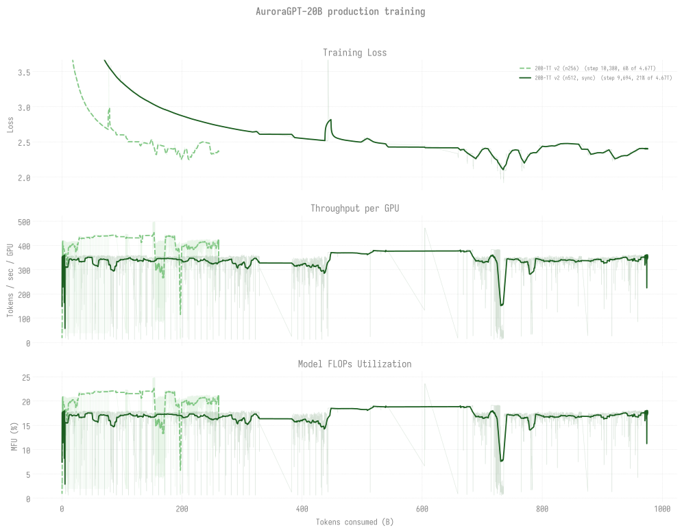

# Production Training — agpt 20B

> Last updated: 2026-08-30
>
> **Nothing is training right now.** The last leg on either 20B chain was
> umbrella `8773440` on **2026-08-26**, which used 5h13m of a 12h slot
> (`Exit_status=-14`): its 20B-256 seat trained 201 steps (loss 2.31488 ->
> 2.24577) and its 20B-512 seat never started. The successor umbrella
> `8784460` (2,098 nodes, `large`) has been `Q` since 2026-08-26 13:22 UTC
> with 101h+ eligible and `score_boost=0`, `8784462` held behind it; ticket
> drafted, NOT sent
> ([`ops/alcf-ticket-8784460-not-scheduling-20260830.md`](../../../ops/alcf-ticket-8784460-not-scheduling-20260830.md)).
>
> Current v2 production runs on `--training.dtype=float32`.
> Historical v1 (bf16-tainted) runs are archived at
> [`../historical/v1-bf16/`](../historical/v1-bf16/README.md) along
> with the diagnosis link.

## 20B chains overlaid

Every 20B trajectory (TT v2 256N + TT v2 512N sync) overlaid on shared
axes vs tokens consumed. Three panels: training loss / TPS-per-GPU /
MFU. Refreshed via `python3 -m
torchtitan.experiments.ezpz.utils.plot_production_combined`.

For the cross-model view (2B + 20B together) with per-token efficiency
comparison, see [`../README.md`](../README.md).

## 🏁 Headline (2026-07-24, historical -- step counts below are as of that date)

**20B 512N chain beats 2B 256N async on every benchmark per token.**
Advanced to step **6,050** / ~609.0B tokens (13.0%) after the native
auto-retry relaunch (8638793 + 8638795) broke the long sync-chain stall on
2026-07-05..07 (was stuck at step-4,400 since 2026-05-29). The eval headline
below is the step-100 → step-4,400 window (35+ ckpts); the modern-eval
ladder (mmlu/gsm8k/arc_challenge) was backfilled across the full chain on 2026-07-24:

- ARC-Easy `acc` 0.463 → **0.664** (+20pp)
- HellaSwag `acc_norm` 0.296 → **0.635** (+34pp)
- ARC-C `acc_norm` 0.224 → **0.380** (+16pp)
- Winogrande `acc` 0.493 → **0.586** (+9pp)

Monotonic lift across 35+ consecutive ckpts. See
[`evals/agpt/20b/`](../../../evals/agpt/20b/README.md) for the full
per-task table.

## Snapshot

| Trajectory | Status | Cumulative steps | Loss | Tokens |
|------------|--------|-----------------:|-----:|-------:|
| [**v2 512N**](n512/README.md) (canonical chain) | **Idle since 2026-08-20.** Last advanced by umbrella `8764675` (10,101 -> 10,699, ckpt head 10,600); its seat in `8773440` on 08-26 never started. Waiting on `8784460`. | **10,600** (persisted, disk-audited 2026-08-21) | **2.41076** (last logged, step 10,699) | **~1,067.0B (22.8%)** |
| [v2 256N](n256/README.md) | **Idle since 2026-08-26.** Last leg was umbrella `8773440` seat t2: 201 steps, loss 2.31488 -> 2.24577, on top of the step-12,000 head. Per-token comparator to the canonical 512N. | **12,000** (persisted, disk-audited 2026-08-21) | **2.24577** (last logged, 08-26) | **~604.0B (12.9%)** |
| [v2 1024N](n1024/README.md) | First attempt 8463183 crashed at startup (SIGSEGV at 12,288 ranks); not retried | — | — | — |

**Canonical 512N chain (sync-mode)**: 8505258 (🏁 sync-mode
breakthrough, +6) → 8505259 (+6) → 8507197 (+6) → 8507200 (+6,
walltime, ended step 3,270) → 8508214 (walltime, +5 ckpts, ended step
3,806) → [**8509393**](n512/README.md#log-8509393) (walltime exit
2026-05-29 12:01, +6 ckpts, ended step 4,400). Then: 8513546 / 8514610
(retries, no new ckpts), 8516701 (PBS killed mid-save → empty
`step-4500/` placeholder), 8521624 / 8521625 (trained in-RAM past
4,400 but blocked by stale placeholder), placeholder
renamed `.bak-empty-20260606-170503/` on 2026-06-06 to unblock resume,
cont (8521628) Q, cont (8521632) H. From 2026-07 on the chain moved to
native auto-retry and then to the ~2,098N umbrellas; see
[n512/](n512/README.md) and the [dispatch log](../../dispatch-log.md).

## Per-trajectory detail

- [n512/](n512/README.md) -- **canonical v2 512N chain** (idle since
  2026-08-20; persisted step 10,600)
- [n256/](n256/README.md) -- v2 256N in the `agpt-20b-n256` clone (idle since
  2026-08-26; persisted step 12,000, last logged loss 2.24577)
- [n1024/](n1024/README.md) — v2 1024N (8463183 crashed at startup,
  std::bad_alloc / SIGSEGV — needs 768N/896N bracket before retry)

## Eval scores

See [`docs/evals/agpt/20b/`](../../../evals/agpt/20b/README.md) for the
current 20B lm-eval tables and the **🏁 headline** finding above (which is
a 2026-07-24 snapshot -- both chains have advanced well past it since). At
step 4,400 (~442.9B tokens) v2 512N sync reaches ARC-Easy **0.6641**
and HellaSwag `acc_norm` **0.6346** — beating the 2B 256N async chain
at step-69,900 / ~3.52T tokens (HSn 0.5552) by a wide per-token margin.
The 20B per-token efficiency advantage is dramatic and the chain has
not begun to plateau yet.
