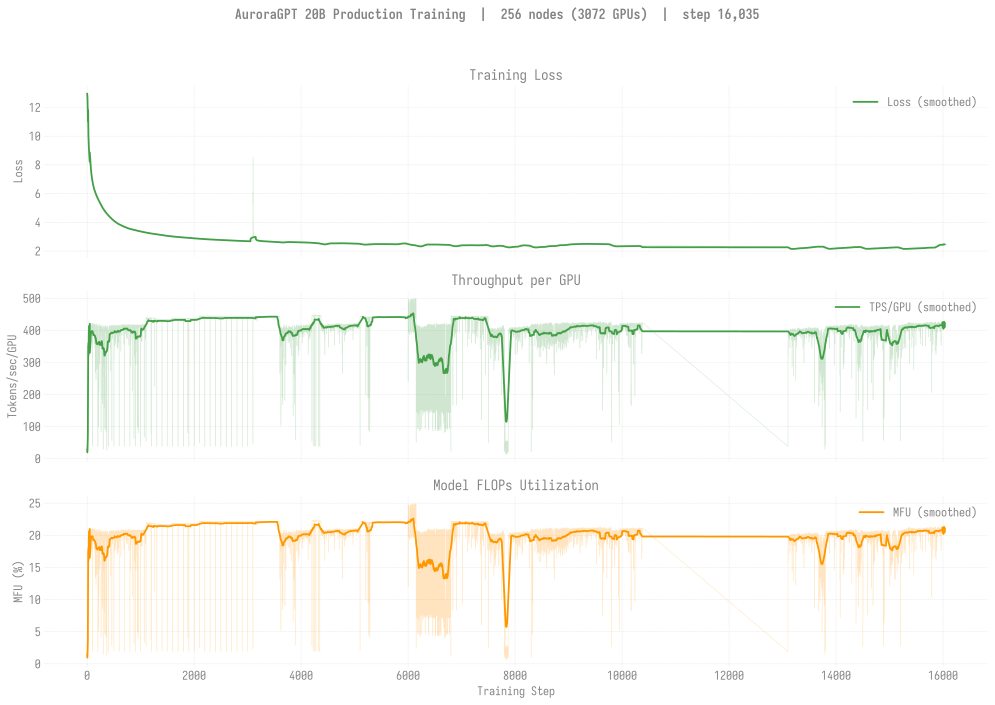
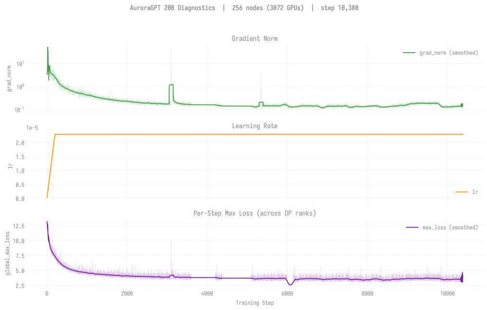
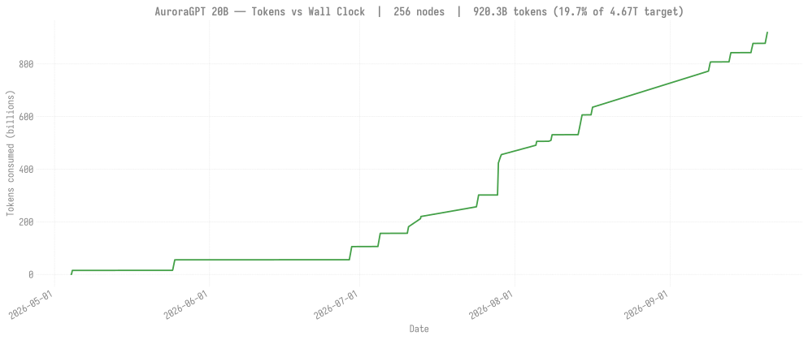

# Production Training — agpt 20B @ 256 nodes

> **Eval scores:** see [`docs/evals/agpt/20b/`](../../../../evals/agpt/20b/README.md)
> for the v2 lm-eval results.

## v2 — 20B @ 256N — SophiaG LR=2.28e-5 (fp32 master)

> Last updated: 2026-07-26
>
> Status: chain at step **6,000** persisted (~302.0B tokens, **6.5%** of
> 4.67T), loss ~**2.51**. Trajectory since the step-300 stall: `8505255`
> (sync mode) reached step-1,125; `8558548`/`8558549` carried it
> 1,101 -> 3,136; native-autoretry continuations (`8647385`, `8661054`)
> advanced it 3,101 -> 4,375; `8681340` (260N) resumed the chain to
> step-6,000. Currently between advances -- the 256N prod resumes
> (`8698753`/`8698754`) are queue-starved; a 16N `capacity`-queue bridge
> (`8703284`, GAS=16 -> GBS=6144 bit-identical) is queued to carry it
> forward from step-6,000. NOTE: the run-ids for the 1,101->3,135 segment
> were originally recorded as the `ezpz.examples.test` preflight-smoke runs;
> corrected 2026-07-24 to the real `torchtitan.ezpz.train` run-ids (the
> metrics were always in the right project), so the charts now source them
> natively (no .o-log fallback).
> **Relocated 2026-06-12** to its own clone
> `agpt-20b-n256/` (metadata-only `mv`, to relieve Lustre dir-size on the
> `agpt-20b-v2/` subtree) so it can be re-armed independently of the
> canonical 512N chain.
>
> **Re-arm blocked then fixed (2026-06-14 → 16):** first two re-launches
> from the new clone (`8540345`, `8540346`) both died in <10s with
> `ModuleNotFoundError: No module named 'spmd_types'` — the symlinked
> `.venv.tar.gz` (2026-05-23) predated the spmd_types==0.2.1 install, so
> the broadcast `/tmp/.venv` lacked it. Fixed 2026-06-16: installed
> spmd_types into the venv (`--no-deps`, torch untouched), rebuilt the
> tarball, re-verified. Chain re-submitted as `8558548` (head, resumes
> step-1,100) + `8558549` (cont1, `afterany`).
>
> Independent trajectory from the canonical 512N chain
> ([n512/](../n512/README.md)) — different ckpt dir (`gbs6144` vs
> `gbs12288`), so it can't extend that chain — but useful as a per-token
> comparator at the same optimizer state.

| Field | Value |
|-------|-------|
| Clone | `/flare/AuroraGPT/foremans/runs/agpt-20b-n256/torchtitan-ezpz/` (relocated 2026-06-12 from `agpt-20b-v2/` to reduce Lustre dir-size pressure on the v2 subtree; `mv` was metadata-only on same FS, no data copy) |
| Submit script | [`scripts/submit_agpt_20b_aurora_venv_failover.sh`](../../../../../scripts/submit_agpt_20b_aurora_venv_failover.sh) (one script handles all v2 node counts via env vars) |
| Stack | torch 2.13 venv (yeet-env tarball mode; venv symlinked from `agpt-20b-v2/`) |
| Optimizer | SophiaG, LR=2.28e-5 |
| Compile | on |
| GBS | 6,144 (LBS=2) |
| Total steps | 92,859 |
| Total tokens | 4.67T |
| Checkpoint dir | `outputs/checkpoints/agpt-20b-sophiag-olmo-mix-1124-n256-gbs6144` (under new clone) |
| Checkpoint interval | 100 steps, keep_latest_k=0 (keep all) |
| W&B | [r1yyxbmt](https://wandb.ai/aurora_gpt/torchtitan.ezpz.train/runs/r1yyxbmt) |

### Loss / Throughput / MFU

### Diagnostics

### Tokens vs Wall Clock

### Progress

| Job ID | Date | Walltime | Steps | Loss (start → end) | TPS/GPU | MFU | Status |
|--------|------|---------:|------:|-------------------:|--------:|----:|--------|
| [`8463659`](#log-8463659) | 2026-05-04 | 12h | 1–364 | 12.96 → 4.61 | 21-410 (variable) | 1-20% (variable) | **NODE_FAIL** after step 364 (`shepherd died from signal 9` on `x4406c6s7b0n0`, exit -20). step-100/200/300 ckpts saved. |
| [`8470102`](#log-8470102) | 2026-05-08 | 12h | 300–~500 | 4.61 → ~5.5 | varies | varies | **Crashed** @ 3h15m (gloo TCP timeout `Connection closed by peer`, multiple ranks). step-400 ckpt saved. |
| [`8470103`](#log-8470103) | 2026-05-08 | 12h | 300–~500 | (resumed but) | — | — | **Crashed** @ 2h59m (also gloo TCP timeout). |
| [`8479581`](#log-8479581) | 2026-05-11 | 12h | 400–500 | (resumed) → 4.08 | 31-419 (variable) | 1.6-20.9% (variable) | **Crashed** @ 3h39m (also gloo TCP timeout, peer 10.115.83.2; exit 0). step-500 ckpt saved. |
| [`8479582`](#log-8479582) | 2026-05-11 | 12h | 500+ | — | — | — | Released, Q to resume from step-500 |
| [`8481646`](#log-8481646) | 2026-05-21 | 12h | 301-500 (logged) | 4.95 → 4.12 | ~405 (steady) | **~20%** | **Failover wrapper validated end-to-end**: attempt 1 ran 2h33m, hit gloo crash from `x4110c3s3b0n0`, wrapper auto-swapped in spare `x4114c7s4b0n0`. **No new ckpts persisted** — `step-400` ckpt dir is empty (May 8 stale from `8470102`) and `step-500` was never written (async save killed by walltime). Attempt 2 only had 98s of parent walltime left. The wrapper's swap+retry path is proven; the training-progress contribution is zero. See [failover writeup](../../../../experiments/agpt/aurora/20260521-failover-validated-8481646.md). |
| `8505255` | 2026-05-22 | 12h | 300 → **1,125** | 4.12 → **3.28** | ~480 (steady) | ~24% | **Broke the step-300 stall.** Sync-mode 12h dispatch, advanced step-300 → step-1,125 cleanly. Persisted step-400..1,100 (11 valid ckpts). `step-400.bak-20260523-095600` is the old empty placeholder, renamed. |
| `8540345` | 2026-06-14 | 12h | — | — | — | — | **Died <10s** (`ModuleNotFoundError: spmd_types`). First re-launch from the relocated `agpt-20b-n256/` clone; symlinked tarball predated the spmd_types install. All 4 failover attempts failed identically (venv bug, not bad nodes). No ckpts. |
| `8540346` | 2026-06-16 | 12h | — | — | — | — | Same `spmd_types` failure (cont1 of 8540345, auto-released). No ckpts. |
| `8558548` | 2026-06-16 | 12h | 1,100 → ? | — | — | — | **Re-submit after tarball fix** (spmd_types==0.2.1 installed + rebuilt 2026-06-16). Resumes from step-1,100. Q at submit. |
| `8558549` | — | 12h | (cont1) | — | — | — | Held (`afterany:8558548`). |
| `8647385`+ | 2026-07-06..23 | 12h | 3,100 -> 4,375 | ~3.2 -> ~2.5 | ~440 | ~22% | Continuations 8647385 (3101-3603), 8661054 (4201-4375) advanced the chain; interspersed with CCL/gloo crashes + resubmits (transient infra). |
| `8681340` | 2026-07-23 | 12h | 5,101 -> **5,885**+ | 2.485 -> 2.509 | 40-443 (variable) | ~22% | **RUNNING** (full 260N throughput, resumes real chain). Advancing step-5,100 -> 5,800+; loss steady ~2.49. |

**Latest checkpoint:** step-6,000 (8505255, all of step-100..1,100 have valid `.metadata`)

**Cumulative persisted steps:** 6,000

**Tokens consumed:** 6,000 × 6,144 × 8,192 = **302.0B tokens** (6.5% of 4.67T target)

**Loss:** 2.5227 (8558549 end, step-3,100)

## v2 -- 20B @ 256N -- job 8661913 (MISLABELED "constlr"; actually from-scratch)

> **Correction (2026-07-12):** this run was originally recorded here as a
> "constant-LR fork from the trained base." That was WRONG. Inspecting the
> resolved config from its own log shows it was a **fresh from-scratch run on
> the DEFAULT schedule**, not a fork and not constant-LR:
> `initial_load_path=null` (nothing loaded), `decay_ratio=0.8`,
> `warmup_steps=200`, `--optimizer.lr=2.28e-5`. Loss starts at **12.21 @ step-10
> and drops steeply** (12.21 -> 11.0 in 6 steps) -- the classic random-init
> warmup signature, not a continuation of the base (which was already ~2.7).
> The `-constlr` in the ckpt-dir name came from an intended config that never
> reached the command line.

- **Job:** `8661913` (256N, 6h, legacy failover wrapper). Ran 2026-07-11 21:59.
- **What it actually was:** a duplicate 20B-256 training run from random init on
  the standard warmup+linear-decay schedule (same optimizer/LR as the canonical
  chain), writing to a NEW dir `...-gbs6144-constlr`.
- **Result:** reached only **step-400** (still in early warmup, loss ~4.3) before
  it **silently hung after ~step 435** and sat idle until PBS walltime-killed it
  at 04:01. No NaN; MFU ~22%; checkpoints step-50..step-400 saved (~385s/save).
- **Disposition:** NOT resumed -- it would just duplicate the canonical 20B-256
  chain (already at step-4,200) at a worse loss. The mislabeled ckpt dir can be
  archived/removed. A REAL constant-LR experiment is now handled differently:
  the canonical chains hold LR flat via `DECAY_RATIO=0.0` in
  `submit_agpt_20b_autoretry.sh` (see 2026-07-12 journal entry).

### Logs

| Job ID | Path |
|--------|------|
| `8463659` | `/flare/AuroraGPT/foremans/runs/agpt-20b-v2/torchtitan-ezpz/agpt-20b-n256-v2.o8463659` |
| `8470102` | `/flare/AuroraGPT/foremans/runs/agpt-20b-v2/torchtitan-ezpz/agpt-20b-n256-v2-chain1.o8470102` |
| `8470103` | `/flare/AuroraGPT/foremans/runs/agpt-20b-v2/torchtitan-ezpz/agpt-20b-n256-v2-chain2.o8470103` |
| `8479581` | `/flare/AuroraGPT/foremans/runs/agpt-20b-v2/torchtitan-ezpz/agpt-20b-n256-v2-chain3.o8479581` |
| `8479582` | `/flare/AuroraGPT/foremans/runs/agpt-20b-v2/torchtitan-ezpz/agpt-20b-n256-v2-chain4.o8479582` |
| `8481646` | `/flare/AuroraGPT/foremans/runs/agpt-20b-v2/torchtitan-ezpz/agpt-20b-n256-v2-failover-chain1.o8481646` + `logs/failover-8481646/{attempt-1,attempt-2}.log` |
