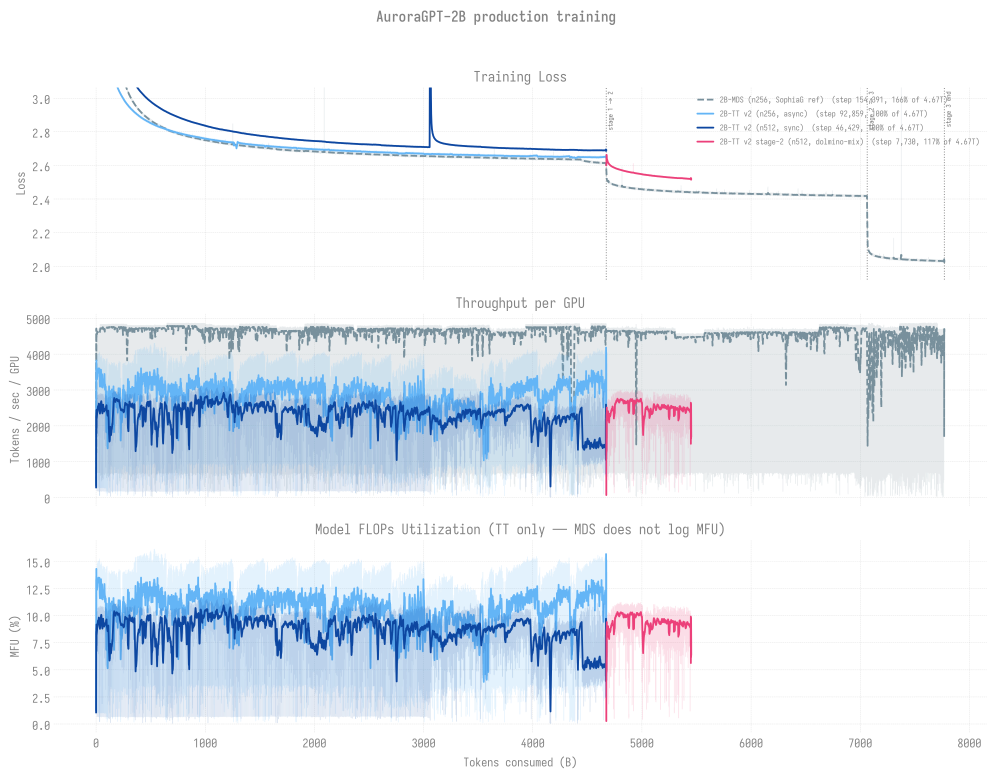

# Production Training — agpt 2B

> Last updated: 2026-08-23
>
> Current v2 production runs on `--training.dtype=float32`.
> Historical v1 (bf16-tainted) runs are archived at
> [`../historical/v1-bf16/`](../historical/v1-bf16/README.md) along
> with the diagnosis link.

## 2B chains overlaid

Every 2B trajectory (MDS-reference + TT v2 256N async + TT v2 512N sync)
overlaid on shared axes vs tokens consumed. Three panels: training loss /
TPS-per-GPU / MFU. Refreshed via `python3 -m
torchtitan.experiments.ezpz.utils.plot_production_combined`.

For the cross-model view (2B + 20B together), see
[`../README.md`](../README.md).

## Snapshot

| Trajectory | Status | Cumulative steps | Loss | Tokens |
|------------|--------|-----------------:|-----:|-------:|
| [**v2 256N (async)**](n256/README.md) (per-token comparator) | **COMPLETE** 2026-06-29 (step-92,859 = 100% of 4.67T target); finished by cont12 (8558531). Now the base for CPT ([../../cpt/](../../cpt/README.md)) + SFT. | **92,859** | **2.6524** | **~4.674T (100.0%)** |
| [**v2 512N (sync)**](n512/README.md) (canonical chain) | **LIVE** -- past the old step-30,400/30,500 stall via the autoretry chain + a HEAD-migration dress rehearsal (8686135 -> 8686136); not pinned/queue-blocked | **46,429** | **2.6907** | **~3.99T (100.0%)** |
| [v2 1024N](n1024/README.md) | Crashed at startup (12,288-rank init OOM/SIGSEGV); not retried | — | — | — |
| v2 512N sqrt(2)-LR fork | 8467141 → 8467142 (separate ckpt dir `gbs12288-lr3.22e-5`) | 200 | — | ~20B |

**Headlines (2026-07-24):**

- **256N async chain COMPLETE** at step-92,859 (100.0% of the 4.67T
  target, loss ~2.6511). Finished by cont12 (8558531) on 2026-06-29; it
  is now the base for CPT ([../../cpt/](../../cpt/README.md)) + SFT.
- **512N sync chain LIVE at step-39,600** (~3.99T tokens, 85.3%, loss
  ~2.71). It advanced past the old step-30,400/30,500 stall via the
  autoretry chain and a HEAD-migration dress rehearsal
  (8686135 -> 8686136); it is no longer pinned or queue-blocked.

## Per-trajectory detail

- [n256/](n256/README.md) — v2 256N async (canonical per-token comparator;
  COMPLETE at step-92,859)
- [n512/](n512/README.md) — **canonical v2 512N sync chain** (LIVE at step-39,600;
  past the old stall)
- [n1024/](n1024/README.md) — v2 1024N (8463182/8463183 both crashed
  at 12,288-rank init; needs 768N/896N bracket before retry)

## Eval scores

See [`docs/evals/agpt/2b/`](../../../records/evals/agpt/2b/README.md) for the
current 2B lm-eval tables (HellaSwag / ARC-Easy / ARC-Challenge /
Winogrande). Latest entries are at the bottom of that table; step-69900
holds the chain's **best Winogrande** at 0.5627.

**Per-token efficiency note:** the 20B 512N sync chain at step 4,400
(~442B tokens) hits HSn 0.6346 / ARC-E 0.6641 — beating this 2B 256N
plateau on every benchmark per token. The 2B chain has burned ~8×
more tokens to reach a worse score, which is expected; the comparator
exists to confirm the 20B chain is converging *qualitatively faster*
per token, not just per FLOP. See
[`evals/agpt/20b/`](../../../records/evals/agpt/20b/README.md).
