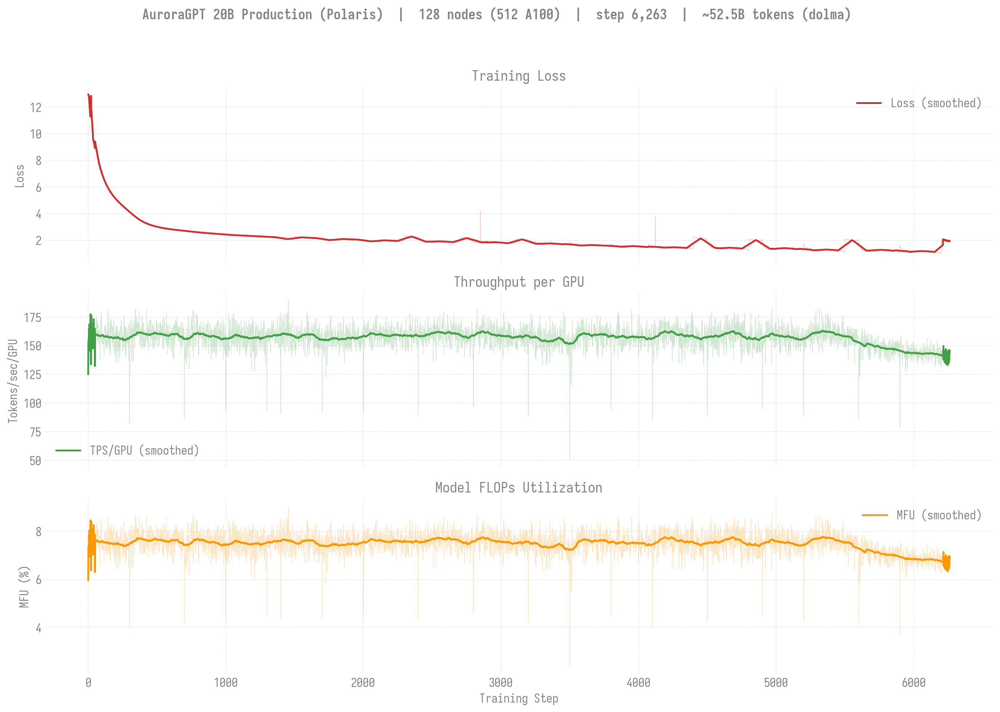
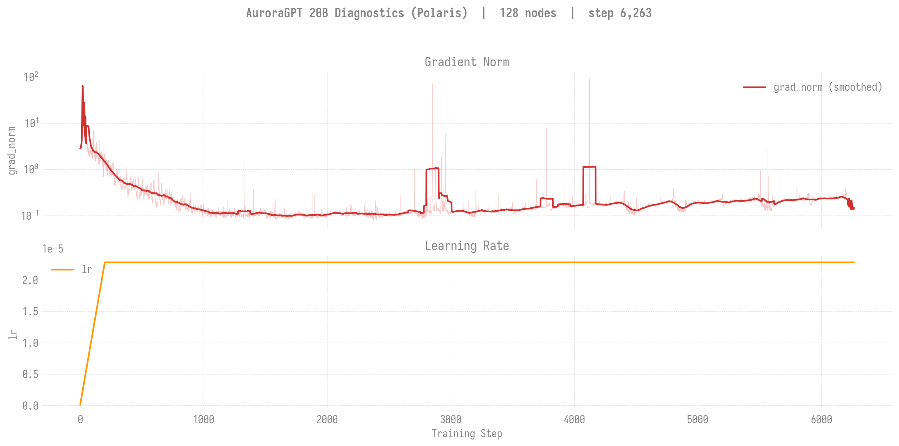
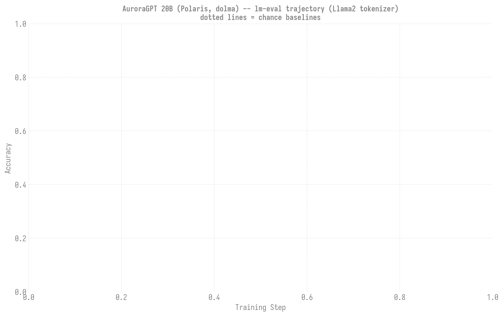

# Production Training Runs -- Polaris (A100)

> **Living document** -- updated as jobs complete and new runs are submitted.
>
> Last updated: 2026-08-23

Polaris (NVIDIA A100-SXM4-40GB) production trajectories. Distinct from the
Aurora/Sunspot (Intel XPU) chains tracked in the
[parent production README](../README.md): different hardware, different
dataset (`dolma`), different job-ID range (`72xxxxx`), and a
Polaris-specific checkpoint mode (`async`; see Known Issues).

All runs use `scripts/submit_agpt_{2b,20b}_autoretry.sh` (native
`ezpz launch --auto-retry`), the `dolma` data list, and the SophiaG
optimizer at LR=2.28e-5. The script auto-detects `machine: polaris`.

**Jump to:** [Status at a glance](#status-at-a-glance) ·
[2B chain](#2b-agpt-2b-sophiag-dolma) ·
[20B chain](#20b-agpt-20b-sophiag-dolma-n128-gbs1024) ·
[Known issues](#known-issues-polaris-specific)

## Status at a glance

Tokens = `GBS x seq_len(8192) x step`. `dolma` corpus; no fixed token
target is assigned to these Polaris chains yet, so tokens are reported
absolute (not % of a budget).

| Trajectory | State | Persisted step | Live step | Loss | Tokens | Notes |
|------------|-------|---------------:|----------:|-----:|-------:|-------|
| **2B n128** (`gbs512`) | idle (last leg done) | **5,300** | 5,383 | **2.36** | ~22.6B | 53 ckpts; last leg 7228272 ran full 12h |
| **20B n128** (`gbs1024`) | **restarting** (chain 4-deep) | **2,400** | 2,500 | **~2.2** | ~25.2B | 9 legs done -> step-2400; chain went dry after a stuck-resume, resubmitted 7270694 (Q) + 3 held (7270700/01/02) |

Smaller/earlier 2B node-count variants also exist on disk (comparison
runs, not the canonical chain): n64 -> step ~1,970 / loss 2.57;
n32 -> step ~543 / loss 4.03.

---

## 2B (`agpt-2b-sophiag-dolma`)

Canonical chain: **n128, GBS=512**. Also ran n32 / n64 as scaling
comparators (same optimizer/dataset).

| Field | Value |
|-------|-------|
| Submit script | `scripts/submit_agpt_2b_autoretry.sh` |
| Optimizer / LR | SophiaG / 2.28e-5 |
| GBS | 512 (NHOSTS_TRAIN=128, LBS=1, GAS=1) |
| Seq len | 8192 |
| Checkpoint mode | `async` (script default for 2b) |
| Checkpoint interval | 100 |
| Checkpoint dir | `outputs/checkpoints/agpt-2b-sophiag-dolma-n128-gbs512` |

**Progress (n128 canonical):** step **~5,383**, loss **2.36**
(from 12.9 at init) -- deep into convergence. **53 checkpoints**
persisted (step-100 ... step-5300), latest ckpt step-5300
(2026-07-05). ~**22.6B tokens** consumed. grad_norm settled to ~0.16.
Throughput ~1,080 TPS/GPU, ~3.9% MFU (compile config as submitted).

The final full-walltime leg was **7228272** (large, 130 nodes, ran the
complete 12:00:45 window, step -> 5,383, saving 53 ckpts cleanly). No
current continuation is queued for the 2B chain (production focus moved
to bringing up 20B).

### Scaling comparators (not the canonical chain)

| Variant | Nodes | Step reached | Loss |
|---------|------:|-------------:|-----:|
| n64 | 64 | ~1,970 | 2.57 |
| n32 | 32 | ~543 | 4.03 |

---

## 20B (`agpt-20b-sophiag-dolma-n128-gbs1024`)

New chain brought up 2026-07-06/07. This is the current production focus.

| Field | Value |
|-------|-------|
| Submit script | `scripts/submit_agpt_20b_autoretry.sh` |
| Optimizer / LR | SophiaG / 2.28e-5 |
| GBS | **1024** (NHOSTS_TRAIN=128, **LBS=1, GAS=2**) |
| Seq len | 8192 |
| Activation checkpoint | full (20b config default) |
| Checkpoint mode | **`async`** (REQUIRED override on Polaris -- see Known Issues) |
| Checkpoint interval | 100 |
| Checkpoint dir | `outputs/checkpoints/agpt-20b-sophiag-dolma-n128-gbs1024` (~700 GB on disk) |

### Bring-up (2026-07-06)

Validated via a smoke campaign before the first prod submit (per
smoke-before-prod practice). Three real issues surfaced and were fixed:

1. **OOM at low node count.** 20B OOMs at 2N (model shard 13.1 GiB/rank
   @ 8 GPUs) but fits at scale (3.05 GiB @ 40 GPUs, ~0.24 GiB @ 512).
   Pure-FSDP shard scales with GPU count -> smoke at >=10N, not 2N.
2. **bit.ly 429 broke env bootstrap.** The submit script's fallback
   `curl https://bit.ly/ezpz-utils` was rate-limited (HTTP 429),
   leaving every ezpz function undefined -> cascade to `libcudart.so.12`
   + venv failure. Fixed by pre-creating `.ezpz-utils-cache/ezpz-utils.sh`
   in the repo root (script prefers the local cache over curl).
3. **Sync checkpoint deadlock at 512 ranks** (see Known Issues) -- the
   first prod attempt (7237697) hung in the step-100 checkpoint save.
   Fixed with `CHECKPOINT_ASYNC_MODE=async`.

Batch config: **LBS=1, GAS=2** on Polaris (LBS=2 OOMs A100-40GB). GAS=2
keeps the canonical per-GPU effective batch (matching Aurora's LBS=2)
so the SophiaG LR=2.28e-5 stays valid; GBS = 512 x 1 x 2 = 1024.

### Charts

Loss / throughput / MFU across all legs, stitched from the per-leg W&B
runs (each `ezpz launch` leg is a separate run; resume points are merged
latest-wins into one continuous curve). Current through step ~2,500
(9 legs).





Regenerate (from the Polaris repo, whose venv has W&B creds + the
plotting stack):

```bash
python3 torchtitan/experiments/ezpz/utils/plot_polaris_20b.py
```

Append each new leg's W&B run-id to `RUN_IDS` in
[`plot_polaris_20b.py`](../../../utils/plot_polaris_20b.py) as legs
start, then rerun (add an `OLOG_FALLBACKS` entry too if a leg's
`scan_history` returns empty). W&B runs (oldest first): `jgjd0qbf`
(leg1), `h8uzg2om` (leg2), `u81yhgtb` (leg3), `j56diiz9` (leg4),
`nm41nsbj` (leg5), `nvmf9hnj` (leg6), `j0jnww7s` (leg7), `8snyuaxk`
(leg8), `rnf9tfhw` (leg9). Project `aurora_gpt/torchtitan.ezpz.train`.

### Trajectory

| Leg | Job | Outcome | Steps | Loss |
|-----|-----|---------|------:|-----:|
| smokes | 7237663/68/80/90 | config validated | -- | -- |
| leg 1 (bad) | 7237697 | **killed** -- sync-ckpt deadlock @ step 100 | 0->~100 | (hung) |
| **leg 1** | 7237948 | ran full 12h, clean | 0 -> **400** | 12.95 -> **3.38** |
| **leg 2** | 7237949 | ran full 12h (resumed step-300) | 301 -> **705** | 4.14 -> **2.72** |
| **leg 3** | 7243413 | ran full 12h (resumed step-700) | 701 -> **1,100** | 2.71 -> **2.39** |
| **leg 4** | 7247525 | ran full 12h (resumed step-1000) | 1001 -> **1,400** | 2.43 -> **2.31** |
| **leg 5** | 7252666 | **NVLink fault** @ step 1,449 (rank426, node ECC-failed) | 1301 -> 1,449 | 2.26 -> 2.20 |
| **leg 6** | 7260480 | ran full 12h (restart, resumed step-1400) | 1401 -> **1,804** | 2.13 -> 2.25 |
| **leg 7** | 7260483 | ran full 12h (resumed step-1700) | 1701 -> **2,096** | 2.08 -> 2.24 |
| **leg 8** | 7262999 | ran full 12h (resumed step-2000) | 2001 -> **2,405** | -> ~2.2 |
| **leg 9** | 7263000 | **stuck-resume** (init hang, 0 steps 2nd attempt); chain went dry | 2401 -> 2,500 | -> ~2.2 |
| **restart** | 7270694 (+3 held) | **Q**, resumes step-2400; chain now 4-deep | -- | -- |

**Persisted checkpoints:** complete through **step-2400** (each 234 GB /
512 shards). A checkpoint is only complete when it has a **`.metadata`**
file (DCP writes it LAST, after all 512 shards); **512 `.distcp` shards
alone do NOT mean complete.** Boundary dirs from walltime-kills landing
between the shard flush and the `.metadata` write are metadata-less and
DCP correctly skips them, resuming from the last checkpoint WITH
`.metadata` (up to ~`CKPT_INTERVAL`=100 steps rework). No corruption;
safe fallback. When auditing which ckpt a leg resumes from, check
`ls step-N/.metadata`, not the shard count.

**Failure notes (legs 5, 9):** leg 5 died to a genuine NVLink hardware
fault (rank426 on `x3205c0s37b0n0`, which ALCF then took offline for
"2763 uncorrected ECC errors -- Replace"); leg 9 died to a stuck resume
(bad-node init hang, `stuck_pre_training` guard bailed after 0-step
retries). Both left step-2400 (leg 9) / step-1400 (leg 5) intact. The
chain went dry twice because it was only 1-2 deep at the time -- now run
**4-deep** (7270694 + 7270700/01/02) to survive multi-day unattended
windows.

**Current state:** step **2,400** persisted (loss **~2.2**), ~**25.2B
tokens**, memory 20.2 GiB (51%), grad_norm ~0.10. Descent across legs:
12.95 -> 3.38 -> 2.72 -> 2.39 -> 2.31 -> ~2.2. Restart 7270694 resumes
from step-2400 when it lands a slot.
**Milestone:** now past the mature 2B chain's token count (~25B vs
~22.6B) at a lower loss (~2.2 vs 2.36) -- the larger-model
token-efficiency lead is holding.

### Failover: bad-node attribution (Polaris)

> Polaris failover was **blind** until 2026-08-23: no bad-node scraper
> patterns were registered for the machine, so `launch_autoretry` could
> never name a culprit and always rotated an arbitrary (usually healthy)
> node, leaving the sick one in the allocation. Job 7550301 burned ~1h of
> 130 nodes to exactly this. Fixed by a Polaris pattern module plus
> `EZPZ_MPI_LABEL=1` (PALS `--label`), which is what makes a rank's CUDA
> traceback attributable at all. Full writeup:
> [`known-bugs/polaris-failover-blind-rotation.md`](../../guides/known-bugs/polaris-failover-blind-rotation.md).
>
> **After any venv rebuild**, re-run
> `scripts/install_polaris_failover_patterns.sh` *before* `ezpz tar-env`
> -- ezpz is installed from a pinned commit, so the fix would otherwise
> silently vanish and revert failover to blind.

### Evaluation (lm-eval, Llama2 tokenizer)

> **Important:** this chain trained on **Llama2-tokenized** dolma
> (`/eagle/datasets/dolma/data_v1.7_Llama2Tokenizer`), but the model
> config declares vocab 256128 (gemma). It must be evaluated with the
> **Llama2** tokenizer (`bos=1`/`eos=2`), not gemma -- evaluating with
> gemma produces fluent-subword salad and chance scores on every task.
> Full diagnosis:
> [`known-bugs/polaris-20b-tokenizer-mismatch.md`](../../reference/known-bugs/polaris-20b-tokenizer-mismatch.md).
> The earlier `results/` (gemma) dirs are all at chance and should be
> ignored; the corrected results live in `results-llama2tok/`.

Zero-shot lm-eval (vLLM backend, TP=4, `gpu_memory_utilization=0.80` for
the 256128-vocab logits) across the sampled checkpoint sweep
(job 7274538). Metric is `acc` for arc_easy/boolq/piqa/winogrande,
`acc_norm` for hellaswag/arc_challenge/openbookqa.

| Step | Tokens | arc_easy<br>(acc) | arc_challenge<br>(acc_norm) | piqa<br>(acc) | hellaswag<br>(acc_norm) | boolq<br>(acc) | openbookqa<br>(acc_norm) | winogrande<br>(acc) |
|---|---:|---:|---:|---:|---:|---:|---:|---:|
| 100 | 0.8B | 0.264 | 0.269 | 0.523 | 0.255 | 0.378 | 0.240 | 0.499 |
| 500 | 4.2B | 0.314 | 0.221 | 0.560 | 0.270 | 0.551 | 0.230 | 0.505 |
| 1,000 | 8.4B | 0.397 | 0.235 | 0.597 | 0.294 | 0.536 | 0.264 | 0.507 |
| 1,500 | 12.6B | 0.418 | 0.243 | 0.604 | 0.312 | 0.446 | 0.270 | 0.500 |
| 2,000 | 16.8B | 0.412 | 0.242 | 0.622 | 0.318 | 0.481 | 0.278 | 0.519 |
| 2,400 | 20.1B | **0.487** | 0.248 | **0.665** | **0.397** | **0.564** | 0.288 | 0.515 |



The four strong signals (arc_easy, piqa, hellaswag, boolq) rise cleanly
from chance at step-100 (10B tokens, barely trained) to well above chance
by step-2400 -- a healthy learning curve that independently confirms both
the model and the tokenizer fix. arc_challenge / openbookqa / winogrande
stay near chance at this token count (expected; matches the Aurora 20B
early trajectory).

Regenerate the chart + table (from the Polaris repo):

```bash
python3 torchtitan/experiments/ezpz/utils/plot_polaris_20b_evals.py
```

Rerun the sweep after new checkpoints land (reuses existing HF exports,
overrides tokenizer to Llama2, `gmu=0.80`):

```bash
qsub torchtitan/experiments/ezpz/scripts/eval/polaris_20b_eval_llama2tok_sweep.sh
```

---

## Known issues (Polaris-specific)

### Checkpoint async-mode is REQUIRED on Polaris (CUDA)

`submit_agpt_20b_autoretry.sh` defaults `checkpoint.async-mode` to
`disabled`. On Polaris (512 ranks) the **synchronous DCP save
deadlocks**: the step-100 save hung with GPUs at 0%, ranks spinning in a
collective, zero files written, no resumable checkpoint (job 7237697,
killed after ~3.4h). The 2b Polaris script already defaults to `async`,
which is why the 2b chain checkpoints fine.

**Fix:** pass `-v CHECKPOINT_ASYNC_MODE=async` on every Polaris 20B
submit. With async, the step-100 save staged in 0.55s and flushed 234 GB
in the background without blocking training.

**Do NOT change the script's `disabled` default.** The canonical
production scripts target Aurora/Sunspot (Intel XPU), where async
checkpointing is broken -- `disabled` is the correct XPU default. `async`
is a Polaris/CUDA-only per-invocation override.

### Walltime-kill leaves the final checkpoint incomplete

Each 12h leg is killed mid-step at the wall (`Exit_status = -29`). If the
kill lands during an async save, the checkpoint dir is left incomplete and
the next leg resumes from the previous complete one -- costing up to
`CKPT_INTERVAL` (=100) steps of rework per handoff. Tolerable and
self-recovering; reducible by lowering `CKPT_INTERVAL` if rework becomes
costly.

**Completeness test: `.metadata`, NOT shard count.** DCP writes the 512
`__N_0.distcp` shards first and the `.metadata` file LAST. A dir with all
512 shards but no `.metadata` is INCOMPLETE -- DCP skips it and falls back
to the previous checkpoint. When auditing which checkpoint a leg will
resume from, check for `.metadata`
(`ls <ckpt>/step-N/.metadata`), do not just count `.distcp` files. Empty
or metadata-less boundary dirs seen so far: step-400, step-1100, step-1400
(each a walltime kill between shard-flush and `.metadata` write).

### Chain continuation

Each leg is chained with `qsub -W depend=afterany:<prev>`. Keep one
`+1` continuation held behind the newest job so training never runs dry
at a walltime handoff. Current depth: leg 2 running (7237949) + leg 3
held (7243413).
