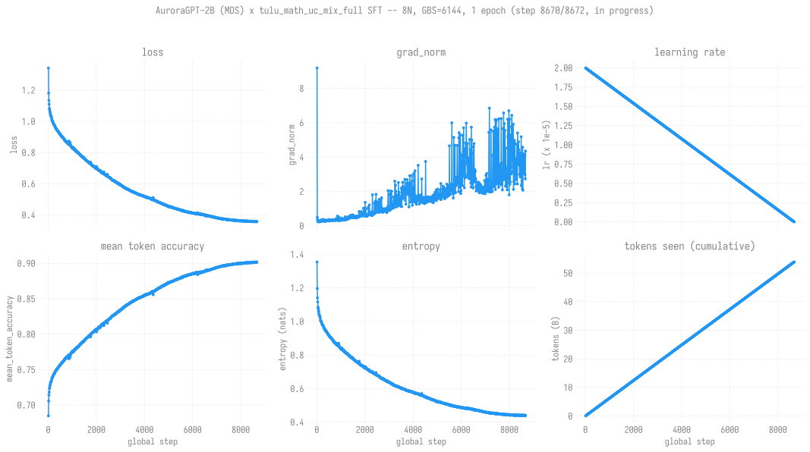

# SFT recipe: gs138650 x tulu_math_uc_mix (FULL big mix, ~54B tokens)

> **Last updated: 2026-07-12.**
> **Status: in progress at 8N.** Job **12470350** + afterany chain (Sunspot,
> launched 2026-07-12). This is the "more tokens" SFT: the SAME gs138650 base as
> the completed 729-step SFT, but over the FULL OpenMathInstruct-2
> `tulu_math_uc_mix` (~53.3M packed sequences, ~54B tokens, 1 epoch) instead of
> the small metamathqa-swap mix (~4.5B tokens).
>
> Runs at **8N, not 32N**: the 32N run GPU-page-faults at step 1-2 (a 384-rank
> scale fault; see "The 8N-vs-32N scale fault" below). 8N (96 ranks) is the
> largest scale proven safe by a bisect.

## Quick reference

| Field | Value |
|-------|-------|
| Base model | `global_step138650` (vocab 256000, 1.99B params, llama arch) -- the checkpoint the completed 729-step SFT trained on |
| Recipe | registered `tulu_math_uc_mix` = tulu-3 0.65 + **OpenMathInstruct-2** 0.15 + ultrachat-200k 0.20 (`all_exhausted`) -- the FULL 14M-row OpenMathInstruct-2, not the metamathqa swap |
| Materialized mix | ~93.1M interleaved rows -> **53,276,203 packed sequences** at len 1024 |
| Trainer | TRL `SFTTrainer` (HF Trainer base, FSDP full_shard) |
| Sequence length | 1024, packing pre-applied offline, `assistant_only_loss` via baked-in `assistant_masks` |
| Hyperparameters | LR 2e-5 (cosine to 0), bf16, AdamW (TRL default), 1 epoch |
| Scale | **8 nodes x 12 = 96 ranks**, GBS = 6144 (bsz 2 x gas 32), FSDP full_shard |
| Submit script | [`rl/scripts/sft/agpt2b_gs138650_tulu_math_uc_mix_8n_gbs6144.sh`](../../../../../../rl/scripts/sft/agpt2b_gs138650_tulu_math_uc_mix_8n_gbs6144.sh) |
| Output dir | `outputs/sft/agpt-2b-gs138650-tulu-math-uc-mix-8n-gbs6144/` |
| Expected steps | ~8,672 (1 epoch at GBS=6144); ~24s/step -> ~58h -> ~5 x 12h windows |
| Fault tolerance | afterany chain + `--resume_from_checkpoint`, save_steps=50, NO ezpz auto-retry |

## The data pipeline (why this took a while)

The full OpenMathInstruct-2 mix needed an offline build pipeline; each stage hit
a distinct failure, all now fixed. Full blow-by-blow in the
[launch report](../../../../../experiments/agpt/sunspot/2026-07-10-sft-2b-gs138650-big-mix-32n.md).
Short version:

1. **Interleave build** was ~90 min single-threaded -> vectorized to ~5s
   (bit-identical; also upstream PR huggingface/datasets#8318).
2. **Runtime tokenize** of 93M rows (~8.5h) blew the job watchdog -> moved
   offline via `--pretokenize_to` / `--pretokenized_dataset` (TRL skips prep
   when `input_ids` present).
3. **save_to_disk** OOM/slowness -> parallel `save_to_disk(num_proc)` with no
   pre-flatten; **packing map** OOM at high num_proc -> walked down to
   `dataset_num_proc=8`.
4. **seq_len 2048** OOM'd the XPU tile -> reverted to the proven **1024** corner
   (bsz 2 / gas 32 here to hold GBS=6144 at 8N).
5. **TRL re-packs pre-packed data** -> `packing=False` auto-set when the dataset
   has `seq_lengths`.
6. **ezpz `--auto-retry`** false-positives on TRL (`stuck_pre_training`, since
   it looks for `step=` markers TRL never emits) -> dropped; fault tolerance is
   now the afterany chain.

## The 8N-vs-32N scale fault

The 32N run (384 ranks) GPU-page-faults at step 1-2:

```
Segmentation fault from GPU at 0x... ctx_id: 5 (CCS) type: 0 (NotPresent), access: 1 (Write), banned: 1, aborting
-> rank 221 died from signal 6
```

Ruled out (evidence-based): **bad node** (reproduces on rank 221 across
different nodes), **OOV token id** (full 53M-row scan: max 255998 < base vocab
256000). Confirmed a **384-rank scale fault** (same class as
`project_sft_v2_base_oom_badnode`, base-independent). Scale bisect (jobs
12470343/346/347/348/349):

| N | ranks | result |
|---:|---:|---|
| 2 / 4 / 8 | 24 / 48 / 96 | **clean** (20 steps, loss descends) |
| 12 / 16 / 32 | 144 / 192 / 384 | GPU segfault at step 1-2 |

-> **8N = 96 ranks is the largest safe scale.** The onset (~96-144 ranks)
is near the recurring ~186-192 dp_degree boundary on this XPU/torch stack.
The scale fault itself remains an open infra issue; running at 8N sidesteps it.

## Loss trajectory

[](charts/sft-curves.svg)

Loss + grad_norm + LR + mean-token-accuracy + entropy + cumulative-tokens over
the run so far (regenerated from the latest checkpoint's `trainer_state.json` by
[`scripts/plot_sft_curves.py`](scripts/plot_sft_curves.py), wired into the
[refresh catch-all](../../../../../scripts/update_all_charts.sh)). The token axis
stitches TRL's per-chain-link `num_tokens` counter into a monotonic total (each
afterany continuation resumes and re-inits the counter). Chart is absent until
the first `update_all_charts.sh` run lands it on Sunspot.

## Run status

| Job | Date | Steps | Loss | Notes |
|-----|------|------:|-----:|-------|
| 12470350 (head) | 2026-07-12 | 0 -> ~790/8672 | 1.343 -> 0.864 | 8N head; save_steps=50, checkpoints through step-850. mean_token_accuracy 0.685 -> 0.77, no GPU fault. **Idle-watchdog SIGTERM (rc=124) at step ~790**: a genuine ~30-min mid-training hang (not a crash/walltime; checkpoint saves are ~9s), afterany chain recovered. wandb `summer-mountain-82` / [vkwpxnqh](https://wandb.ai/aurora_gpt/torchtitan.ezpz.sft/runs/vkwpxnqh). |
| 12470351 (cont 1) | 2026-07-12 -> | ~800/8672 (in progress) | resumed 0.87 | Resumed from checkpoint-850 (loss/lr continuous, not step 0). wandb `peachy-morning-...` / [hrbfiwk7](https://wandb.ai/aurora_gpt/torchtitan.ezpz.sft/runs/hrbfiwk7). Chain: 352/353/354/355/364 H. |

<!-- RUN-PROGRESS -->

### wandb runs (one per chain link)

This run uses the afterany chain (NOT ezpz auto-retry), so each chain link
relaunches a fresh `train_sft` process and starts its OWN wandb run under
project [`aurora_gpt/torchtitan.ezpz.sft`](https://wandb.ai/aurora_gpt/torchtitan.ezpz.sft).
Each continuation resumes from the latest checkpoint (not step 0). Run ids:

| Chain link | wandb run | Steps covered |
|---|---|---|
| 12470350 (head) | [vkwpxnqh](https://wandb.ai/aurora_gpt/torchtitan.ezpz.sft/runs/vkwpxnqh) (`summer-mountain-82`) | 0 -> ~790 (idle-watchdog hang) |
| 12470351 (cont 1) | [hrbfiwk7](https://wandb.ai/aurora_gpt/torchtitan.ezpz.sft/runs/hrbfiwk7) (`peachy-morning-...`) | ~800 -> (in progress), resumed from checkpoint-850 |

### Early trajectory (job 12470350)

First ~482 steps at 8N (GBS=6144): loss **1.343 -> 0.912**, mean_token_accuracy
**0.685 -> ~0.75**, grad_norm settled from 9.2 to ~0.29. Clean textbook SFT
descent, consistent with the completed gs138650 SFT's start (~1.16 -> 0.77 over
729 steps on the small mix). Checkpoints accumulate every 50 steps.

## Evals

Base-LM lm-eval **step sweep** (checkpoints 300/600/900 vs the gs138650
baseline, job 12470365) in [`evals/README.md`](evals/README.md). TL;DR: the
expected **alignment-tax** pattern -- base-LM multiple-choice is flat-to-down
under SFT (arc_easy/challenge decline monotonically with more steps; boolq /
winogrande tick up), same as the completed metamathqa SFT. The real SFT signal
lives in IFEval + downstream GRPO (TODO for this run), not these tasks. More
sweep points land as the run advances.

## Comparison to the completed 729-step SFT

The prior production SFT
([tulu_math_uc_mix, metamathqa swap](../tulu_math_uc_mix/README.md))
reached final loss 0.77 over 729 steps / ~4.5B tokens. This run keeps the same
base + recipe weights but uses the FULL OpenMathInstruct-2 mix (~54B tokens,
~12x the tokens) for 1 epoch. The eval comparison (base-LM benchmarks, IFEval,
downstream GRPO signal) will show whether the ~12x-larger math+instruction SFT
corpus improves on the metamathqa-swap deliverable.
